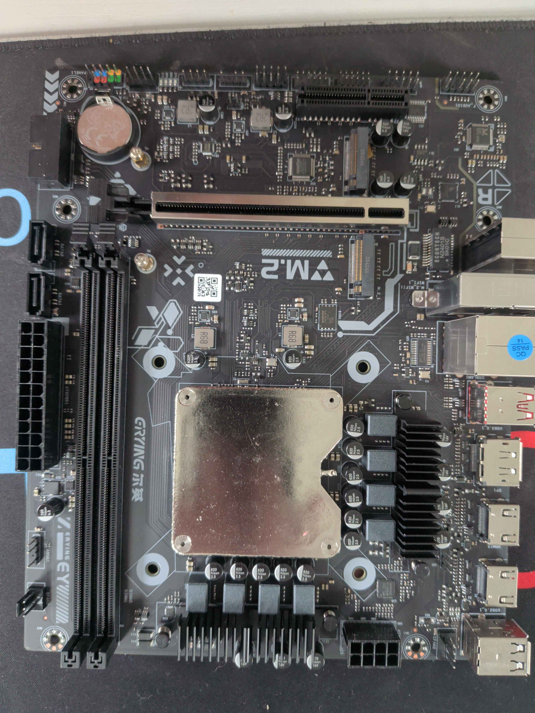
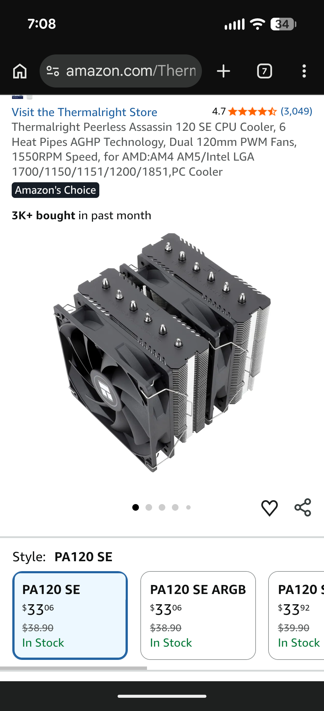
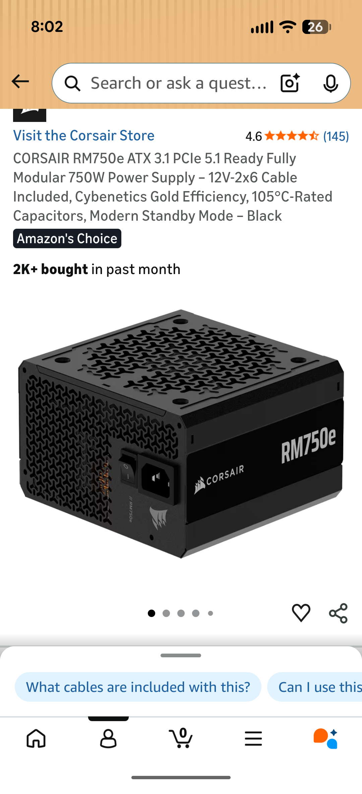

There's a moment in every homelab evolution where you stop and ask: *what am I actually buying when I buy infrastructure?*

For me that moment came two weeks ago, staring at a renewal email from a SaaS I won't name, doing back-of-the-envelope math on a Synology I almost ordered, and pricing out an EKS cluster for a side project that — let's be honest — was never going to leave my apartment.

The numbers didn't add up. Or rather, they added up *too well*, in the wrong direction. 📈

So I did what any reasonable cloud architect with 18 years of enterprise scar tissue and a vinyl record habit would do: I bought a motherboard with the CPU **soldered onto it**, from a Chinese brand most of you have never heard of, and started planning the funeral for my dual-Xeon storage node. 🔥

This post is about that decision, the build that's currently mid-flight on my workbench, and why I think the homelab renaissance isn't really about saving money. It's about something quieter and more important.

Let's get into it.

## The hardware, briefly

The board in question is an **Erying Ultra 9 285H** — yes, that 285H, Intel's Arrow Lake mobile flagship, BGA-soldered to a mini-ITX motherboard by a vendor in Shenzhen that does this for a living.

Specs that matter for this build:

- **16 cores / 24 threads** (6P + 8E + 2 LP-E), Arrow Lake-H
- **Arc 140T iGPU** — Intel's first real shot at integrated graphics that aren't a joke
- **96GB DDR5 SODIMM** capacity (DDR5 SODIMM is still expensive in May 2026, but trending down)
- **2.5GbE onboard**, PCIe 5.0 x8 slot, 2x M.2 NVMe
- Total cost with the welcome deal: ~**$275 for the board+CPU combo**

For comparison, an equivalent retail i9 build (CPU + Z890 board + cooler bracket) would run you north of $700. The Erying play is simple: laptop CPUs are *cheaper per watt and per dollar* than their desktop equivalents, and the only reason most of us don't run them is that nobody sells them in a form factor we can use. Erying does.

The cooler is a **Thermalright Peerless Assassin 120 SE** — $33, 4.7 stars across 3,000+ reviews, dual-tower, six heat pipes. Five years ago this would have been a $90 Noctua. The market has caught up.

Power is a **Corsair RM750e**, ATX 3.1, 80+ Gold, fully modular. Overkill for a node that'll idle at 30W and peak around 150W under K8s scheduling pressure, but I want headroom for the ConnectX-3 dual-port 40GbE card and the eventual NVMe array. Future-proofing isn't a sin when the cost delta is $20.

So far, so homelab. But here's where it gets interesting.

## The plan: xeon2socket is dead, long live xeon2zfs

The 285H isn't joining the cluster as just another worker. It's the keystone of a much bigger reorg.

Current state of the nodes:

| Node | CPU | Role | Status |
|---|---|---|---|
| zima | N3450 | K8s control plane | Active |
| intel5 | i5-8400 | K8s worker (UHD 630 iGPU) | Active |
| intel9 | i9-12900K | K8s worker (UHD 770 iGPU + Tesla P4) | Active |
| xeon2socket | Dual Xeon E5 | K8s worker | **Decommissioned** |

xeon2socket served honorably for years. Two physical CPUs, 94GB of ECC RAM, ran Frigate against the Tesla P4, hosted Longhorn replicas. But it drew 180W idle and the dual-socket Sandy Bridge platform is finally showing its age — no AVX-512, no AES-NI acceleration that anyone cares about in 2026, and a PCIe 3.0 ceiling that bottlenecks anything modern.

The new plan:

- **285H** takes over the K8s worker duties xeon2socket used to handle — and then some, because Arrow Lake-H at 16 cores eats Sandy Bridge for breakfast at half the wattage.
- **xeon2socket** gets reformatted, renamed **xeon2zfs**, and becomes a dedicated **TrueNAS SCALE** box. The Tesla P4 stays for transcoding. The 94GB of RAM becomes ZFS ARC cache, which is exactly what 94GB of RAM was born to do.
- **Storage fabric** moves to **InfiniBand** — ConnectX-3 Pro dual-port 40GbE cards on every storage participant, IPoIB for NFS, $20 used cards from eBay because Mellanox enterprise gear depreciates beautifully.
- **Longhorn gets retired.** Longhorn was always a compensation for not having dedicated storage. Once xeon2zfs is serving NFS over IB, the K8s cluster gets real storage and Longhorn becomes a complication I no longer need.

The infrastructure monitoring stack is already running — Grafana hitting Prometheus through dual exporters on TrueNAS (`node_exporter` with custom ARC metrics via textfile collector on port 9100, plus `zfs_exporter` for pool and dataset stats on port 9134). The whole thing is served over Ingress with cert-manager TLS, behind Authentik SSO, fronted by Cloudflare Zero Trust. Every layer of that stack is something I run, on hardware I own, with software I can read the source of.

> **Sidebar: The L2ARC Question**
> 
> Right now I'm on Day 3 of a 7-day ARC performance monitoring campaign to decide whether to add L2ARC (Level 2 cache) using NVMe drives. Current baseline: **97.22% demand data hit rate**, **89.8% ARC pressure**. If the hit rate stays above 95% consistently, L2ARC is overkill. If it drops below 90% under load, the NVMe goes in. 
> 
> This is what legibility buys you: the ability to measure, not guess. The metrics are in Prometheus. The decision will be data-driven. No vibes, no vendor whitepapers, no "best practices" from someone who's never seen my workload.

## Now the actual point

Here's what I want to argue, and I want to argue it carefully because it's easy to get wrong.

**The homelab renaissance is not about saving money.**

If you do the math honestly — including your time, the electricity, the failed experiments, the postmarketOS flash that bricked your OnePlus 9 Pro for three days (asking for a friend) — most homelabs cost more than the SaaS equivalents over a five-year window. Mine certainly does. I am not breaking even.

What I'm buying is something else. Three things, actually.

### 1. Jurisdiction

That 27.27 TiB pool holds my daughter's first-grade photos, six years of family video, every document I've scanned since 2019, my Immich library, my Paperless-ngx archive, my Kavita comics, the Frigate footage from the Nest cameras I migrated off Google's SDM API last year.

None of it is subject to a TOS change. None of it is one corporate pivot away from being deleted, "deprecated," or quietly fed into someone's training corpus. Cloudflare Zero Trust gates the front door, but the data sits on disks I can physically pick up and walk away with.

This is what *sovereignty* actually means. Not a manifesto. Not a Mastodon bio. The literal ability to say no.

### 2. Legibility

Vanilla Kubernetes, not K3s. TrueNAS SCALE, not Synology DSM. Self-signed PKI under cert-manager, not whatever Synology's HTTPS solution is calling itself this year. Authentik for SSO instead of Okta. Technitium for DNS. Velero for backup. Calico for the CNI, even when it gives me ppc64le headaches.

Every one of those choices trades a small amount of convenience for a *large* amount of legibility. When something breaks — and things break, constantly, gloriously — I can read the logs. I can read the source. I can write a CRD or a controller and fix it. The substrate is *visible* to me.

The consumer cloud is producing a generation of engineers who can't operate the substrate they depend on. I am not going to be one of them, and neither is my homelab. 🛠️

### 3. Optionality

This is the one I've come around to most recently, and it's the one that's relevant to a lot of you reading this.

Eighteen months ago I was running on managed everything. SaaS for notes, SaaS for photos, SaaS for documents, SaaS for the *idea* of having documents. Today I run roughly thirty self-hosted services on hardware I assembled myself, and the cost of switching any one of them to something else is hours, not weeks.

That optionality has compounded in ways I didn't predict. When I needed to migrate Frigate off the Tesla P4 to OpenVINO on the UHD 770, it took an afternoon. When I wanted to swap NestMTX for go2rtc's native SDM integration, it took an evening. When I decided Longhorn was the wrong abstraction for my storage tier, I started planning a replacement instead of submitting a feature request to a product manager who doesn't know I exist.

This is what *capability* looks like, as opposed to *access*. And it turns out capability scales, while access has to be renewed monthly. 💰

## What's next

The 285H ships May 8–14. RAM is on order (96GB DDR5 SODIMM, prices easing off). ConnectX-3 cards are stacked on the shelf waiting for their slots. The migration sequence is roughly:

1. ✅ TrueNAS SCALE installed on xeon2socket
2. ✅ K8s storage migrated to interim TrueNAS NFS
3. 🔲 Finalize xeon2socket → xeon2zfs rename and network config
4. 🔲 Swap Tesla P4 → ConnectX-3 in xeon2zfs
5. 🔲 Install ConnectX-3 in intel9
6. 🔲 Stand up the InfiniBand fabric, configure IPoIB
7. 🔲 Migrate K8s NFS workloads to IB-backed storage
8. 🔲 Retire Longhorn
9. 🔲 Receive the 285H, assemble, join to cluster
10. 🔲 Write the follow-up post

I'll write the next one when it's all running. Whether or not the InfiniBand fabric humbles me on the way is, statistically speaking, the only real question. 🤞

Until then — if you've been thinking about your own setup, the math, the trade-offs, the *why* of any of it — I hope this was useful. The hardware is cheap. The software is free. What you're really paying for is the right to keep your own keys.

Worth it.

---

*Currently running: vanilla Kubernetes (kubeadm), Calico, MetalLB, cert-manager, Authentik, Grafana/Prometheus, Velero, Technitium DNS, Cloudflare Zero Trust. Domain: debene.dev. The cluster has a name and I refuse to tell you what it is.* 💃
