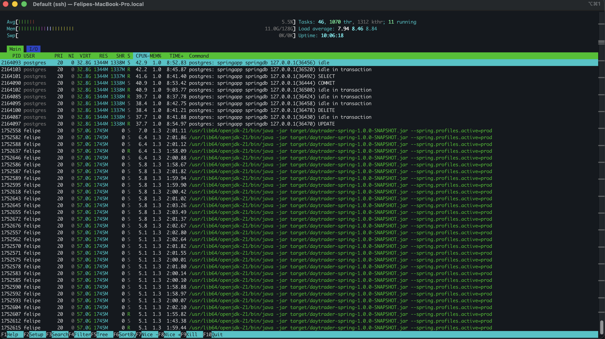
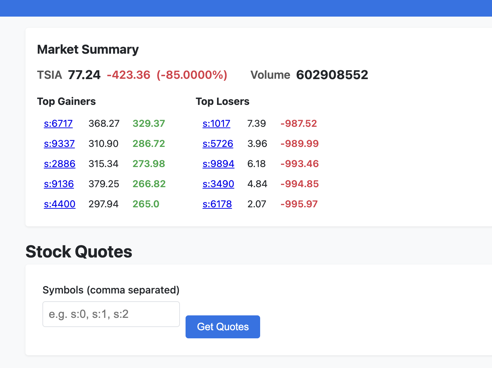
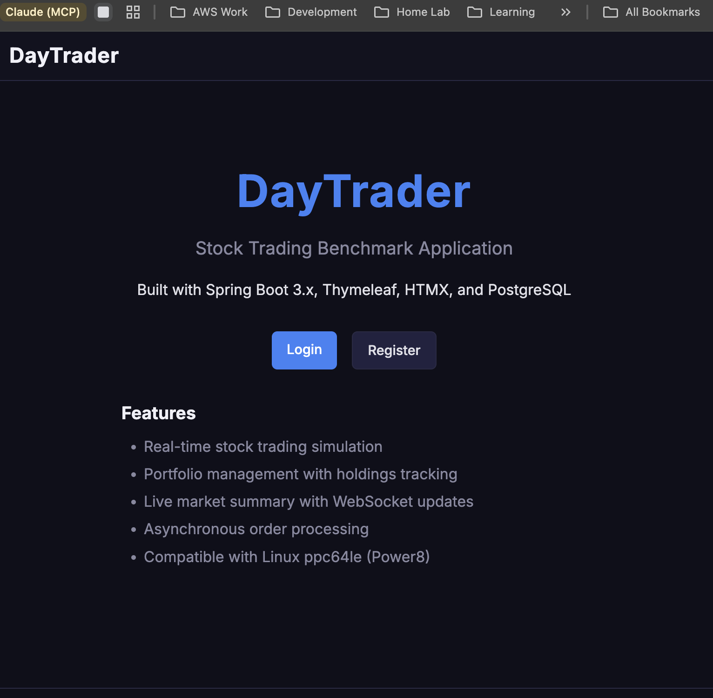
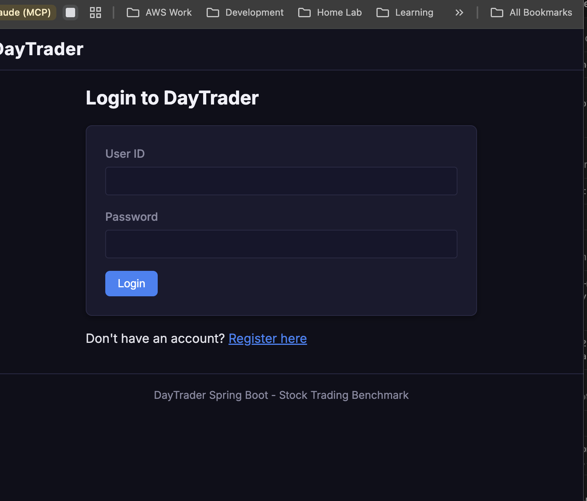
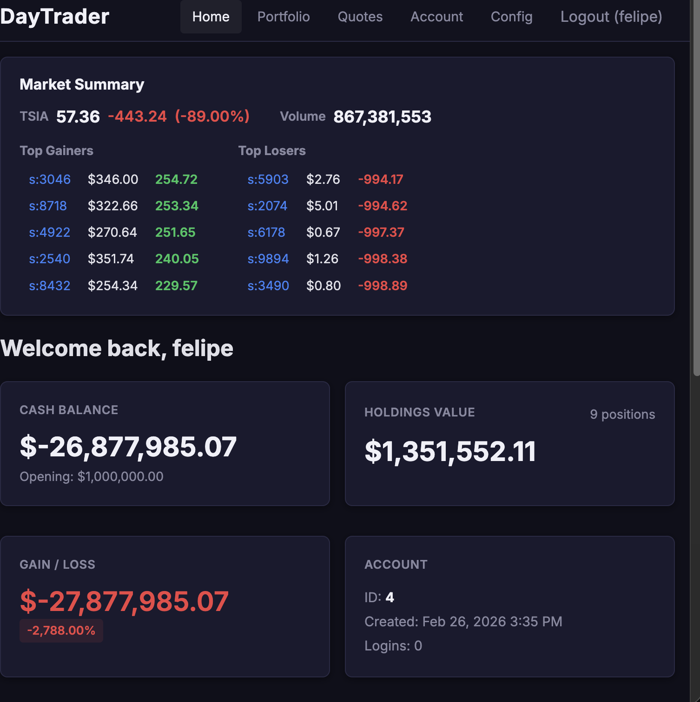

## Previously, on "Man Yells at POWER8"

In [Part 1](https://debene.dev/posts/aix-power8-enterprise-java/), I told you about the time I decided to run AIX 7.2 inside a KVM VM on a Gentoo ppc64le host, on actual IBM POWER8 hardware, in my basement in Chicago. I monkey-patched Python 2.7's `sqlitecachec.py` to make yum work. I nuked my entire system by installing OpenSSL 3.5 instead of 3.0. I got WebSphere Liberty running and deployed IBM's DayTrader 7 — a Java EE benchmark app from 2005 that speaks EJBs, JPA, JMS, and looks like it was designed by someone who thought JSP framesets were the pinnacle of web technology.

At the end of that post, I had a working enterprise Java app running on AIX. A perfectly functional 2005-era benchmark doing 2005-era things.

I looked at it. It worked. It was ugly. It had no API. It used embedded Derby. It deployed manually via `scp`. And it was only accessible from my LAN.

So naturally, on February 25th, 2026, I woke up and chose violence.

34 commits. One day. What follows is the story of what happened.

## Act 1: "We Need a REST API"

It started innocently enough. I was looking at the DayTrader web UI — all JSP framesets and form submissions — and I thought: *what if this thing could speak JSON?*

DayTrader 7, IBM's official `sample.daytrader7`, is a Java EE 7 benchmark application. It's got the full enterprise stack: EJBs for business logic, JPA for persistence, JMS for asynchronous order processing, message-driven beans for trade execution. It's a genuinely impressive piece of software architecture, designed to stress-test application servers. It also hasn't been meaningfully updated since the Obama administration.

I forked IBM's `sample.daytrader7` — first into a separate repo called `daytrader-modern` where I tried to bolt modern features onto the Java EE version. REST APIs, PostgreSQL, OIDC, Docker. That's where the 34 commits of chaos happened. That's where the OIDC saga unfolded. That's where Docker broke my spirit.

Eventually I archived `daytrader-modern` and went back to the original fork — [sample.daytrader7](https://github.com/felipedbene/sample.daytrader7) — which already had a Spring Boot module sitting right there, waiting to be discovered. Sometimes the answer is in the repo you started with.

The approach was surgical. I wrote 6 JAX-RS resource classes exposing 9 endpoints:

- `/api/quotes/{symbol}` — get a stock quote
- `/api/quotes` — list all quotes
- `/api/accounts/{userId}` — account info
- `/api/accounts/{userId}/portfolio` — holdings
- `/api/accounts/{userId}/orders` — order history
- `/api/trade/buy` and `/api/trade/sell` — execute trades
- `/api/market/summary` — market overview
- `/api/health` — because we're civilized

Each resource used CDI `@Inject` to wire in the existing EJB layer. The EJBs already had all the business logic — account management, trade execution, quote lookup. I just needed to expose it. JSON-B handled serialization. No Jackson, no custom mappers, no configuration hell.

Here's the beautiful part: **no existing Java source code was modified.** Zero changes to IBM's original EJBs, entities, or business logic. The REST layer sits entirely *on top* of the existing codebase, like a modern skin graft on a 20-year-old patient.

The 2005 JSP app now speaks JSON. It feels wrong. It feels *right*.

## Act 2: Derby Is Dead, Long Live PostgreSQL

DayTrader ships with Apache Derby as its embedded database. Derby is fine. Derby is simple. Derby is also a single-file embedded database running inside the same JVM as your application server, which means your "enterprise benchmark" has the data architecture of a SQLite hobby project.

We can do better.

My Kubernetes cluster runs CloudNativePG — the operator for PostgreSQL on K8s. I already had a PostgreSQL instance running, accessible at `10.0.100.104` via a MetalLB LoadBalancer service. That IP is on a different VLAN than the AIX VM, but my network routes between VLANs because I'm the kind of person who has a Gentoo-powered IBM POWER8 running AIX in a KVM VM. VLANs were the easy part.

Stop and appreciate the absurdity for a moment: a Java EE benchmark application from 2005, running on an operating system whose lineage traces back to 1986, inside a KVM virtual machine on a ppc64le Gentoo host, connecting over bridged networking across VLANs to a cloud-native PostgreSQL database managed by a Kubernetes operator, with a MetalLB-assigned IP address. Seven layers of technology spanning four decades.

The JDBC driver (`postgresql-42.7.1.jar`) needed to live on AIX, in Liberty's shared library path. I'd handle that with CI/CD — more on that nightmare shortly.

The `server.xml` configuration was straightforward... until GitGuardian sent me a very polite email about commit `1e09e93`. I had hardcoded the PostgreSQL password. In a public repository. Like a professional.

Lesson learned. Environment variables in `server.xml`:

```xml
<dataSource jndiName="jdbc/TradeDataSource">
    <jdbcDriver libraryRef="PostgreSQLLib"/>
    <properties.postgresql serverName="10.0.100.104"
        portNumber="5432"
        databaseName="daytrader"
        user="${env.DB_USER}"
        password="${env.DB_PASSWORD}"/>
</dataSource>
```

GitGuardian was satisfied. My dignity was not.

## Act 3: CI/CD to AIX — Yes, Really

At this point I was deploying by building locally, `scp`-ing files to AIX, and restarting Liberty by hand. It worked. It was also the kind of workflow that makes DevOps engineers wake up screaming.

I wanted `git push` to production. On AIX. Via GitHub Actions.

The pipeline runs on a self-hosted runner in my homelab (label: `homelab`) because GitHub's hosted runners don't exactly come with SSH access to basement IBM hardware. Here's what happens when I push to main:

1. **Maven build** — compile the EAR, run whatever tests still work after 20 years
2. **Upload to MinIO** — push the EAR file and JDBC driver to my MinIO instance
3. **SSH to AIX** — connect to `10.0.1.132` and pull artifacts from MinIO
4. **Deploy** — copy EAR to Liberty's `dropins/` directory, JDBC driver to shared libs
5. **Restart Liberty** — stop, start, wait for it
6. **Health check** — hit the `/api/health` endpoint with retry loops
7. **Database setup** — create tables, populate 10,000 stock quotes and 15,000 user accounts
8. **Discord notification** — webhook to `#p8-power8` channel on success or failure

Why MinIO instead of downloading directly from GitHub? Because AIX's `curl` can't verify TLS certificates against my homelab CA. And I wasn't about to go down the "install custom CA certificates on AIX" rabbit hole. Not today. MinIO speaks HTTP on the LAN. Good enough.

The deploy script is a work of art. Or horror. Depending on your perspective:

```bash
# Retry loop for health check — Liberty takes its sweet time on AIX
for i in $(seq 1 30); do
    if curl -sf http://localhost:9080/api/health > /dev/null 2>&1; then
        echo "Liberty is up after $i attempts"
        break
    fi
    echo "Attempt $i/30 - waiting..."
    sleep 10
done
```

Thirty retries. Ten seconds apart. Five full minutes of staring at a terminal waiting for a JVM to warm up on a virtualized POWER8 core. This is enterprise computing.

On failure, the script dumps Liberty's `messages.log`, `ffdc/` directory contents, and running process lists to the GitHub Actions log. Because when your deploy fails at 1 AM and you can't reproduce it, you want *every scrap of diagnostic data* waiting for you in the morning.

Discord gets a webhook notification either way — green checkmark or red X. My phone buzzes. I either smile or sigh. The pipeline doesn't care.

## Act 4: The OIDC Saga, or How I Learned to Stop Worrying and Love the Revert

This is where the day went sideways.

My homelab runs Authentik as the identity provider. Everything uses OIDC — Grafana, Jellyfin, the wiki, even some of my K8s dashboards. It's a single sign-on dream. So naturally, I thought: DayTrader should use OIDC too!

What followed was a masterclass in yak-shaving, XML corruption, and commit messages that got increasingly desperate.

It started fine. Commit `ce1d3ea`: add `defaultKeyStore` to `server.xml` for SSL/OIDC support. Standard stuff. Liberty needs a keystore to handle TLS for the OIDC backchannel.

Then `46eabdc` and `5ac9ad9`: auth filter configuration, legacy security constraints in `web.xml`. DayTrader's original `web.xml` has security constraints from the Java EE dark ages — role-based access with `FORM` login. I needed to bridge that with OIDC.

Then things got *weird*.

Commit `926bc55`: XML corruption. Duplicate `</web-app>` closing tags. The XML parser didn't throw an error — Liberty just silently ignored half the configuration. The app started but authentication didn't work. No error in the logs. No warning. Just... nothing.

Commit `1fdb045`: dangling comment tags. A `<!-- ` without a matching ` -->`. XML is technically still valid with unclosed comments at the end of a file — the parser just treats everything after the opening tag as a comment. Including, you know, all your security configuration.

I spent two hours debugging why OIDC redirects weren't happening before I found that single missing `-->`.

Then the Dockerfile saga began. I was also trying to containerize the app for x86 deployment alongside the AIX native target. The Dockerfile reverts came fast and furious:

- `6541ea1`: revert Dockerfile, ENTRYPOINT broken
- `b185e95`: revert again, wrong base image
- `fec8d34`: revert *again*, feature install failed
- `fc6af7c`: one more revert for good measure

The ENTRYPOINT issue (`dc77526`) was particularly fun — the Liberty Docker image runs as user `1001` by default, but the deploy script needed to write to directories owned by root. `Permission denied` on the entrypoint script. Classic container problems, except I was also debugging XML corruption on AIX simultaneously and my brain was in at least three different decades of computing.

Commits `0cbd50a` and `1515cae`: full reverts. Nuclear option. Back to a clean state. Deep breath. Start over.

Commit `93dcd2d`: unified OIDC working. *Finally*.

The lesson, written in the blood of a dozen commits: **WebSphere Liberty's web.xml and OIDC configuration is fragile in ways that will ruin your day.** It doesn't validate aggressively. It doesn't warn loudly. It just... doesn't work. And you're left reading raw XML character by character, looking for a phantom closing tag, wondering if this is really how you want to spend your Tuesday.

## Act 5: The Pivot — Sometimes the Best Code Is the Code You Don't Write

Parallel to the OIDC disaster, I was also trying to containerize DayTrader for Docker deployment. The ppc64le Docker ecosystem is... sparse. I tried four different base images in rapid succession:

- `a0c51cb`: Official `websphere-liberty` for ppc64le. Features missing. Dead end.
- `8128c44`: Temurin 17 + Open Liberty. Feature resolution broken.
- `e3c3c0a`: JavaEE8 with `featureUtility`. Feature repo unreachable. Timeout.
- `1219473`: Full Liberty package. 1.8GB image. ENTRYPOINT permission denied as user 1001.

More reverts. More commits. More frustration.

And then I stepped back. Looked at what I was doing. I had a REST API that worked. PostgreSQL that worked. CI/CD that worked. OIDC that *finally* worked after 12 commits of XML archaeology. And I was now fighting Docker — a container runtime — to package an application that was already running perfectly fine as a plain archive deployed to Liberty.

Why was I doing this? Because Docker is "modern"? Because a blog post about enterprise Java modernization needs containers to be taken seriously?

*No.*

I closed the Docker tab. I deleted the Dockerfile experiments. And I did the simplest possible thing: deployed the EAR file directly to Liberty. Just `scp` the archive, drop it in `dropins/`, restart. Like it's 2010. Like containers were never invented.

And you know what? **It worked perfectly.** No Docker daemon. No image registry. No ENTRYPOINT permission issues. No 1.8GB images. Just a 40MB EAR file and a `server start` command.

But I didn't stop there. Because while I was fighting with AIX and Docker, I realized something else: the POWER8 hardware underneath was being *wasted*. AIX was running in a KVM VM with 4 cores and 8GB of RAM. Meanwhile, the host — Gentoo ppc64le — had access to all 20 cores and 128GB of RAM.

## Act 6: "Screw It, We're Going Bare Metal"

Here's the thing about `sample.daytrader7` that I hadn't explored yet: it includes a `daytrader-spring` module. A full Spring Boot version of DayTrader. Same benchmark, same trading logic, but running on Spring Boot instead of Java EE.

Spring Boot on Gentoo ppc64le. OpenJDK 21. Native POWER8 hardware. No VM overhead. No AIX compatibility headaches. No IBM JVM restrictions.

I compiled it. I ran it. It came up in seconds.

```bash
java -jar target/daytrader-spring-1.0.0-SNAPSHOT.jar \
    --spring.profiles.active=prod
```

That's it. That's the deployment. No Liberty server. No EAR packaging. No `server.xml` with 47 XML elements. A single JAR file and a command line flag.

I pointed it at the same PostgreSQL database on Kubernetes. Same MetalLB IP, same JDBC connection, different application. The Spring Boot app came up on port 9082 while the Liberty/AIX instance kept running on port 9080. Two DayTraders, same database, same POWER8 hardware — one in a VM running a proprietary UNIX, one on bare metal Gentoo.

And then I wrote a load test.

## Act 7: 157 Trades Per Second — The POWER8 Doesn't Even Notice

The load test was simple and brutal: log in as each of the 15,000 users, buy random stocks, sell random holdings, check portfolios. A bash script hammering the Spring Boot REST API as fast as `curl` could go.


*1,070 threads on the POWER8. PostgreSQL doing SELECTs, COMMITs, DELETEs, and UPDATEs in the top half. Spring Boot DayTrader workers churning through trades in the bottom half. CPU at 5.5%. Load average: 7.94. The machine doesn't even notice.*

The results:

- **15,000 users** processed
- **~75,000 trades** executed (buys + sells)
- **475 seconds** total runtime
- **~157 trades per second** sustained throughput
- **CPU usage: 5.5%** — barely a rounding error on 20 POWER8 cores


*Market Summary after the load test. TSIA at 77.24, volume over 600 million. 10,000 stock symbols actively traded.*

This is a machine from 2015 that cost $300 on eBay. Running an enterprise Java benchmark at 157 trades per second while barely breaking a sweat. The POWER8's massive thread count and memory bandwidth were *designed* for exactly this kind of workload — lots of concurrent transactions, lots of database operations, lots of JVM threads.

The AIX VM was impressive as a proof of concept. But bare metal Gentoo on the same hardware? That's where the real performance lives.

## Act 8: The Dark Trading Floor — 21 Files, Zero npm

But I wasn't done. The UI modernization in Act 6 was a good start, but it was still lipstick on a pig. The JSP framesets were gone, the colors were modern, but it still *felt* like a 2005 app wearing a Halloween costume.

What if DayTrader looked like an actual trading platform? Not a Bloomberg terminal cosplay — but something you'd believe was built this decade?

21 files changed. 8 new, 13 modified. All in one session. Here's what happened:

**The Dark Trading Theme.** A complete CSS rewrite. Deep navy-black palette with bright trading colors — green for gains, red for losses, blue for actions. The Inter font because we have *standards*. Every single one of the 12 templates was updated for dark theme compatibility. A proper card component system. A mobile hamburger menu that actually works. Active navigation highlighting.

**Charts and Data Visualization.** I vendored TradingView's `lightweight-charts` library — the same charting engine used by actual crypto exchanges. Created a new `quote_price_history` database table (Flyway V3 migration) that stores price data points on every trade execution. An hourly auto-cleanup job purges records older than 24 hours. A REST endpoint at `/api/charts/quote/{symbol}` serves the chart data. The result: when you look up a stock quote, you get an actual area chart showing price history. On a 2005 benchmark app. Running on POWER8.

**Dashboard Redesign.** The home page — `tradehome.html` — is now a card-based grid: Cash Balance, Holdings Value, Gain/Loss, Account Info. A Quick Trade search bar sits at the top. A Recent Orders table shows your last 5 trades. The `HomeController` was updated to fetch recent order data. It looks like Robinhood. It runs on hardware older than some of Robinhood's engineers.

**Real-time Feedback.** WebSocket updates flash stock prices green or red using `data-symbol` attributes — when a trade executes, the relevant price ticks on screen. A toast notification system wired up for HTMX triggers. Loading spinners in the market summary. Form buttons that show loading state on submit. The kind of micro-interactions that make an app feel *alive*.

And the constraint that makes all of this insane: **still no npm. Still no webpack. Still no node_modules.** TradingView charts via a vendored JS file. HTMX via a single script tag. CSS via one hand-crafted stylesheet. Because this deploys to a POWER8 running Gentoo, via a GitHub Actions pipeline that SSHs into the machine and drops a JAR file. There is no build step. There is no `package.json`. There is only the archive and the machine.

The CI/CD pipeline deploys it automatically on every push. Populate the database, run the trading scenario, and watch the charts animate and prices flash in real-time. On a $300 server from 2015. Running a benchmark from 2005. Looking like it was built yesterday.


*The landing page. "Built with Spring Boot 3.x, Thymeleaf, HTMX, and PostgreSQL. Compatible with Linux ppc64le (Power8)." Try finding another trading app that lists ppc64le compatibility as a feature.*


*Clean dark login. "DayTrader Spring Boot - Stock Trading Benchmark" at the bottom. No frameworks were harmed in the making of this CSS.*


*The dashboard. Market Summary with TSIA at 57.36 (-89%). Card-based layout: Cash Balance (-$26M, oops), Holdings Value ($1.3M), Gain/Loss (-2,788%). This is what happens when 15,000 AI-controlled traders hit the market simultaneously. The UI handles it beautifully. The portfolio... less so.*

## The Architecture: Where We Ended Up

After all that chaos, here's the final stack — no AIX, no Docker, no VMs:

```
Browser (anywhere in the world)
  → Cloudflare Tunnel (aix-daytrader)
    → Caddy reverse proxy (aix.k8s.debene.name, TLS)
      → WebSphere Liberty 24.0.0.12 (Gentoo Linux, kernel 6.17, port 9080)
        → JPA / EclipseLink
          → JDBC (postgresql-42.7.1.jar)
            → PostgreSQL 16 (also on the Gentoo box)
```

Everything on one machine. Bare metal POWER8. Gentoo ppc64le. No virtualization layer. No container runtime. No orchestrator. Just Linux, Liberty, and PostgreSQL, running on 20 cores of IBM iron.

The CI/CD still works:
```
git push → GitHub Actions (self-hosted runner)
  → Maven build → MinIO (artifact store)
    → SSH to P8 → deploy archive → restart Liberty
    → Discord webhook notification
```

## The Numbers

Let's take stock of what happened on February 25th, 2026:

- **34 commits** pushed to GitHub between morning coffee and midnight
- **6 JAX-RS resources**, **9 REST endpoints** — zero modifications to original IBM source code
- **1,013 lines of CSS** added for the UI modernization
- **498 lines** of old styles removed
- **10,000 stock quotes** and **15,000 user accounts** populated via automated CI/CD
- **7 layers deep** from browser to database
- **2 AI models** credited as co-authors in commit history
- **1 GitGuardian alert** (deserved)
- **~12 reverts** across the OIDC and Docker sagas
- **1 man** who learned when to stop fighting and start shipping

## What Does This Actually Mean?

I started this day trying to prove that AIX could do everything a modern platform can. REST APIs? Done. PostgreSQL? Done. CI/CD? Done. OIDC? Eventually done, after losing years off my life to XML parsing.

But Docker broke me. Not because AIX can't run containers — it can't, but that's not the point. It broke me because I was so focused on proving that AIX could be "modern" that I forgot the most important engineering principle: **use the right tool for the right job.**

AIX is incredible at what it was built for. WebSphere Liberty on AIX is a legitimate enterprise runtime. But when you're fighting the platform instead of building on it, that's a signal. Not a signal that the platform is bad — a signal that you're using it wrong.

The moment I pivoted to Gentoo bare metal with a simple Spring Boot JAR, everything clicked. No more XML surgery. No more Docker permission issues. No more retry loops waiting for a JVM to warm up in a VM. Just `java -jar` and go. 157 trades per second on a $300 eBay server that wasn't even trying.

**The real lesson of these 34 commits isn't "AIX is dead" or "Gentoo is better."** It's that knowing when to pivot is as important as knowing how to persist. Part 1 was about stubbornness — refusing to give up until AIX booted and DayTrader ran. Part 2 is about wisdom — recognizing that the same hardware can do *more* when you stop fighting its constraints.

AIX still runs on that POWER8. Liberty still serves DayTrader on port 9080. The Cloudflare tunnel still works. But the real workhorse? That's Gentoo on bare metal, speaking Spring Boot and OpenJDK 21, processing 75,000 trades without breaking a sweat.

Sometimes the most modern thing you can do is deploy a JAR file and call it a day.

The code is public:

- **The abandoned attempt (archived):** [github.com/felipedbene/daytrader-modern](https://github.com/felipedbene/daytrader-modern) — 34 commits of learning what *not* to do
- **The real deal:** [github.com/felipedbene/sample.daytrader7](https://github.com/felipedbene/sample.daytrader7) — Spring Boot rewrite, dark trading UI, CI/CD, the works

And the app is live. Right now. Liberty on AIX *and* Spring Boot on Gentoo, both running on the same POWER8 in my basement.

**[Try it yourself → daytrader.debene.dev](https://daytrader.debene.dev)**

Come visit. The market's always open.
