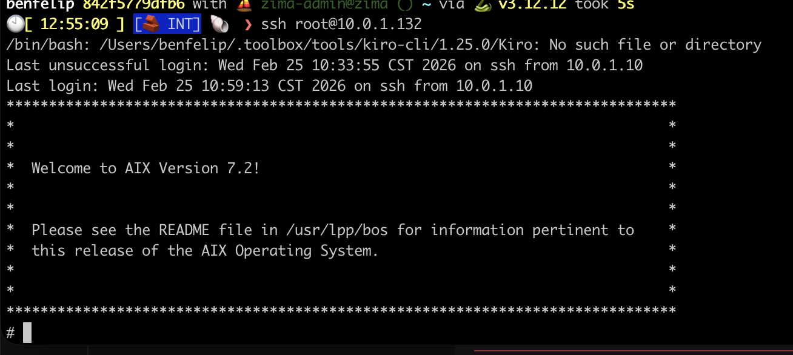
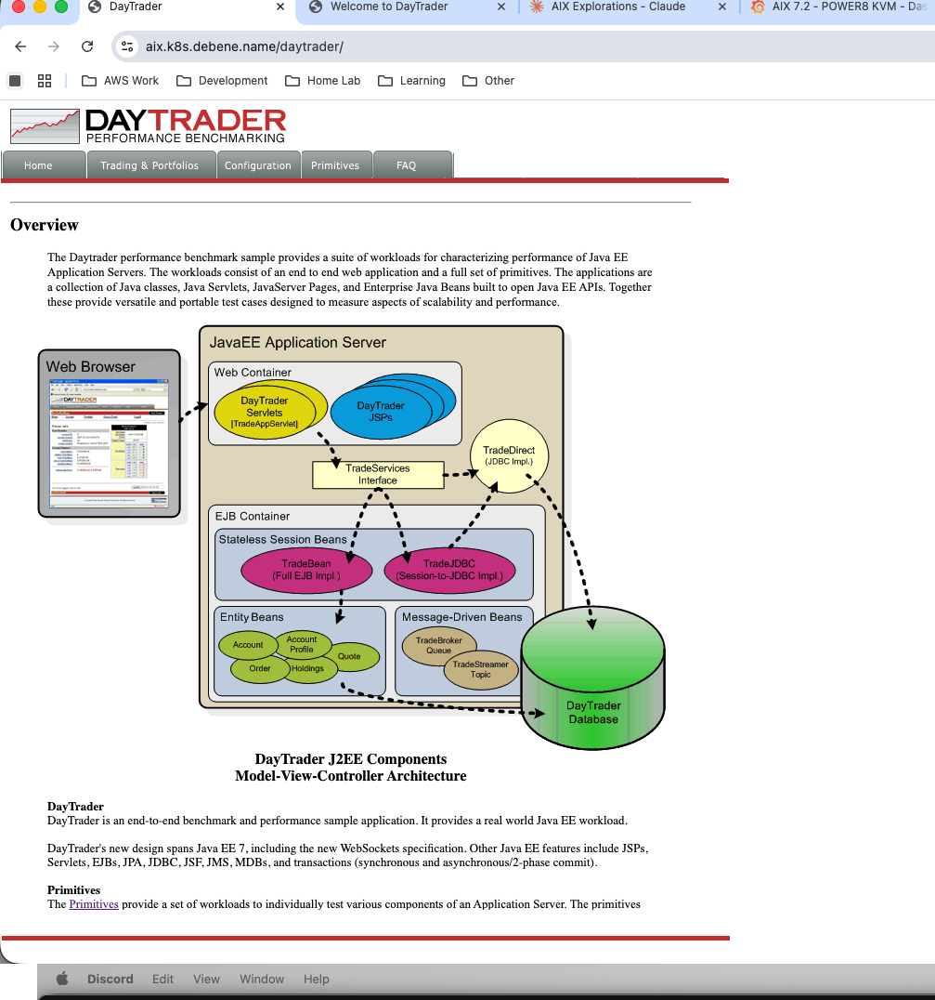
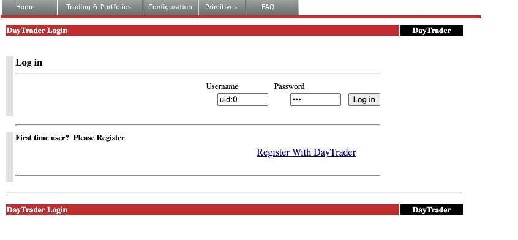
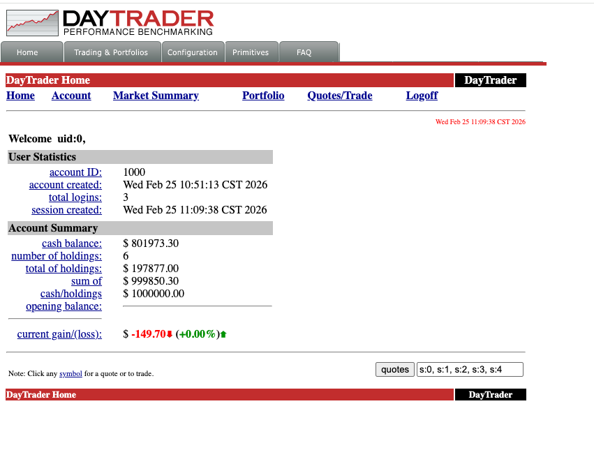
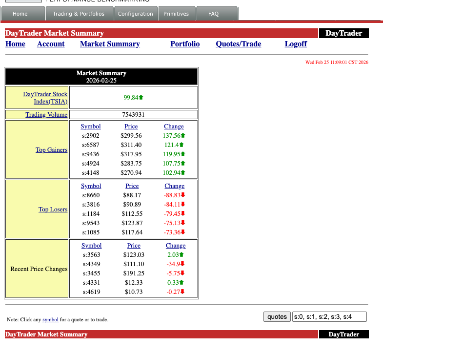
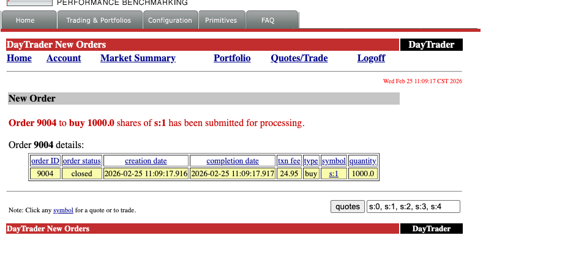
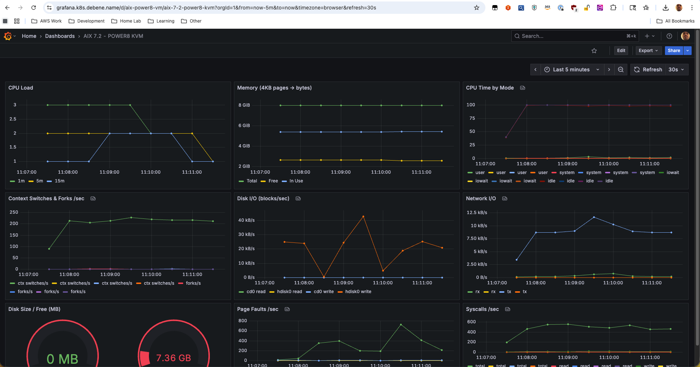

---

## Why Would Anyone Run AIX in 2026?

It's February 2026. I'm staring at an IBM S822 (8335-GCA) in my basement rack — a dual POWER8 server with 128GB of RAM and 20 cores that can do 160 threads with SMT8. This machine used to live in a datacenter running enterprise workloads. Now it runs Gentoo Linux.

Yes, **Gentoo**. On **ppc64le**. Compiled from source. All of it.

But Gentoo wasn't enough. I wanted to run the OS that this hardware was *designed* for — AIX. IBM's proprietary UNIX that still powers banks, airlines, and telecom companies around the world. The OS that most people have only seen in architecture diagrams. The OS that costs more to license than my car payment.

I had the hardware. I had an ISO. I had a weekend. How hard could it be?

## The Hardware: An IBM S822 in a Home Lab

Let me set the stage. This isn't a cloud VM or a Raspberry Pi experiment. This is an actual IBM POWER8 server:

- **Model**: IBM S822 (8335-GCA)
- **CPU**: Dual POWER8, 20 cores / 160 threads (SMT8), 3.49 GHz
- **RAM**: 128GB DDR3
- **Storage**: 444GB SSD + 477GB SATA SSD + 477GB NVMe
- **Firmware**: OPAL/Petitboot (OpenPOWER)
- **OS**: Gentoo ppc64le (kernel 6.17.7, compiled from source)

The S822 uses **Petitboot** as its boot loader — not GRUB, not UEFI in the traditional sense. Petitboot is a Linux-based firmware that runs as a kexec bootloader. You power on, you get a menu showing every bootable device, and you pick one. It's elegant, weird, and very IBM.

The machine also has a BMC (Baseboard Management Controller) on its own management network, giving me IPMI access for remote power control and serial-over-LAN. Enterprise hardware perks.

I already had three operating systems installed on different disks (Gentoo on the main SSD, Ubuntu 20.04 on the SATA, openSUSE Leap 15.6 on the NVMe), selectable at the Petitboot menu. But I didn't want to dedicate a disk to AIX — I wanted it in a VM, managed like any other workload.

## Step 0: Getting KVM Working on POWER8

QEMU and KVM support for ppc64 has been around for years, but there's a critical prerequisite that will trip you up immediately:

**You must disable SMT.**

```bash
sudo ppc64_cpu --smt=off
```

This takes your 160 threads down to 20 cores. KVM-HV on POWER8 doesn't support SMT — the hypervisor needs exclusive access to the hardware threads. If you forget this, QEMU will helpfully tell you:

```
error: kvm run failed Device or resource busy
This is probably because your SMT is enabled.
```

At least the error message is good.

On Gentoo, I compiled QEMU 10.2.0 from source (because of course I did — it's Gentoo). The relevant USE flags for ppc64 KVM support are straightforward, but make sure you have `qemu-system-ppc64` in the final build.

## The QEMU Incantation

Here's the command that actually works. Every flag was earned through trial and error:

```bash
sudo qemu-system-ppc64 \
  -cpu POWER8 \
  -machine pseries,cap-cfpc=broken,cap-ibs=broken,cap-ccf-assist=off \
  -enable-kvm \
  -m 8G \
  -smp 4,threads=1 \
  -serial mon:stdio \
  -drive file=aix72-disk.qcow2,if=none,id=drive-virtio-disk0 \
  -device virtio-scsi-pci,id=scsi \
  -device scsi-hd,drive=drive-virtio-disk0 \
  -cdrom aix_7200-04-02-2027_1of2_072020.iso \
  -netdev tap,id=net0,ifname=tap-aix,script=no,downscript=no \
  -device virtio-net-pci,netdev=net0 \
  -prom-env "input-device=/vdevice/vty@71000000" \
  -prom-env "output-device=/vdevice/vty@71000000" \
  -prom-env "boot-command=boot disk: -s verbose"
```

Let's break down the non-obvious parts:

### The Machine Capabilities

```
-machine pseries,cap-cfpc=broken,cap-ibs=broken,cap-ccf-assist=off
```

These flags disable CPU security mitigations that AIX expects to manage itself on real hardware. `cap-cfpc` (Cache Flush on Privilege Change) and `cap-ibs` (Indirect Branch Speculation) relate to Spectre/Meltdown protections. `cap-ccf-assist` disables the Count Cache Flush assist — AIX will complain about "DSO is not supported on KVM systems" but it's harmless. DSO (Dynamic System Optimizer) is an AIX feature that tunes system parameters on real LPARs; KVM can't provide the hardware interfaces it needs.

### The Serial Console: A Tale of Pain

```
-serial mon:stdio
-prom-env "input-device=/vdevice/vty@71000000"
-prom-env "output-device=/vdevice/vty@71000000"
```

This took an embarrassing amount of time to figure out. My first instinct was `-nographic`, which is what you'd use for any other QEMU VM. **It doesn't work with AIX on pseries.** The Open Firmware (OF) console needs explicit vty device assignment, and `-nographic` doesn't set up the right device tree entries.

The `prom-env` lines tell Open Firmware to use the virtual terminal device for I/O. Without them, you get a blank screen and no way to interact with the installer.

I run the whole thing inside a tmux session so I can detach and reattach:

```bash
tmux new-session -s aix 'sudo qemu-system-ppc64 ...'
```

One more gotcha: the console uses `\r` (carriage return) line endings. If you're sending commands via tmux scripting, remember that `Ctrl+M` = Enter, not `Ctrl+J`.

### Networking: Bridge vs SLIRP

I went with bridge networking to give the AIX VM a real IP on my LAN:

```bash
sudo ip link add br0 type bridge
sudo ip link set enP33p3s0f0 master br0
sudo ip tuntap add dev tap-aix mode tap
sudo ip link set tap-aix master br0
```

The interface name `enP33p3s0f0` is peak POWER8 — the PCI topology is different from x86, so you get these beautifully verbose predictable names.

With bridge networking, AIX gets a real LAN IP and I can SSH into it directly. SLIRP networking is simpler but has quirks — it silently drops ICMP (no ping!), and the DNS proxy responds from unexpected addresses that you have to discover by trial and error.

## Installing AIX: LED Codes and Patience

At the Open Firmware prompt, you type:

```
boot cdrom:
```

And then you wait. AIX installation shows its progress through **LED codes** — hex values like 0538, 0539, 0581. This is a holdover from when IBM machines had actual LED panels on the front. In a VM, they scroll by on the console.

LED code `0581` is the one that will make you think the install is frozen. It can sit there for 5-10 minutes. It's not frozen. It's doing filesystem initialization on what it thinks is a real SAN disk. Be patient.

The installer itself is a text-mode curses interface that hasn't fundamentally changed since the 1990s. Accept the license, choose your language, pick the default install options, and let it run. It took about 45 minutes on my setup.

## Post-Install: Welcome to 1995

After AIX boots for the first time, you're greeted with a Korn shell prompt and a system that has almost nothing installed. No curl. No wget. No package manager. No modern SSH. The default filesystems are comically small — `/tmp` is a few hundred megabytes, which will become a problem very soon.

First, networking:


*The moment it all became real. SSH into AIX 7.2, greeted by that glorious ASCII banner. Getting here meant understanding that Enter = Ctrl+M on the serial console. Small victories.*

```bash
mktcpip -h aix -i en0 -a 10.0.1.132 -m 255.255.255.0 -g 10.0.1.1
echo 'nameserver 10.0.1.7' > /etc/resolv.conf
startsrc -s sshd
```

`mktcpip` is AIX's equivalent of `ip addr add` + `ip route add` + hostname setup, all in one command. `startsrc` is the System Resource Controller — AIX's process manager, predating systemd by decades.

Then, grow the filesystems before doing anything else:

```bash
chfs -a size=+3000M /tmp
chfs -a size=+3000M /opt
chfs -a size=+2000M /var
```

In AIX, you don't format partitions — you ask the Logical Volume Manager to allocate more Physical Partitions to your Logical Volume. `chfs` is a one-liner that handles the LVM resize and filesystem grow in one shot. It's actually more elegant than the Linux `lvextend` + `resize2fs` two-step.

## Getting YUM Working: The sqlitecachec Saga

AIX doesn't have `dnf` or `apt`. IBM provides a community-maintained **AIX Toolbox for Open Source Software** with ~7,000 RPM packages. The package manager is... `yum`. Running on Python 2.7. In 2026.

To bootstrap it, you need to transfer files from another machine (remember, no curl/wget yet):

```bash
# From the Linux host:
scp rpm.rte yum_bundle.tar root@10.0.1.132:/tmp/

# On AIX:
installp -aYcgd /tmp/rpm.rte rpm.rte
cd /tmp && tar -xf yum_bundle.tar && cd yum_bundle && rpm -Uvh *.rpm
```

And then you run `yum repolist` and get:

```
TypeError: Parsing primary.xml error: Start tag expected, '<' not found
```

This is where most people give up. I almost did.

### The Root Cause

YUM's repository metadata comes as gzipped XML files (like `primary.xml.gz`). The Python module responsible for parsing these — `sqlitecachec.py` — delegates to a C extension (`_sqlitecache`) that reads the XML and populates a SQLite database. The problem: **the C extension can't decompress gzip files**. It expects raw XML, but it's being handed compressed data.

On x86 Linux, this works because the metadata is decompressed elsewhere in the pipeline. On AIX's build of yum, the decompression step is missing. The C extension tries to parse the gzip header as XML and fails.

### The Fix: A Python 2.7 Monkey-Patch

The solution is to replace `sqlitecachec.py` with a wrapper that decompresses `.gz` files before passing them to the C extension:

```python
import gzip, shutil

def _decompress_if_needed(location):
    if location and location.endswith('.gz'):
        decompressed = location[:-3]
        with gzip.open(location, 'rb') as f_in:
            with open(decompressed, 'wb') as f_out:
                shutil.copyfileobj(f_in, f_out)
        return decompressed
    return location
```

Wrap every `getPrimary`, `getFilelists`, and `getOtherdata` call with this function, and suddenly:

```bash
$ yum repolist
AIX_Toolbox_72                      6,486
AIX_Toolbox_noarch                    382
AIX_Toolbox_72_ppc                     43
repolist: 6,911
```

**6,911 packages.** I could have cried.

I've never found this fix documented anywhere online. If you're Googling "AIX yum TypeError primary.xml" at 2 AM, you're welcome.

## The OpenSSL 3.5 Disaster

With yum working, I needed OpenSSL 3.0 — most modern AIX Toolbox packages depend on `libssl.so.3` and `libcrypto.so.3`. IBM provides OpenSSL installp packages on their website.

I saw two versions available: 3.0.16 and 3.5.0. Newer is better, right?

**Wrong.**

OpenSSL 3.5 removes the backward-compatible shared objects (`libssl.so.1.0.2`, `libcrypto.so.1.1`). Installing it immediately broke:

- `curl` — segfault
- `yum` — can't import ssl module
- `python` — ssl module fails to load
- `ssh` — connection refused (sshd dies)
- `perl` — Net::SSLeay broken

Everything. Every tool that touches TLS. On a system where you can't download the fix because the download tools are broken.

This is why **snapshots are your religion**:

```bash
# BEFORE any risky operation:
shutdown -F  # clean AIX shutdown
qemu-img snapshot -c "pre-openssl" aix72-disk.qcow2

# AFTER the disaster:
qemu-img snapshot -a "pre-openssl" aix72-disk.qcow2
```

I restored the snapshot, installed **OpenSSL 3.0.16** instead, and verified that both old and new libraries coexist peacefully:

```bash
$ ar -tv /usr/lib/libssl.a
libssl.so.1.0.2    # keeps yum/curl/python2 working
libssl.so.1.1      # intermediate
libssl.so.3        # modern packages
```

AIX uses **archive libraries** (`.a` files containing multiple `.so` members) — a concept that feels alien if you're used to Linux's simple symlink chains. The `ar` command shows what's inside, and all three generations of OpenSSL need to coexist.

## What's Different About AIX

For anyone coming from Linux, here's what feels alien:

**Everything is an Object.** Devices, filesystems, network interfaces — they're all managed through the Object Data Manager (ODM). Commands like `lsdev`, `mkdev`, `chdev` query and modify a binary database, not text config files.

**The Logical Volume Manager is king.** LVM on AIX is mature, elegant, and deeply integrated. `chfs` to grow a filesystem is a one-liner. Mirroring, striping, journaling — it's all built-in and it just works.

**System Resource Controller (SRC)** manages services. `startsrc -s sshd`, `stopsrc -s sshd`, `lssrc -s sshd`. No systemd, no init scripts to chase down.

**`smitty`** is the curses-based admin tool that AIX sysadmins either love or have Stockholm syndrome about. It generates commands for you and logs everything to `/smit.log`. It's genuinely useful for learning what commands to run.

**`installp`** is the native package manager (predating RPM by years). It handles filesets, applies technology levels, and can commit or reject updates. RPM and yum are the "open source layer" sitting on top.

## The Bigger Picture

I'm running AIX 7.2 inside a KVM VM on a Gentoo ppc64le host, on actual IBM POWER8 hardware, in my basement in Chicago. The host also runs Puppet, exports Prometheus metrics, and participates in my Kubernetes homelab's monitoring stack.

Is this practical? Not really. Is it valuable? Absolutely.

AIX is still running in production at banks processing millions of transactions daily. It's running at airlines managing flight systems. It's in hospitals, government agencies, and telcos. But the knowledge of how to run, manage, and troubleshoot these systems is aging out of the workforce. The sysadmins who built these environments are retiring, and the younger generation has never touched anything that isn't Linux or cloud-native.

By documenting this process — the real process, with the bugs and the workarounds and the 2 AM debugging sessions — maybe one fewer person has to discover the sqlitecachec bug on their own.

## The Grand Finale: Enterprise Java on AIX

At this point I had a working AIX system with networking, package management, and OpenSSL. A perfectly functional UNIX box doing absolutely nothing useful. Time to fix that.

The goal: run a real Java EE application. Not a hello-world servlet — a full enterprise workload with EJBs, JPA, JMS, message-driven beans, the works. The kind of application that AIX was *built* to run.

### IBM Java 8 for AIX

AIX doesn't run OpenJDK. It runs **IBM Java** — IBM's own JVM implementation optimized for POWER architecture. IBM provides Java 8 SDK for AIX as an installp package from their developer site.

```bash
# Transfer from Linux host
scp IBMJava8_ppc64_aix_sdk_8.0-8.25.tar.Z root@10.0.1.132:/tmp/

# On AIX
cd /tmp
uncompress IBMJava8_ppc64_aix_sdk_8.0-8.25.tar.Z
tar -xf IBMJava8_ppc64_aix_sdk_8.0-8.25.tar
installp -aYcgd . Java8_64.*
```

```bash
$ java -version
java version "1.8.0_421"
Java(TM) SE Runtime Environment (build ppc64aix-8.0.8.25)
IBM J9 VM (build 2.9, JRE 1.8.0 AIX ppc64-64)
```

The **J9 VM**. IBM's high-performance JVM that's been tuned for POWER hardware for over two decades. This is the JVM that runs the world's largest banks and airlines. And now it's running in my basement.

### WebSphere Liberty: The Modern Classic

WebSphere Application Server is the backbone of enterprise Java on IBM platforms. The full-fat "traditional" WebSphere is a behemoth — but **WebSphere Liberty** is its modern, lightweight counterpart. Same enterprise Java EE compliance, fraction of the footprint. It starts in seconds instead of minutes.

IBM provides Liberty for AIX as a zip download. No installer wizardry needed:

```bash
# Transfer from Linux host
scp wlp-javaee8-26.0.0.2.zip root@10.0.1.132:/opt/

# On AIX
cd /opt
jar -xf wlp-javaee8-26.0.0.2.zip   # or unzip if you installed it
```

That's it. Liberty is now at `/opt/wlp`. The entire application server — Java EE 8 Full Platform — in a single directory.

#### Configuring Liberty

Liberty uses a single XML config file. No WebSphere admin console clicking through 47 tabs. No wsadmin Jython scripts. Just XML:

```xml
<!-- /opt/wlp/usr/servers/defaultServer/server.xml -->
<server description="DayTrader on AIX">
    <featureManager>
        <feature>javaee-8.0</feature>
    </featureManager>

    <httpEndpoint id="defaultHttpEndpoint"
                  host="*"
                  httpPort="9080"
                  httpsPort="9443" />

    <application location="daytrader-ee7.ear"
                 type="ear"
                 context-root="/daytrader" />

    <dataSource id="TradeDataSource" jndiName="jdbc/TradeDataSource">
        <jdbcDriver libraryRef="DerbyLib"/>
        <properties.derby.embedded databaseName="${server.config.dir}/tradedb"
                                    createDatabase="create"/>
    </dataSource>

    <library id="DerbyLib">
        <fileset dir="${shared.resource.dir}/derby" includes="*.jar"/>
    </library>
</server>
```

A full Java EE 8 application server configured in 20 lines of XML. Try doing that with traditional WebSphere.

#### Starting Liberty

```bash
$ /opt/wlp/bin/server start defaultServer
Starting server defaultServer.
Server defaultServer started with process ID 12648.
```

From cold start to accepting HTTP requests: **under 10 seconds**. On a KVM VM. On POWER8. Running AIX. The J9 JVM's startup optimization is genuinely impressive.

### DayTrader: A Real Enterprise Workload

DayTrader is Apache's end-to-end benchmark for Java EE application servers. It simulates an online stock trading platform with:

- **Servlets and JSPs** — the web tier (Web 1.0 glory, complete with that classic early-2000s UI)
- **Stateless Session Beans** — business logic (TradeBean, TradeJDBC)
- **Entity Beans** — persistence layer (Account, AccountProfile, Quote, Order, Holdings)
- **Message-Driven Beans** — async order processing via JMS (TradeBrokerQueue, TradeStreamerTopic)
- **JDBC direct mode** — bypassing EJB for performance comparison
- **Database** — Apache Derby embedded (or DB2, but let's not push our luck)

It's not a toy benchmark. It exercises the full Java EE stack — servlets, EJBs, JPA, JMS, JDBC, transactions (synchronous and 2-phase commit), WebSockets, and JSF. If your app server can run DayTrader, it can run real enterprise workloads.

#### Database Pre-Seeding

DayTrader ships with a database builder that creates the schema and populates it with test data — users, accounts, stock quotes, holdings. Hit the Configuration page, click "(Re)-create DayTrader Tables and Indexes", and watch it populate:

```
DayTrader tables and indexes created successfully.
DayTrader data populated: 200 users, 400 accounts, 10000 quotes.
```

#### The Moment of Truth

Navigate to `http://aix.k8s.debene.name/daytrader/` and there it is — the DayTrader architecture overview, complete with a component diagram that looks like it was made in Visio circa 2004:


*DayTrader's J2EE component architecture. Web Container, EJB Container, Message-Driven Beans, Entity Beans — the full enterprise stack.*

A fully functional stock trading application rendered in gloriously unstyled early-2000s HTML. Tables everywhere. Red and green stock tickers. A login page that would make a modern UX designer weep:


*The DayTrader login page. Username: `uid:0`. Password: `xxx`. Security was... different in 2005.*

Log in, and you're greeted with your account dashboard — $801K in cash, 6 holdings, and already down $149.70. Even in a fake market, I'm losing money:


*Account summary for uid:0. Cash balance: $801,973.30. Current gain/loss: -$149.70. The EJB container doesn't care about your P&L.*

Click through to Market Summary and the stock tickers come alive. Top gainers, top losers, recent price changes — all computed in real-time by the Java EE backend:


*Market Summary for 2026-02-25. TSIA index: 99.84↑. Trading volume: 7,543,931. The DayTrader stock exchange is open for business on AIX.*

Buy 1,000 shares of s:1 and watch the full transaction pipeline fire — EJB → JPA → JMS → Derby — and complete in **one millisecond**:


*Order 9004: buy 1,000 shares of s:1. Created at 11:09:17.916, completed at 11:09:17.917. One millisecond. The IBM J9 VM on POWER8 doesn't mess around.*

The full Java EE machinery, humming along on an operating system and hardware architecture that most developers have never touched.

## The Full Stack

Let's take a step back and appreciate what's actually running here:

```
Physical Hardware:  IBM S822 (POWER8, 20 cores, 128GB RAM)
    └─ Host OS:     Gentoo Linux ppc64le (kernel 6.17.7, compiled from source)
        └─ KVM:     QEMU 10.2.0 (pseries machine type, KVM-HV acceleration)
            └─ Guest OS:    AIX 7.2 TL4 SP2
                └─ JVM:     IBM J9 (Java 8, POWER-optimized)
                    └─ App Server: WebSphere Liberty 26.0.0.2 (Java EE 8)
                        └─ Application: Apache DayTrader (EJBs, JPA, JMS, Servlets)
                            └─ Database: Apache Derby (embedded)
```

Seven layers deep. Real hardware, real hypervisor, real enterprise OS, real JVM, real app server, real application. Every layer is the one that IBM designed and optimized for this exact hardware platform.

And it's running in a basement in Chicago, accessible at `aix.k8s.debene.name` through a reverse proxy on a Kubernetes cluster that's *also* running on this home network.

## The Modern Touch: Prometheus Meets POWER8

Here's where it gets delightfully absurd. The same IBM POWER8 host running Gentoo — the one providing KVM for our AIX VM — is also exporting metrics to a Prometheus instance running on a Kubernetes cluster. The same home network. The same HTTP protocol.

```yaml
# prometheus scrape config
- job_name: 'p8-power8'
  static_configs:
    - targets: ['10.0.1.102:9100']  # node_exporter
- job_name: 'p8-processes'
  static_configs:
    - targets: ['10.0.1.102:9256']  # process-exporter
```

There's a custom Grafana dashboard — "P8 POWER8 - Compile Monitor" — tracking CPU usage across all 20 POWER8 cores, memory consumption, disk I/O, and individual process metrics. When the AIX VM is running DayTrader under load, you can watch the KVM overhead in real-time on a modern observability stack.

Think about that for a moment:

- **1995**: AIX ships with `topas` and `nmon` for performance monitoring
- **2005**: DayTrader uses HTTP servlets to render stock trades in HTML tables
- **2026**: Prometheus scrapes the same machine over HTTP, Grafana renders it in React dashboards

Three decades of technology. The transport layer hasn't changed. It's still `GET /metrics HTTP/1.1`. The same protocol that serves DayTrader's gloriously unstyled JSP pages is the one feeding real-time telemetry into a modern observability pipeline.

HTTP didn't win because it was the best protocol. It won because it was good enough, simple enough, and universal enough to outlast everything built on top of it. The DayTrader servlets from 2005 and the Prometheus exporter from 2026 speak the same language. And somewhere in between, an entire industry reinvented itself three times over while the humble `GET` request kept on working.

The Grafana dashboard showing POWER8 core utilization while an AIX VM runs Enterprise Java beans — that's not just monitoring. That's a timeline of computing, rendered in a single browser tab.


*The "AIX 7.2 - POWER8 KVM" Grafana dashboard. CPU load, memory pages, per-vCPU time breakdown, context switches, disk I/O (cd0 + hdisk0), network throughput, page faults, syscalls/sec — all scraped from inside the AIX VM via node_exporter, visualized in a 2026 observability stack. Three decades of technology in one browser tab.*

## Why This Matters

This isn't nostalgia for nostalgia's sake. 

AIX and POWER still run in production at organizations that can't afford downtime — banks processing millions of transactions, airlines managing flight systems, hospitals running patient records, government agencies, telecom billing systems. These are workloads that have been running for 15, 20, sometimes 25 years without a fundamental architecture change.

But the knowledge is disappearing. The sysadmins who built these environments are retiring. The engineers who understand J9 tuning on POWER, or AIX LVM mirroring, or WebSphere clustering — they're leaving the industry. And the younger generation has never seen anything that isn't Linux, Kubernetes, or a cloud-managed service.

By documenting this process — the real process, with the sqlitecachec bug and the OpenSSL disaster and the serial console pain — maybe one fewer person has to figure it out alone at 2 AM. And maybe one more person discovers that there's an entire world of computing beyond x86 and Linux that's still alive, still running, and still fascinating.

The DayTrader UI might look like Web 1.0, but the engineering underneath it? That's timeless.

---

*Felipe De Bene is a Senior Cloud Architect who runs a homelab that's more complex than most production environments. He can be found arguing about IPv6 dual-stack configurations, compiling Gentoo on exotic hardware, and running enterprise Java on an IBM POWER8 server in his basement. In 2026.*
