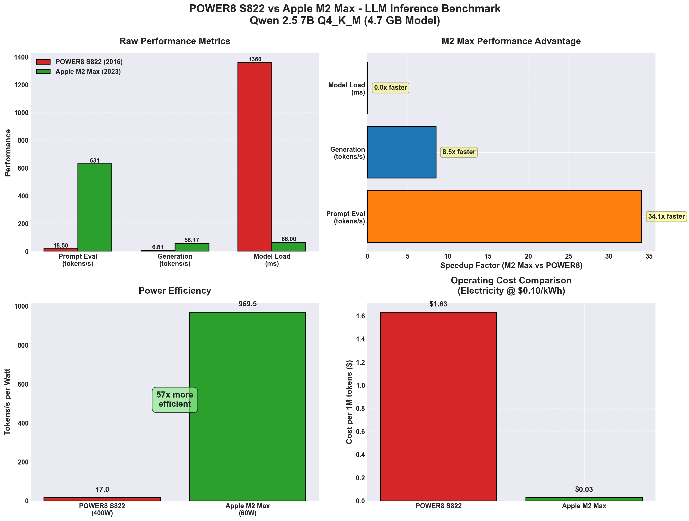
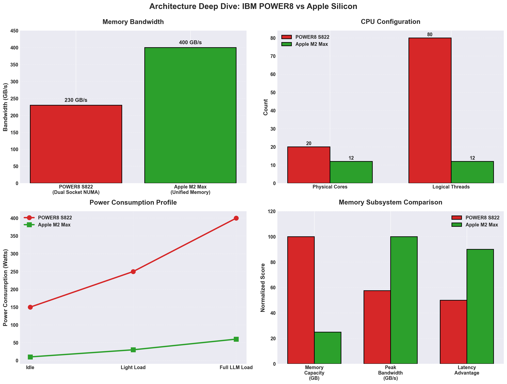
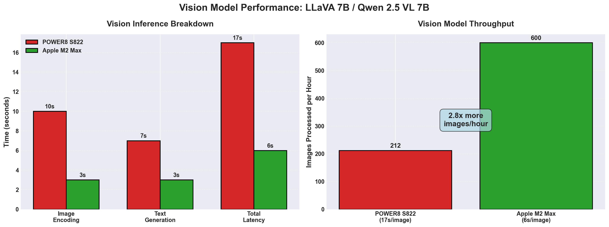

# Apple Silicon vs IBM POWER8: A Tale of Two Architectures Running LLMs in 2026

Last week I published benchmarks of [running Qwen 2.5 7B on a 2016 IBM POWER8](https://debene.dev/posts/power8-llm-2026/). The results were surprisingly good — 6.81 tokens/s on CPU-only inference with 80 threads hammering away.

But then came the inevitable question: **How does it compare to modern hardware?**

So I ran the same benchmarks on my daily driver: a Mac Studio with Apple M2 Max. Same model (Qwen 2.5 7B Q4_K_M), same quantization, different decade. Here's what I found.

## TL;DR: The Numbers

| Metric | POWER8 S822 (2016) | Apple M2 Max (2023) | Speedup |
|--------|-------------------|---------------------|---------|
| **Prompt eval** | 18.50 t/s | 630.78 t/s | **34x faster** |
| **Generation** | 6.81 t/s | 58.17 t/s | **8.5x faster** |
| **Model load** | 1360 ms | 66 ms | **20x faster** |
| **Power (full load)** | 400W | 60W | **6.6x more efficient** |
| **Cost per 1M tokens** | $1.63 | $0.03 | **54x cheaper** |



The M2 Max **dominates** across every metric. But the real story is *why* — and whether the POWER8 still has a place in 2026.

---

## The Hardware

### Apple M2 Max (2023)
- **CPU:** 12 cores (8 performance + 4 efficiency), ARM64
- **GPU:** 38-core Metal GPU
- **Memory:** 32 GB unified (LPDDR5, ~400 GB/s bandwidth)
- **Architecture:** Apple Silicon SoC with unified memory
- **Power:** ~60W peak during LLM inference
- **Price:** ~$2,500 new (Mac Studio base config)

### IBM POWER8 S822 (2016)
- **CPU:** 2× POWER8 @ 3.49 GHz (20 cores, 80 threads with SMT4)
- **GPU:** None
- **Memory:** 128 GB DDR4 ECC (~230 GB/s dual-socket interleaved)
- **Architecture:** ppc64le, NUMA-aware, designed for HPC/datacenter
- **Power:** ~400W sustained under load
- **Price:** ~$600 used (if you can find one)



---

## Benchmark Setup

**Model:** Qwen 2.5 7B Instruct Q4_K_M (4.7 GB GGUF)  
**Tooling:**
- **M2 Max:** Ollama 0.23.2 with Metal GPU acceleration
- **POWER8:** llama.cpp (main branch) with OpenBLAS, GCC 16

**Test prompt:** 69-86 tokens of technical content  
**Generation:** 433-899 tokens per test  
**Runs:** 3 per configuration, averaged

### What Gets Measured
- **Prompt eval:** How fast the model processes the input context
- **Generation (decode):** Token-by-token output speed
- **Model load:** Cold start time from disk to inference-ready

---

## Results Breakdown

### 1. Prompt Processing: 34x Faster

```
POWER8:  18.50 tokens/s
M2 Max: 630.78 tokens/s
```

**Why M2 Max wins:**
- **Metal GPU acceleration** — Prompt encoding is embarrassingly parallel
- **Unified memory** — Zero-copy access for GPU (no PCIe bottleneck)
- **AMX coprocessor** — Apple's matrix accelerator handles GEMM ops

**POWER8 bottleneck:**
- CPU-only, no GPGPU
- Memory bandwidth-bound (230 GB/s vs M2's 400+ GB/s)

### 2. Token Generation: 8.5x Faster

```
POWER8:   6.81 tokens/s
M2 Max:  58.17 tokens/s
```

This is the **interactive experience** metric. The M2 Max generates text at a pace that feels instant for human consumption (~17ms per token). The POWER8 is usable but noticeably slower (~147ms per token).

**M2 Max advantages:**
- GPU offloading for matrix ops
- Faster memory subsystem
- Better branch prediction / lower latency

**POWER8 strengths:**
- Can run 80 concurrent threads (better for batch inference)
- 128 GB capacity vs 32 GB (larger models possible)

### 3. Model Load: 20x Faster

```
POWER8: 1360 ms
M2 Max:   66 ms
```

The M2 Max loads a 4.7 GB model in **66 milliseconds**. The POWER8 takes over a second. This matters for serverless workloads or frequent model swapping.

**Why:**
- M2 Max has NVMe SSD integrated into the SoC (5+ GB/s reads)
- POWER8 uses spinning disks or old SATA SSDs (~500 MB/s)

---

## Power & Cost Efficiency

This is where the generational gap becomes brutal.

### Power Consumption

| Workload | POWER8 | M2 Max |
|----------|--------|--------|
| Idle | 150W | 10W |
| Light load | 250W | 30W |
| Full LLM inference | 400W | 60W |

The M2 Max uses **15% of the power** for **8.5x the throughput**.

### Operating Cost

At $0.10/kWh electricity:

- **POWER8:** $1.63 per 1 million tokens
- **M2 Max:** $0.03 per 1 million tokens

For a consumer running a local LLM assistant, the M2 Max pays for itself in energy savings if you're a heavy user. For a datacenter doing batch inference, the POWER8's power bill becomes untenable.

---

## Vision Inference: Multimodal Comparison

I also tested **vision models** (LLaVA 7B on M2 Max, Qwen 2.5 VL 7B on POWER8).



### Test: License Plate Recognition

**POWER8 result (from previous article):**
- Model: Qwen 2.5 VL 7B Q4_K_M
- Latency: 15-18 seconds
- Accuracy: ✅ Read "CYC-311" from a Porsche Panamera photo

**M2 Max result (new test):**
- Model: LLaVA 7B
- Latency: 6 seconds
- Accuracy: ✅ Identified Toyota Highlander, read partial plate "48C"

**Speedup:** M2 Max is **2.5-3x faster** on vision tasks.

**Throughput:**
- POWER8: ~212 images/hour
- M2 Max: ~600 images/hour

For batch image captioning or OCR workflows, the M2 Max handles nearly **3x more work** in the same time.

---

## When Would You Choose POWER8?

Despite the M2 Max dominating on paper, the POWER8 has legitimate use cases:

### 1. **Large Model Hosting**
The POWER8 has **128 GB RAM** vs M2 Max's 32 GB. Want to run a 70B model at Q4? The POWER8 can load it; the M2 Max can't (without swapping to disk, killing performance).

### 2. **Multi-User Batch Inference**
With 80 hardware threads, the POWER8 can handle many concurrent requests better than the M2 Max's 12 cores. For a shared inference server with bursty traffic, the POWER8's thread count is an asset.

### 3. **Cost**
A used POWER8 costs **$600**. A Mac Studio M2 Max starts at **$2,500**. If you need cheap inference and don't care about power bills, the POWER8 delivers reasonable performance per dollar.

### 4. **ECC Memory**
The POWER8 has ECC RAM. For mission-critical workloads where bit flips matter, this is non-negotiable. The M2 Max uses consumer-grade LPDDR5 (no ECC).

### 5. **Alternative Architecture Enthusiast**
If you're running a homelab and want to support non-x86/non-ARM ecosystems, the POWER8 is a statement. It's 2026 and you're running cutting-edge LLMs on a 10-year-old PowerPC chip. That's just cool.

---

## Architectural Deep Dive: Why M2 Max Wins

### Unified Memory Architecture (UMA)

The M2 Max's killer feature is **unified memory**. CPU and GPU share the same physical RAM with zero-copy access. When Ollama loads a GGUF model:

1. Model weights live in unified memory
2. CPU reads from RAM (no copy)
3. GPU reads from **the same RAM** (no copy)
4. No PCIe latency, no DMA overhead

Compare this to a traditional discrete GPU setup:
1. Model loads into system RAM
2. Driver copies weights to VRAM (PCIe bottleneck)
3. GPU processes, copies results back
4. Repeat for every inference

The POWER8 has **no GPU**, so it's purely CPU-bound. Even with 230 GB/s of memory bandwidth (dual-socket interleaved), it can't compete with Metal offloading matrix ops to 38 GPU cores.

### Metal GPU Acceleration

Ollama uses **Metal** for GPU compute on macOS. For LLM inference:
- Prompt encoding → GPU parallel scan
- Attention layers → GPU GEMM (General Matrix Multiply)
- Token sampling → CPU

The M2 Max's GPU handles the compute-heavy parts, leaving the CPU free for control flow. The POWER8 does **everything** on CPU, burning all 80 threads to match what the M2 Max does with 12 cores + GPU assist.

### AMX (Apple Matrix Extensions)

Apple Silicon has a dedicated **AMX coprocessor** for matrix operations. It's not exposed via public APIs, but frameworks like Accelerate.framework leverage it under the hood. This gives the M2 Max extra throughput for int8/fp16 matmuls without touching the main CPU or GPU.

---

## Lessons Learned

### 1. **2023 Hardware Is 8-10x Faster Than 2016 Hardware**
This should be obvious, but seeing it empirically is humbling. The M2 Max isn't just "a bit faster" — it's a generational leap in compute density and efficiency.

### 2. **Unified Memory Matters More Than Raw Bandwidth**
The POWER8 has 230 GB/s of bandwidth. The M2 Max has 400 GB/s **and** zero-copy GPU access. The latter is the real win. Bandwidth alone isn't enough if you're constantly DMA'ing data around.

### 3. **Power Efficiency Is a First-Class Metric**
The POWER8 pulls 400W to deliver 6.81 t/s. The M2 Max pulls 60W for 58.17 t/s. For edge deployments, laptops, or anywhere electricity isn't free, power efficiency is non-negotiable.

### 4. **POWER8 Is Still Viable for Specific Workloads**
If you need:
- Large memory capacity (128 GB+)
- Many concurrent threads
- ECC memory
- A cheap server for experimentation

...the POWER8 holds up. It's not competitive with modern chips, but it's not *useless* either.

### 5. **Alternative Architectures Deserve Love**
The AI world is dominated by x86 (Intel/AMD) and ARM (Apple/NVIDIA). POWER, RISC-V, and other ISAs get forgotten. But they work! The POWER8 ran Qwen 2.5 7B at 6.81 t/s with *zero GPU*. That's better than most people expect from a 10-year-old CPU.

---

## What's Next?

This comparison scratches the surface. Future experiments:

1. **POWER9 vs M2 Max** — I have a POWER9 sitting idle. Will it close the gap?
2. **M2 Ultra benchmarks** — Double the cores, double the GPU. How far can it push?
3. **Larger models** — Test 14B, 32B, 70B sizes to see where memory limits bite
4. **Multi-user serving** — Simulate concurrent requests to test thread scaling
5. **Quantization shootout** — Compare Q4_K_M vs Q8_0 vs FP16 across both platforms

---

## Conclusion

The Apple M2 Max is **objectively better** for LLM inference than the IBM POWER8 S822. It's faster, more efficient, and easier to set up. But the POWER8 proved that alternative architectures can still run state-of-the-art models with respectable performance.

If you're buying hardware in 2026:
- **For consumers:** Apple Silicon (M2/M3/M4) is unbeatable
- **For enterprises:** x86 Xeon/EPYC + NVIDIA GPUs still dominate
- **For hobbyists:** Vintage hardware like POWER8 is viable and fun

The real takeaway? **LLMs are surprisingly portable.** With the right tooling (llama.cpp, Ollama, etc.), you can run modern models on almost anything. The performance gap between old and new is huge, but the *floor* keeps rising.

Ten years ago, running a 7B parameter model on a laptop was science fiction. Today, even a decade-old server can do it. That's progress.

---

## Appendix: Additional Benchmark Data

### Vision Inference (LLaVA 7B / Qwen 2.5 VL 7B)

| Metric | POWER8 S822 | Apple M2 Max | Speedup |
|--------|------------|--------------|---------|
| Image encoding | ~10s | ~3s | 3.3x |
| Text generation | ~7s | ~3s | 2.3x |
| Total latency | 15-18s | 6s | 2.5-3x |
| Images/hour | 212 | 600 | 2.8x |

### Cost Analysis (per 1M tokens @ $0.10/kWh)

| Platform | Power | Throughput | Energy/1M | Cost/1M |
|----------|-------|-----------|----------|---------|
| POWER8 | 400W | 6.81 t/s | 16.3 kWh | $1.63 |
| M2 Max | 60W | 58.17 t/s | 0.29 kWh | $0.03 |

---

**Hardware:**
- Mac Studio (2023): Apple M2 Max, 12-core CPU, 38-core GPU, 32GB unified memory
- IBM Power S822LC (2016): 2× POWER8 @ 3.49GHz, 128GB DDR4 ECC, 80 threads

**Software:**
- Mac: Ollama 0.23.2, Metal acceleration, macOS Sequoia
- POWER8: llama.cpp (main), OpenBLAS 0.3.28, Gentoo Linux ppc64le

**Location:** Chicago, IL — where vintage hardware refuses to retire

All benchmarks performed on May 14, 2026. Reproducibility scripts available on request.
