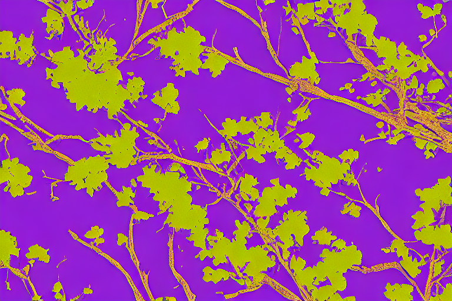
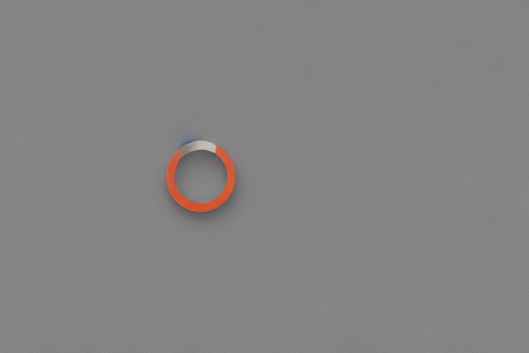
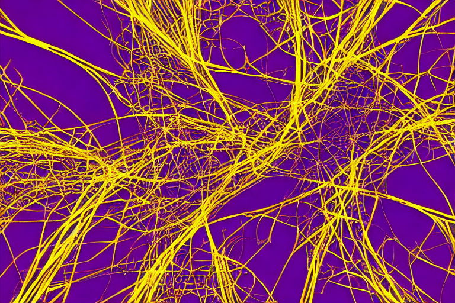
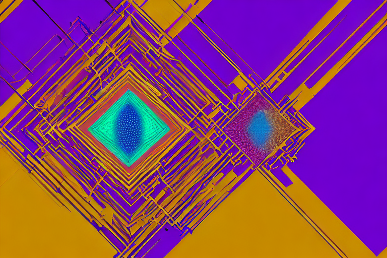

My laptop has a `~/projects` folder. Most of it is a graveyard. Not because the ideas were bad — I'd still build some of them if I sat down today. They're dead because I get excited by a technical problem, work on it for two weekends, hit the part that stops being fun, and drift to the next thing. The codebase stays. The git log doesn't.

I'm 40, a Cloud Architect with ~18 years across IBM and AWS, and I have ADHD. Diagnosed late, lived with it longer. The pattern above isn't laziness — it's a specific shape of attention. Hyperfocus until the dopamine of novelty runs out, then gravitational pull toward whatever's next. Anyone with this wiring recognizes the feeling: the moment a project transitions from "fun problem" to "ten unsexy decisions in a row," part of your brain leaves the room.

This is about a tarot reading app I built called [askthedeck](https://ask.debene.dev) — but really it's about the fact that I *finished* it. And what finishing looked like was using Claude not as a coding accelerator but as a brake.

## The boring middle

Every project has a moment where it stops being interesting. For askthedeck, that moment came when the LLM prompt worked and the basic flow was shippable. The reading text came out beautifully — moody, evocative, screenshot-worthy. I could've called it done.

But there were ~15 unsexy decisions left between "works on my machine" and "actually a product":

- The astrology calculations were mathematically wrong. The moon sign formula was the sun's formula with a fixed 13-day offset, which has no astronomical basis. Output looked plausible. It wasn't.
- The prompt actively asked the LLM for "cosmic weaving" and "shadow and light integration," and the model dutifully delivered. I'd built a cliché generator.
- Storage was Cloudflare KV with one-hour TTL — fine for ephemeral jobs, hostile to persistence.
- Custom domains, locales, share links, donation flow, analytics, privacy. Each one 90 minutes of work that was 5% interesting and 95% chore.

Past me would've stopped here. Posted a screenshot on Twitter, wrote "v0.1 shipped 🚀" as a flag plant, and moved on. The app would be online but unfinished forever.

## What Claude actually did

I used Claude through this entire stretch, but not the way the AI demos sell it. I didn't ask it to generate the app. I didn't vibe-code my way through. The code is mine, the architecture is mine, the decisions are mine.

What Claude did was narrower and, for me, more useful: it absorbed the impulse to expand.

ADHD is, among other things, an expansion engine. Every five minutes my brain produces a new exciting tangent. *What if I added Italian and French? What if cookie identity merged across devices via magic link? What if there was a star rating? What if the modal pulsed gently with the moon phase?* Each would've been fun to build. Each would've added two days of work and pushed shipping further out. Each would've been a perfect off-ramp into the next project, leaving askthedeck 80% done forever.

Every time one of those impulses fired, I'd describe it to Claude. And here's the part I didn't expect: Claude pushed back more often than it agreed.

When I asked about a star rating system, the response was a thorough argument for why ratings would damage the product — pulling it toward cold reading optimization and breaking the tone I'd built. When I suggested using request metadata (city, timezone, time of day) to make readings feel more accurate, the response was a flat ethical no: that's automated cold reading, it destroys trust when discovered, don't. When I wanted to add three more languages at once, the response was "pick the three you started with, ship those, talk to me later."

Claude wasn't being conservative for its own sake. It was treating my impulses the way a good collaborator does — taking them seriously enough to interrogate them, instead of validating them to keep me happy. I'd describe the new shiny thing, Claude would walk through what it would cost, what it would compromise, and what was actually more valuable. About 70% of the time I'd come out agreeing the impulse was bad. The other 30% I'd push back, defend it, and we'd refine it into something smaller.

For ADHD specifically, this is the missing piece. The problem isn't generating ideas; the problem is the absence of friction between idea and execution. Every "yes, and..." voice fires immediately; the "wait, should we?" voice is depleted. Claude became an externalized version of that second voice — patient, available at 11pm, never bored, never social-pressured into agreement.

## The decisions that came out of that

The version of askthedeck that shipped is meaningfully different from the version I'd have shipped solo:

**The astrology actually works.** Moon sign comes from real ephemerides, the calculation has an internal sanity check that warns if moon phase and sun-moon angular distance disagree. I'd have shipped the broken version.

**The LLM prompt has an explicit anti-patterns section.** It bans hedging with "perhaps X, or Y, or Z," bans empty stock phrases ("dark night of the soul," "spiritual download"), bans promising specific outcomes within timeframes, and bans resolving card tensions with "combine them" — when two cards conflict, the model has to name the conflict. The readings got noticeably better. I'd have shipped the cliché version.

**There is no IP geolocation in the prompt.** No `request.cf.city`, no timezone, no time-of-day. The prompt actively forbids the model from referencing anything the user didn't tell it. Trivially easy to add; chose not to. I'd have shipped the version where readings felt magically accurate because they were quietly using location data. Many similar apps do this. I think it's gross. Claude agreed and was articulate about why, which made it easier to hold the line.

**There's no post-reading donation modal.** We designed one, talked it through, and killed it in favor of a permanent header link and a dedicated `/apoiar` page with honest cost transparency. The page tells you exactly how much each reading costs in API calls and what donations do and don't unlock (answer: nothing functional). I'd have shipped the modal version and felt slightly slimy about it.

**Analytics are self-hosted in D1.** Reader IDs are SHA-256 hashed before insert, events are purged after 90 days, no third-party trackers. The privacy notice describes exactly what's collected, in three languages. I'd have shipped with Google Analytics and a vague "we use cookies" banner.

## What this isn't

It's not "AI ended my ADHD." I still have ADHD. Tomorrow I'll start another project, get bored, and want to abandon it. The pattern doesn't dissolve because I shipped one app.

It's not "Claude is my therapist." It isn't, it shouldn't be, and the moments in this project where I leaned on it for that were the moments I had to course-correct.

It's not even a recommendation to everyone with ADHD. People's wiring is different. Some people with ADHD would find Claude's pushback exhausting rather than helpful. Some would route around it. For me, the specific combination — patient counterweight, technically literate, no social cost to disagreeing with me — fit a gap I didn't know how to fill any other way.

What it is: one project, finished. The thing I usually don't do.

## The technical post is also coming

If you're here for the architecture — Cloudflare Workers + D1 + KV, custom domains across three locales, DeepSeek for generation, an embarrassingly simple async job pattern that solves a 60-second LLM latency problem — that's the next post. The decisions are interesting on their own merits, and I want to write about them without folding everything under the ADHD lens.

But I wanted to write this first, because the technical post would be dishonest without it. The architecture is good because I had a brake. The brake came from a tool. The tool happened to be Claude.

Worth saying out loud.

---

**[askthedeck](https://ask.debene.dev)** · **[repo](https://github.com/felipedbene/askthedeck)**
