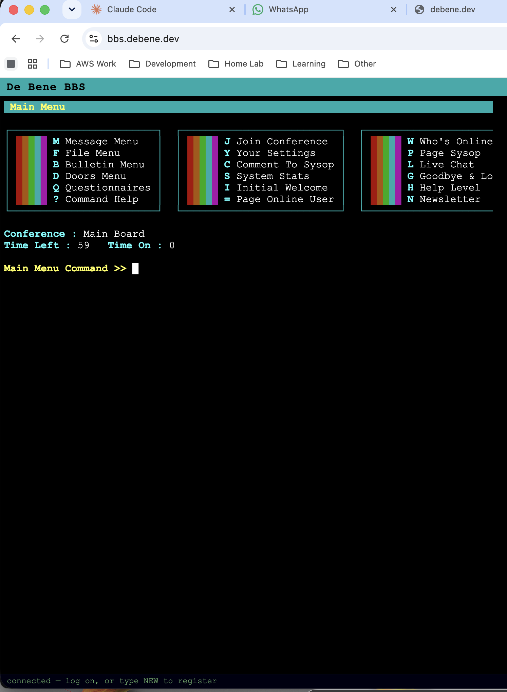
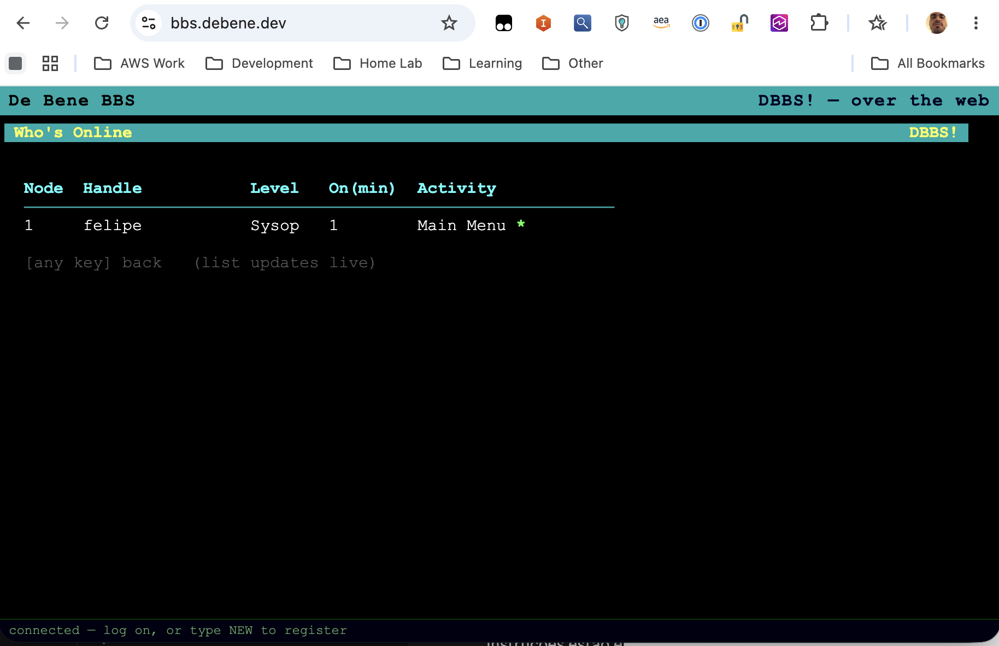
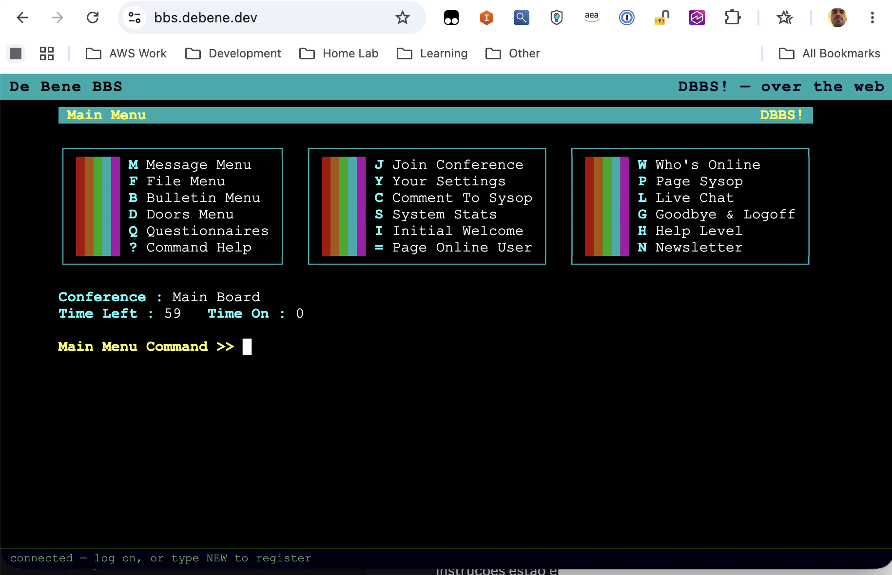
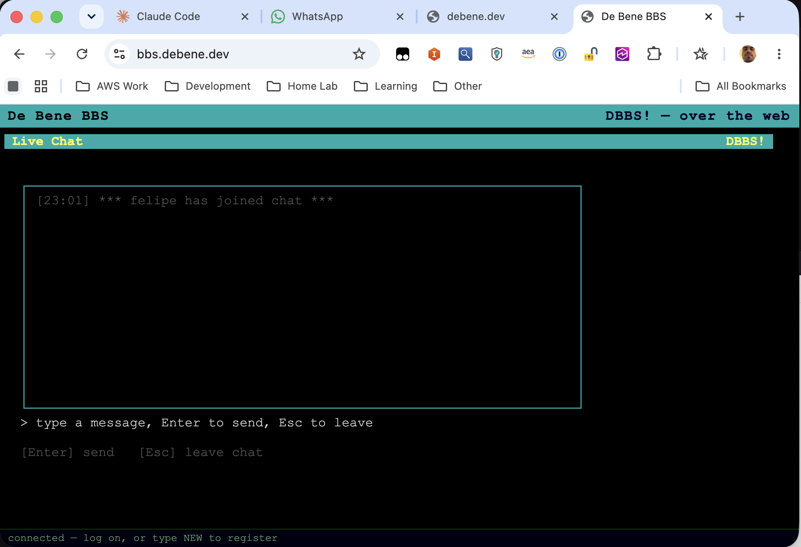

# I Built a 1990s BBS in 2026 (In One Day)

Remember bulletin board systems? Those pre-internet communities where you'd dial in with a modem, navigate ANSI menus, download files, and leave messages for other users? I spent yesterday rebuilding that entire experience from scratch. In Go. In under 6 hours.

## Why?

Honestly? Nostalgia hit hard. I grew up in Brazil in the mid-90s, and before the internet became widely available, BBSes were *the* way to connect with other computer nerds. You'd call a local number (long distance was expensive), wait for the modem handshake, and suddenly you were in this text-based world of forums, file libraries, and door games.

The aesthetic was unforgettable: 16-color ANSI art, CP437 characters, that specific menu layout with `[M]ain Menu` prompts everywhere. The mechanics were fascinating too — time limits, download ratios, sysop chat, door games that would kick you to a subprocess and resume your session after.

So last Monday morning, I woke up and thought: "I wonder if I could rebuild that experience over SSH instead of a phone line?"

Six hours later, I had a fully functional BBS running on my Kubernetes cluster.

## The Stack

I wanted to stay true to the original constraints while using modern tools:

- **Go** for everything — no CGO, cross-compiles cleanly
- **SSH instead of modems** — `charmbracelet/wish` for the server
- **Bubbletea for the TUI** — because terminal UIs are bubbletea's whole thing
- **Pure ANSI colors** — exactly 16, the classic palette (`lipgloss.Color("0")` through `"15")`, no truecolor
- **SQLite** — single file, WAL mode, zero admin
- **Classic BBS features:**
  - Message boards (conferences)
  - File areas with SFTP upload
  - Door games (external programs)
  - User stats, bulletins, sysop commands
  - Time limits, download ratios

The goal: **ssh to the board and feel like you just dialed into a Wildcat! or RemoteAccess system in 1994.**

*The main menu — 18 commands across three panels, pure ANSI art*

## The Build (A Single Day)

**June 9, 2026, 11:25 AM** — I opened my editor and typed the first line: `package main`.

Six hours later, the board was live.

I'm not going to pretend this was smooth. It wasn't. But it was *structured* — I knew exactly what a BBS needed because I'd used dozens of them as a teenager. So I broke it into milestones and knocked them out one by one:

**11:25 AM** — Auth system. SSH login, new user registration, argon2id password hashing. If you can't log in, you don't have a BBS.

**12:10 PM** — Main menu. The iconic three-panel layout: **[M]ain**, **Message**, **File**. Six commands per panel, 18 total. This is the screen you see after login, and it had to *feel right* — the spacing, the brackets, the alignment.

**1:15 PM** — Message boards. Conferences (like forums), threads, replies, read tracking. The core social feature. I wanted threading to work like Usenet — nested, chronological, no algorithm.

**2:30 PM** — File areas. List files with descriptions, show filesizes, upload via SFTP (because why reinvent file transfer when SSH already includes it?). Download ratios aren't implemented yet, but the foundation is there.

**3:00 PM** — Door games. This is where I hit the first wall (more on that in a minute). The idea: external programs run in a subprocess, take over the user's terminal, and hand control back when they exit. Classic BBS design — the door is a separate binary, the board just bridges I/O.

**3:45 PM** — Multi-user hub. Concurrent sessions, cross-user chat, paging (like IM but in 1994). I wrote tests for this part — race conditions are real when you have 10 people typing at once.

*Real-time user tracking — node number, handle, level, current activity*

**4:30 PM** — Sysop tools. User editor, bulletin editor, stats dashboard. Every BBS needs a sysop panel. I made mine accessible via `[S]ysop Menu` (hidden unless you're an admin).

**4:55 PM** — Deployment. Dockerfile, Kubernetes manifests, multi-arch image build (amd64 + arm64). Push to GHCR, deploy to the cluster, expose via MetalLB. The board was live at `ssh://bbs.debene.dev:2323`.

**5:12 PM** — Polish. ANSI alignment fixes (boxes were off by one character), theme consistency, and a web terminal for people without SSH clients.

Then I spent the next hour fixing two catastrophic bugs that almost killed the project (see below).

## The Numbers

When the dust settled:

- **7,005 lines of Go** (6,219 non-test, 786 test) across **43 files**
- **10 internal packages** (`auth`, `config`, `db`, `door`, `hub`, `models`, `server`, `theme`, `tui`, `web`)
- **3 binaries**: `bbsd` (server), `bbsadm` (admin CLI), `numberduel` (example door game)
- **33 Bubbletea screen models** — login, registration, main menu, message boards, file areas, doors, sysop tools, chat, paging...
- **18 commands on the main menu** (3 panels × 6 items), **27 total** across all submenus
- **10 SQLite tables**: users, conferences, messages, file_areas, files, door_scores, bulletins, settings, questionnaire_answers
- **17 tests** including concurrency tests under Go's race detector (for the multi-user hub)

The final artifacts:

- **`bbsd` binary: 13 MB** (static, stripped, linux/amd64)
- **Container image: 24.5 MB** uncompressed
- **Multi-arch image** on GHCR (`ghcr.io/felipedbene/bbs:latest`) — linux/amd64 + linux/arm64

**11 direct dependencies, 97 modules total** (including transitive). Zero CGO — cross-compiles cleanly.

## Deployment

I run a 5-node Kubernetes homelab cluster (v1.36.0) — mixed Intel and ARM nodes (`intel5`, `intel9`, `orion` on ARM, `ultra2`, control-plane `zima`). The BBS deploys as a single pod with:

- **SSH on port 2323** (exposed via MetalLB LoadBalancer)
- **Web terminal on port 8080** (uses `coder/websocket` + xterm.js)
- **PVC for persistence** (SSH host key + SQLite database)

I verified the persistence by deleting the pod and reconnecting — same host key, all user accounts intact.

## The Bugs (Where Everything Almost Fell Apart)

I said "almost killed the project" earlier. I meant it. Both bugs were show-stoppers — the kind where you start questioning if you should just scrap everything and start over.

### Bug #1: The Phantom Keystroke

**The symptom:** You log in. The prompt appears. You type your username. And the first character *vanishes into thin air.*

Type `12345` → get `2345`.  
Type `felipe` → get `elipe`.  
Type `admin` → get `dmin`.

Every single time. Deterministic. Reproducible. Maddening.

I spent 20 minutes debugging my input handler. I added logging. I hexdumped the SSH stream. I verified my Bubbletea model wasn't consuming an extra keystroke. Everything looked correct.

Then I found it: **the renderer was interrogating the terminal.**

Bubbletea auto-detects dark/light themes by sending a background-color query (`ESC]11;?BEL`) on startup. The terminal dutifully replies with the color code... which arrives as *input* on the SSH channel. My program reads it, interprets it as a user keystroke, and consumes it.

The next real keystroke (the actual first character the user typed) arrives second, so it gets processed correctly. But the *first* one? Gone. Fed to the color detector.

**The fix:** Set the color profile explicitly from `$TERM` (which SSH clients send in the environment). No query, no missing bytes, no phantom keystrokes.

**The lesson:** Terminal I/O is a shared, stateful, order-dependent channel. Side effects matter.

---

### Bug #2: The Silent Door (Three Layers Deep)

This one nearly broke me.

**The symptom:** The door game loads. It prints its prompt: `Guess a number (1-100):`. The cursor blinks. And then... nothing. You type. Nothing happens. No echo. No response. The process is alive but completely deaf.

I thought I had a simple I/O bridge bug. I was wrong. This had **three separate root causes**, stacked on top of each other like a cursed layer cake.

#### Layer 1: The Red Herring

My first PTY bridge used `io.Copy` from the SSH session's stdin to the door's stdin. Simple, right?

Wrong. After the handoff, the `wish` framework *closes the SSH session's input pipe* — it assumes you're done reading from it. So the door immediately gets `EOF`, sees there's no more input, and exits.

I "fixed" this by keeping the SSH pipe open. The door stopped crashing. But it still didn't respond to input.

#### Layer 2: The Fake PTY

`charmbracelet/ssh` (which `wish` is built on) **doesn't give you a real PTY by default.** It *emulates* one — creates a pipe that looks like a pty but isn't a character device.

When I spawned the door with `cmd.Start()`, it inherited this fake pty. The door's stdin was a dead pipe. Nothing could write to it (the SSH framework had closed the write end). The door's `bufio.Reader` hit `EOF` instantly.

I forced a real OS PTY with `ssh.AllocatePty()`. The door stopped hitting EOF. But it *still* didn't respond to typing.

#### Layer 3: Raw Mode (The Real Culprit)

Even with a real PTY, the terminal was in **raw mode** — every keystroke arrives exactly as the hardware sends it. Including:

- Enter as `\r` (carriage return), not `\n` (newline)
- Backspace as `\x7F` (DEL), not `\x08`
- Ctrl+C as raw `\x03`, no signal

My door's `bufio.ReadString('\n')` was waiting for a newline that would *never arrive* because Enter sent `\r`.

**The fix (all three layers):**

1. **Allocate a real OS PTY:** `ssh.AllocatePty()` in the wish handler
2. **Set the door's PTY to cooked mode** using termios (Enter → `\n`, Ctrl+C → SIGINT, echo works)
3. **Bridge all I/O bidirectionally** (SSH ↔ PTY master, PTY slave → door process)

After that, typing `50` in the door echoed `50`, hitting Enter sent `\n`, and the door replied `Too high!`. Finally.

**The lesson:** PTYs are not pipes. Emulated PTYs are not real PTYs. Raw mode is not cooked mode. SSH frameworks lie about what "pty" means. And when three problems stack, each fix reveals the next layer.

I tested the final version in a Linux container with `strace` attached. Watching the door receive clean `\n`-terminated lines from a real character device felt like magic.

*Number Duel running in a real PTY — cooked mode, echoing input, responding to guesses*

## What I Learned

1. **Bubbletea is magical for TUI apps.** I built 33 different screens with consistent navigation, themes, and state management. The tea.Model pattern makes it feel like React for the terminal.

2. **SSH is just TCP with authentication.** Once you realize `wish` is just handling the crypto handshake and giving you I/O streams, everything else is normal Go.

3. **SQLite in WAL mode is perfect for small multi-user apps.** I have 10+ concurrent SSH sessions all reading/writing the same database. Zero tuning, zero issues.

4. **Cross-compiling Go is criminally underrated.** One `go build` command produces binaries for both my Intel and ARM nodes. No Docker build matrix, no runtime dependencies, no CGO headaches.

5. **Nostalgia is a powerful motivator.** I could've built a modern web forum in the same time. But that wouldn't have given me the same joy as seeing `[M]ain Menu  [G]oodbye` in perfect ANSI colors over SSH.

## Try It

The BBS is running at **ssh://bbs.debene.dev:2323** (or use the web terminal at **https://bbs.debene.dev**).

*Multi-user chat — type a message, hit Enter, everyone sees it in real-time*

Create an account, leave a message, try the Number Duel door game. It's gloriously retro.

Source code is at [github.com/felipedbene/bbs](https://github.com/felipedbene/bbs) (private for now, but I'm considering opening it up).

## Closing Thought

**7,000 lines of Go. One day. Zero CGO. 24 MB static image.**

And it speaks the same language a Wildcat! 4.0 board did in 1994 — SSH instead of Hayes AT commands, but the same ANSI art, the same door games, the same message threading, the same download ratios.

Sometimes the best projects are the ones that don't need to exist. They just need to be *fun*.

---

*Built on June 9, 2026. Deployed on a 5-node Kubernetes homelab cluster running in Chicago.*  
*Go 1.22, Bubbletea v1.3.10, SQLite 3.52.0, wish v1.4.7.*  
*Dedicated to every sysop who kept a board running on a 486 in their basement.*
