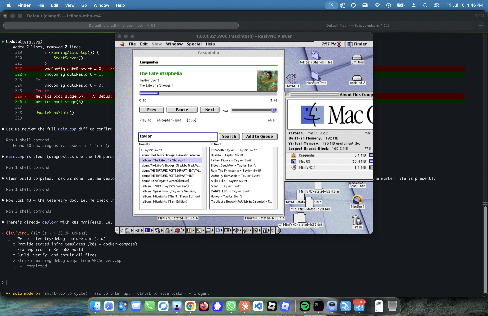
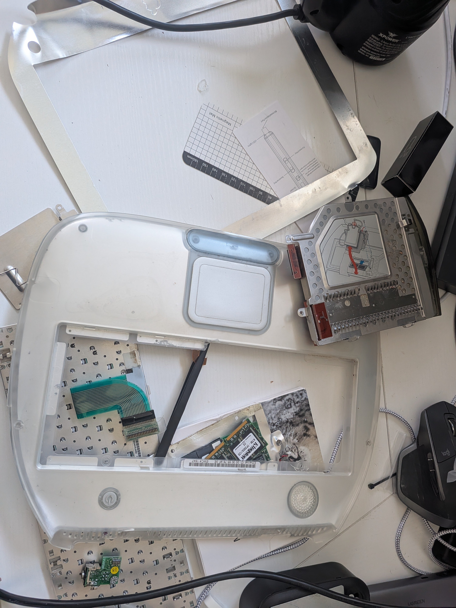
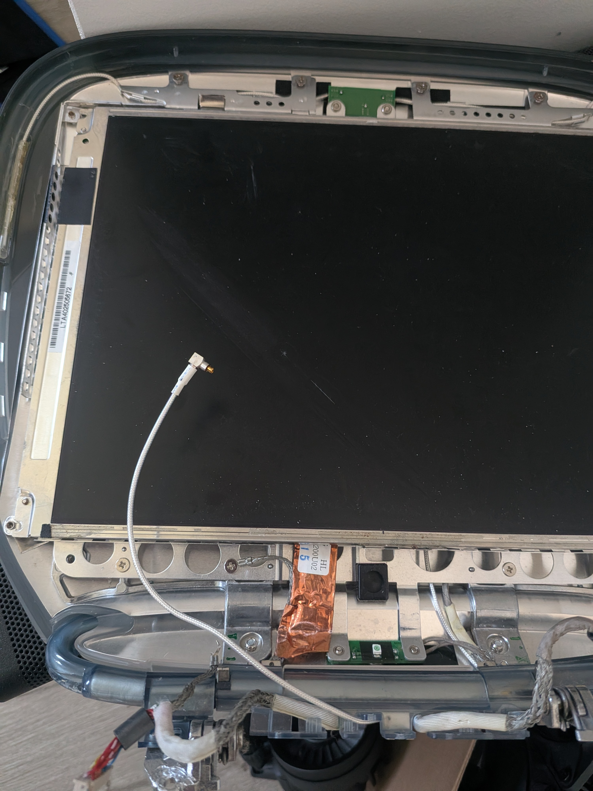
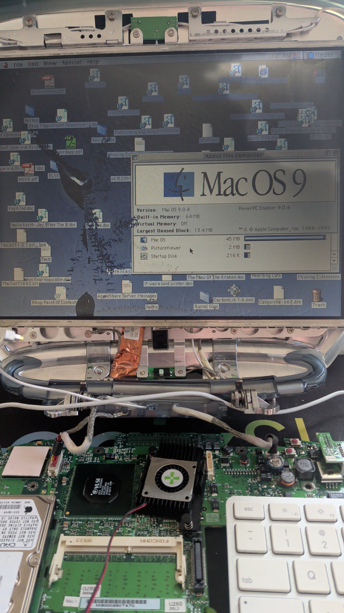
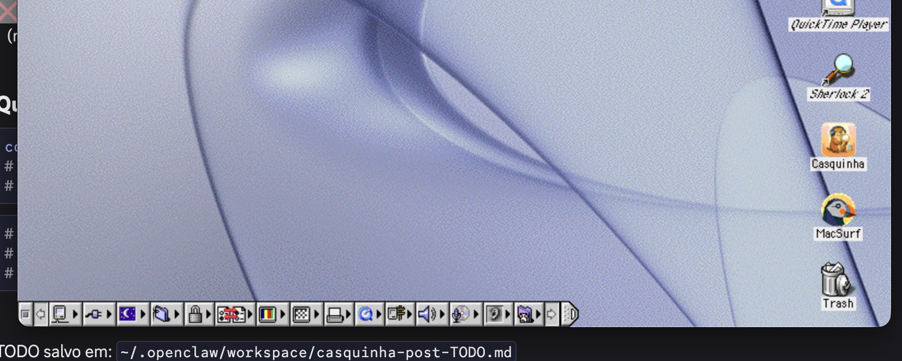

There's a screenshot on my other monitor right now that I can't stop looking at.

An **M4 MacBook** is running a VNC viewer. That viewer is connected to a **Mac OS 9 machine** with a broken display and broken clamshell (new parts on the way) running bare on my workbench. On that classic Mac desktop, a little app called **Casquinha** is playing *The Fate of Ophelia* off Taylor Swift's *The Life of a Showgirl*. Album art loaded. Scrubber moving. "Up Next" queue populated.

The record came out in a world of Spotify, HLS, and DRM. The machine playing it predates all three. Between them sits a stack I built by hand, and honestly? This one meant something.

---

## The signal path

Here's what happens when I click **Next** in that OS 9 window:

```
M4 MacBook (2025)
   │  RealVNC Viewer, RFB over TCP
   ▼
MiniVNC  ── VNC server, running ON the classic Mac
   │  (with statsd telemetry, because why not)
   ▼
Mac OS 9.2.1 @ 10.x.x.x  ─ iBook G3 Clamshell
   │  64MB RAM, dead LCD, running bare on the bench
   ▼
Casquinha  ── my C99 Spotify remote for Mac OS 9
   │  Open Transport → gopher (RFC 1436) over TCP
   ▼
gopher-spot  ── Rust bridge on Kubernetes
   │  Spotify Web API ↔ gopher menus
   ▼
Spotify
```

"Skip to the next Taylor Swift track" travels from Apple Silicon, through a VNC server I ported to PowerPC, across Open Transport, over **gopher** — a protocol from 1991 — into a Rust service on a Kubernetes cluster, and out to Spotify's modern API. Then the answer comes back and repaints a 1-bit progress bar.

Nothing in that path was designed to touch anything else. That's the whole post.

---

## The machine



The hardware is an **iBook G3 Clamshell** I rescued from a basement. It was **covered in mold**. I disassembled the entire thing — logic board, keyboard, every connector — cleaned everything with isopropyl alcohol, and discovered the LCD was dead.



Parts are en route: a new Samsung LT121SU-123 LCD panel (arrives July 24), 256MB RAM upgrade (July 14), and an mSATA SSD with IDE adapter (arriving today). But I couldn't wait. So I reassembled it on the workbench **without the case**, did a clean Mac OS 9.2.1 install, and kept coding.



**VNC isn't a choice here; it's survival.** The display is physically dead. MiniVNC is the only way I can see the desktop until that LCD arrives.

---

## The cast

Three pieces of software are doing the work. Two are mine.

### Casquinha — the native client

**Casquinha** is a Spotify remote written in **C99 for Mac OS 9**. Real classic Toolbox — Controls Manager buttons, hand-managed now-playing pane, Open Transport networking. Built with Retro68 (GCC cross-compiling to PowerPC), which means 2026 code with 2001 headers.

### MiniVNC — the periscope

**MiniVNC** is the VNC server I ported to PowerPC and — the fun part — **instrumented with statsd**. Frame timings, RFB update counts, endpoint health all fire UDP packets to a metrics collector. The vintage Mac is now a **monitored node**. It has telemetry. I can look at a Grafana panel and know how a 2001 laptop is feeling.

Without MiniVNC there's no screen. The classic Mac sits headless; MiniVNC serves its framebuffer over RFB so I can drive it from the M4.

### gopher-spot — the enabler

**[gopher-spot](https://github.com/felipedbene/gopher-spot)** is the piece that makes all of this possible. It's a Rust service running on my Kubernetes cluster that acts as the bridge between two incompatible worlds: Spotify's modern OAuth2/TLS/JSON API on one side, and a 1991 text protocol on the other.

Without gopher-spot, there's no way a 64 MB Mac from 2001 could talk to Spotify. The backend does the heavy lifting — OAuth token refresh, HTTPS connections, parsing megabyte JSON responses, maintaining WebSocket streams for now-playing state, handling rate limits — and translates all of that complexity down to **plain gopher menus**: tab-delimited text lines that a cooperative OS can parse in microseconds without freezing.

It's more than a Spotify bridge. It's the **reference implementation of a pattern**: modern service → K8s → gopher → thin native client. Any API — weather, transit, news feeds — can be reduced to gopher menus by a bridge running on hardware that can afford the complexity. Then *any* vintage machine gets to feel fast and native because it never has to do the hard part.

The architecture is the real trick here. Casquinha is 2,000 lines of C. gopher-spot is 1,500 lines of Rust. But the separation of concerns means the thin client stays simple, testable, and responsive, while the bridge handles every ugly reality of talking to a 2020s API.

**That's** why this works. The protocol choice isn't nostalgia—it's deliberate offloading of complexity to where the compute lives.

## Why gopher, not just HTTP?

The classic Mac *can* do HTTP. There are TLS stacks that sort-of work.

But on a 64 MB machine with **cooperative multitasking**, every byte of parsing you avoid is a freeze you avoid. Modern TLS handshakes, chunked encoding, and megabyte JSON payloads are exactly the kind of work that makes an OS 9 app go unresponsive — because there is no preemption to bail you out. The whole machine waits.

gopher is aggressively simple. A request is a line of text. A response is a menu of tab-delimited rows terminated by `.`. No content negotiation, no compression, no auth dance. Casquinha reads a gopher menu the way it'd read a text file.

So gopher isn't nostalgia (okay, it's *a little* nostalgia). It's a **deliberate protocol choice to move complexity off the weak node.**

---

## Inside Casquinha: fake preemption on a system without any

Mac OS 9 is cooperatively multitasked. If your code doesn't yield, *nothing else runs* — not other apps, not the cursor, not the clock. A blocking network call holds the whole OS hostage.

The naïve version would do a synchronous gopher fetch on the main event loop, and the entire Mac would lock for however long Spotify's API felt like taking.

So the networking doesn't live on the main loop. It lives in an **MPTask** — a preemptive task from Multiprocessing Services, one of the few genuinely preemptive things classic Mac OS shipped. The worker owns the Open Transport endpoint, does the gopher round-trip, hands results back through a queue. The main event loop stays responsive; the fetch happens *beside* it.

```c
OSStatus err = MPCreateTask(GopherWorker, &ctx,
                            kStackSize, kNotifyQueue,
                            NULL, NULL, 0, &gWorkerTask);
```

Inside that worker: `OTOpenEndpoint`, bind, connect, `OTSnd` the selector, `OTRcv` the menu, tear it down. Which brings us to the war story.

---

## War story #1: the 120-second freeze

For a while, Casquinha would occasionally just… stop. Dead for **two full minutes**, then snap back like nothing happened.

The maddening part: it correlated with *nothing I was doing on the Mac*.

The culprit was on the *other* end. gopher-spot lives on Kubernetes, and Kubernetes **rolls pods**. Every time I redeployed — new build, config change — the old pod terminated and a new one came up. During that window, Casquinha's worker kept trying to connect against an endpoint that was mid-rollout, and the endpoints weren't getting cleaned up on failure. **Open Transport resource exhaustion.** The system ran out of endpoints, the next allocation blocked hard for ~120 seconds.

A pod rollout on a 2026 cluster froze a 2001 laptop. I love this bug. I hate this bug.

The fix: bound the endpoint lifecycle, clean up on every failure path, treat "backend is mid-rollout" as normal. Retry with a ceiling; never leak an endpoint.

---

## War story #2: the cassette icon

I gave Casquinha a **custom icon**: a little cassette tape, ribbon and all. 🎞️



Getting the Finder to *show* it on a Retro68 build is annoying. It's not enough to ship the icon family (`ICN#`, `ics#`, `icl8`). The Finder only wires the icon to the app if three things line up:

1. A **`BNDL`** resource (the bundle),
2. An **`FREF`** (file reference) for the app,
3. A **creator code** — a unique four-character signature — that matches across all of it *and* is registered in the invisible Desktop Database.

Miss the creator code and the Finder shrugs, falls back to the generic app icon.

That four-character mechanism dates to **1984**. A cassette icon for a Spotify remote, unlocked by a naming scheme older than most people who'll see it.

*(A music-streaming remote whose icon is a cassette tape is exactly the right icon. Analog controlling digital controlling analog.)*

---

## Inside MiniVNC: telemetry on a Mac from 2001

Most people who get classic Mac OS booting stop at "it boots." I bolted **statsd** onto a VNC server.

Frame timings, RFB update counts, endpoint health — MiniVNC fires UDP statsd packets over Open Transport to a collector. From there it's normal metrics infrastructure. The vintage Mac has telemetry. Grafana panels. Dashboards.

There's a `MetricsCollector` with a debug signature, and the debug dumps are OFF by default in release builds. Telemetry you can't turn off is just a bug with a dashboard.

---

## Wait — "vibe coding in ancient C"?

"Vibe coding" is the 2025/26 zeitgeist: describe what you want, let the model spray code, keep what runs. C99 on a cooperatively-multitasked classic Mac is the opposite — manual memory, locked handles, *Inside Macintosh* open in a tab, a compiler with no seatbelts, failure modes that freeze the whole machine.

But I *am* doing both at once. Claude Code churns through a task list — strip debug dumps, provide statsd templates, fix the icon — while the actual interesting work is what no autocomplete can do: understanding why Open Transport ran out of endpoints, or which resource the Desktop Database needs.

The vibes get you the scaffolding. The ancient C is where you actually have to know things.

---

## The pattern

Strip away the specific machine and there's a reusable idea:

> **Push complexity to where the compute is. Keep the edge dumb, fast, and native.**

gopher-spot is a Spotify adapter, but it's really a template. Any modern API — a data feed, a live map — can be reduced to a gopher menu by a bridge on hardware that can afford the TLS and JSON. Then a tiny native client on *any* weak machine gets to feel fast because it never does the hard part.

The 25-year-old Mac isn't a museum piece. It's a **thin client with a beautiful UI and a well-fed backend.** Same architecture as anything I'd ship at work; I just chose an absurd node to run it on.

That's why the screenshot got me. It's not that an old computer plays Spotify. It's that the boring, correct, modern architecture — bridges, telemetry, bounded resources, thin clients — works so well it stretches across a quarter-century of incompatible technology and still holds.

The cassette icon is just me taking a victory lap.

---

**Code:** [github.com/felipedbene/casquinha](https://github.com/felipedbene/casquinha) (C99, Retro68, MPTasks) · [github.com/felipedbene/gopher-spot](https://github.com/felipedbene/gopher-spot) (Rust bridge)

*Next up: closing the freeze audit, statsd dashboards, and — when the LCD arrives July 24th — putting this whole stack into a proper translucent clamshell case where it belongs.*
