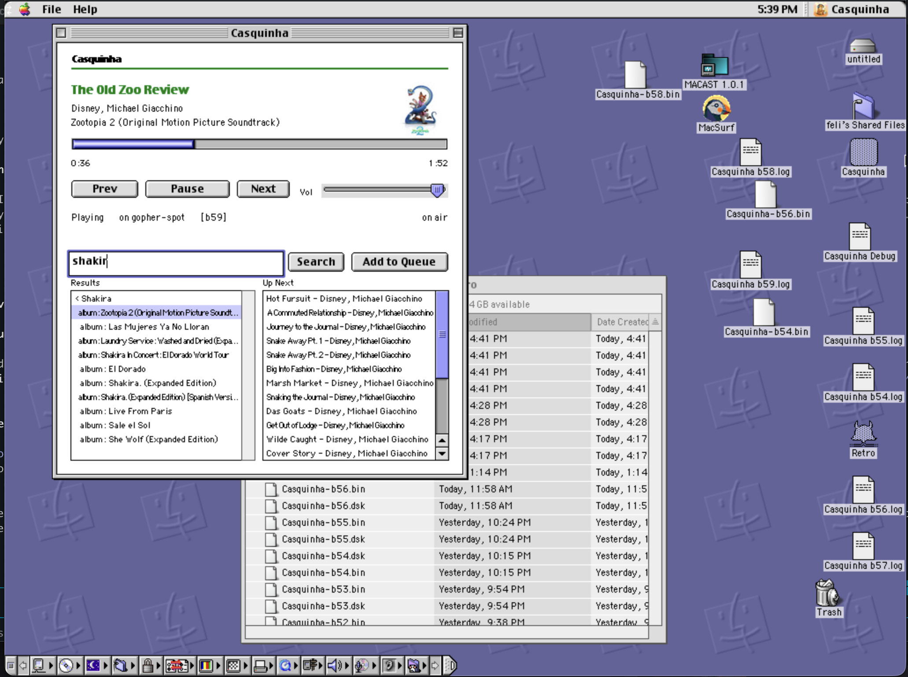

*Or: how fifty-nine builds taught me that someone has to own the state, and why I shipped b59 with the seams still showing.*

Last week I put Spotify on Mac OS 9 over Gopher. That post ended with a small confession baked into the architecture: the "client" on the OS 9 side was **Netscape Communicator**, browsing gopher menus. It worked — Netscape speaks `gopher://` natively, and a menu of tracks is just text — but it's a browser wearing a remote-control costume. Every action was a page load. There was no queue, no now-playing that updated on its own, no seek bar, no *app*.

This is the app. It's called **Casquinha**, it's a native Classic Mac OS gopher client built with Retro68, and as of tonight it's on `[b59]` — the first build I'd call decent.

Here's the proof:

Casquinha playing *The Old Zoo Review* off the Zootopia 2 soundtrack. A real progress bar creeping to 1:52. Prev / Pause / Next. I typed `shakira` into the search box and got actual albums back — *El Dorado*, *Sale el Sol*, *She Wolf*, *Las Mujeres Ya No Lloran*. There's a queue. There's an *Up Next*. Bottom of the window: `on gopher-spot [b59] on air`.

Netscape could never.

## Same split, native this time

The design from the gopher-spot post survives intact, because it was the right idea: a hard wall between the **control plane** and the **data plane**.

Casquinha owns the control plane. It opens raw sockets over **Open Transport** — OS 9's TCP stack, the one that predates every convenience I'm used to — speaks gopher to the same `/spot/api/1` contract the whole client family shares, parses `now` and the queue on a timer, and renders the window you see above. Selectors out, text menus in. Bytes, never audio.

The data plane is still **MacAST**, the classic OS 9 MP3 player sitting right there on the desktop, parked on the Icecast stream the cluster serves. There is no Core Audio on OS 9 and I'm not going to pretend otherwise — so Casquinha doesn't touch audio at all. It drives; MacAST plays.

Two programs, each doing the thing it's actually good at. That division is the one design choice I'm least tempted to revisit.

Same cluster pods behind it, unchanged: `audio-stream` (librespot → ffmpeg → Icecast, appearing as a Connect device named gopher-spot) and `gopher-server` (geomyidae plus the stateless Rust translator).

Except "stateless" stopped being true around b30. More on that below.

## What fifty-nine builds looks like

Count the files on that desktop — `Casquinha-b52.bin`, `b53`, `b54`, all the way up, each with its `.log` beside it. That's not a release history. That's a graveyard.

The lesson that cost most of those builds: **someone has to own the state.** Not "coordinate it" or "negotiate it" — *own* it. This is a proxy with 2 seconds of delay, protocol conversion, the whole nine yards. The client can't guess. The server can't assume. Pick one.

Early builds tried to be clever: Casquinha would send a command, optimistically update the UI, poll `/now` to confirm. Worked great until it didn't — mash Next three times fast and the last poll returns track 2 while gopher-spot is already playing track 4 because all three commands landed and it honored every one. On OS 9's cooperative runloop that failure mode is *worse*: no preemption means a busy socket blocks the UI, so you get the flicker, the lag, and the wrong track all at once.

The same "sends commands like crazy" bug I chased on DeGelato. On OS 9 it's not better, it's exponentially worse. A cancelled request stops Casquinha listening but gopher-spot already got the line and executes it anyway. Mash Next and you fire five plays the server dutifully honors while the client believes only the last one counted.

b59 works because I stopped trying to be clever.

## Making gopher-spot stateful (or: why the server had to grow up)

The original gopher-spot from the first post was a stateless translator: it asked librespot "what's playing?", rendered a gopher menu, done. No memory, no queue, no concept of *session*. That works fine when the client is Netscape loading pages — every request is independent.

Casquinha needed more. A native app with a Now Playing view that updates every second can't treat state as "whatever the last menu said." It needs `/now` to return *truth*, and it needs commands to land in order even when the client fires them like crazy.

So gopher-spot got:
- **Actual queue ownership** — it tracks Up Next, not just "ask Spotify for the queue and hope it's the same as 2s ago"
- **Command sequencing** — `/play?uri=...` doesn't return until librespot confirms, so the *next* poll sees the real state
- **Idempotency where it matters** — hitting Pause twice doesn't toggle you back to Play because the server knows what "paused" means

It's still gopher text menus on the wire. But on the inside it's stateful now, porque tinha que ser — client-side guessing with a 2-second round trip is how you get the b52-b58 graveyard.

These changes weren't in the original gopher-spot post because they didn't exist yet. Casquinha forced them into being.

## The part where I decided to stop

b59 is the first build where I played, searched, queued, seeked, and rode the volume slider in one sitting and nothing fell over. It streamed. It stayed streaming. It said `on air` and meant it.

It is not perfect, and I want to write the seams down in public before I talk myself out of shipping:

- now-playing metadata still lags the audio by a beat on track change
- the queue flickers when it repaints
- there's a fast-`Next`-mashing edge case I haven't fully cornered
- I have Opinions about the results-list layout that I am choosing not to have today

If you've read anything else here, you know my failure mode. I don't stop. I find the seam, I pull it, and three hours later I'm reading `meson_options.txt` at midnight arguing with a build system about a flag nobody will ever notice. The gap between *works* and *perfect* is where I go to disappear — fifty-nine builds is what that looks like from the outside.

**Good enough is a decision, not a lowering of the bar.** It's the call that the thing now does the job it exists to do, that the remaining delta is real but not urgent, and that I'm allowed to close the laptop with an open ticket instead of a closed one.

b59 plays music on a beige-era Mac over a protocol from 1991. The metadata lags by a beat. Both of those are true at once and neither one cancels the other.

The version of me that only ships perfect never ships anything. That guy is still on b12, certain the real release is one socket rewrite away, and he never gets to hear Shakira come out of a machine that predates the album.

## Odds and ends that cost real time

A short field guide — *(these are the ones I remember; my real b-logs have the rest)*:

- **MacRoman, again.** Casquinha reads gopher bytes as Mac OS Roman natively, which is a gift compared to the transcoder gopher-spot needs on the wire — but it means anything I test on modern hardware lies to me about how accented titles will actually render on the target.
- **The race is a server-truth problem, not a UI one.** "Last press wins" in the client does nothing if the earlier presses already crossed the socket. The real fix lives at the command layer, not the button.
- **Open Transport is asynchronous whether you like it or not.** Treating it like a blocking socket is how you get half the b50s graveyard.

## Why b59?

Because it crossed the line that matters — from *project I'm fighting* to *thing I use* — and that line sits well below perfect.

The real prize is still ahead. Casquinha runs in emulation today, but the entire point of the family is period-correct *iron*. There's a clamshell iBook in restoration on the bench right now. When it's clean, this is what it's going to run — a native Spotify remote, on hardware from 1999, driven by a text protocol from 1991.

For now: decent, not perfect. Old exhibits, still standing, still worth the walk. Good enough to open to the public.

`on air.`

---

Code: [github.com/felipedbene/casquinha](https://github.com/felipedbene/casquinha)

*Casquinha is a native Classic Mac OS gopher client (Retro68, PPC, Open Transport) and part of the same family as DeToca and DeGelato. It talks only to gopher-spot on the LAN. MacRoman forever.*
