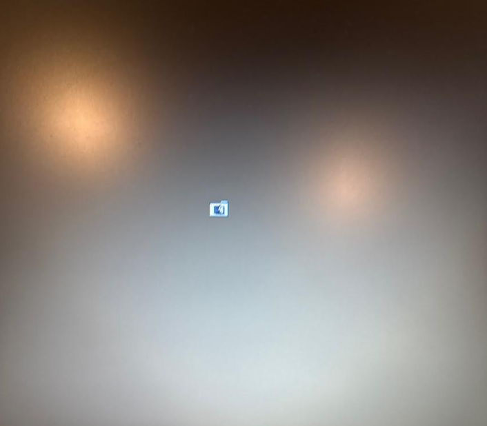

## For fifty bucks, I got myself a time machine.

Ray — the older gentleman who sold it to me — was equal parts amused and confused that someone like me still existed. For the price of a dinner out, I walked away with a brushed-aluminum tower that once symbolized Apple's peak desktop performance.

Now it sits proudly next to my daily driver ("Study"), humming away like a jet engine preparing for takeoff. I hit the power button, braced for the famous chime… and there it was: Mac OS X 10.5.8 Leopard, dual 1.8 GHz G5 CPUs, 4 GB of RAM, and a 500 GB Maxtor spinning drive that sounds like a diesel generator. Inside? Comcast invoices from 2012 and a still-configured iChat account. The ghost of broadband past.

## What Do You Even Do With a G5 in 2025?

Good question. Here's what my over-caffeinated sysadmin brain proposed:

- 🐧 Install a modern Linux PPC build ("modern" here meaning "has a package manager").
- 🐯 Keep Leopard for nostalgia, because dual-booting is the hipster equivalent of running Arch.
- 💿 Use it as a retro media jukebox — iTunes 9, Airport Express, the whole time-capsule vibe.
- 🌐 Try to run it as a home server… and pretend this is a good use of my electricity bill.
- 🎮 Fire up Unreal Tournament 2004 because nothing says "cloud architect" like LAN fragging on PowerPC.

Would any of this actually work? Probably not. But that's half the fun.

## First Mission: Install Something Modern(ish)

I decided to see how far this aluminum beast could go in 2025. Leopard was cute, but I wanted a modern Linux PPC build. Enter: **Adelie Linux** — the distro that promises lightweight, snappy performance on obscure hardware… and actually delivers.

Except for one thing: booting.

Adelie's installer cheerfully declared, "Bootloader installed successfully!"

Reality: "?" — literally, the flashing folder with a question mark.



This was my first real encounter with **OpenFirmware**, Apple's pre-Intel BIOS-that's-not-a-BIOS. Think of it as the love child of Forth and a migraine. The documentation feels like it was written by a monk with a grudge against future sysadmins.

After hours of trial and error, and more hallucinations from Mr. Chat than I care to admit, salvation came from a Gentoo forum post. With a bit of ritual incantation, I rebuilt the bootloader, and suddenly… success. Adelie booted cleanly, no LiveCD required.

The G5 was officially alive in 2025!

## Daily Driver Experiments

Now that Adelie was actually booting, I asked myself the obvious question:

**Can a 2003 tower still pull its weight as a daily driver in 2025?**

I started small. The G5 connected to my LAN (yes, it does IPv6 like a champ), and I even launched a browser. It wasn't slow, but it was… weird. JavaScript either didn't exist or existed in an "improv theater" form.

- Google wouldn't return results.
- Gmail politely faceplanted.
- YouTube refused to acknowledge reality.

I tried every browser Adelie offered and eventually landed on **ArcticFox**. It almost behaved like a modern browser, except for occasional endianness meltdowns — where half the binary thought left was right and up was down.


That's when I fell into a rabbit hole I'd somehow avoided all these years: **Big Endian vs. Little Endian**.

As a mathematician-turned-sysadmin-turned-cloud-architect, I thought I'd seen it all. Nope. Endianness is basically:

- Do you read numbers starting from the big end? (Big Endian)
- Or the little end? (Little Endian)

It blew my mind. Suddenly, I wanted to write poems about it. So Mr. Chat and I did. In Go. Because of course we did.

```go
// Endianness Haiku
big := []byte{0x01, 0x02}
little := []byte{0x02, 0x01}
// Two ways to see life
```

Was it practical? No. Was it fun? Absolutely.

## The Unfinished Quest: Spotify on a G5

Music was the next frontier. I want Spotify! This sounds simple for today's standards but that application is a modern piece of art in terms of how a massive system works. They all expect the client to handle some part of the processing. That's the problem:

- Installing Node.js on a G5 is like asking a pigeon to do algebra.
- The web UI? Forget it — even Gmail laughed at me.

But Spotify is, at the end of the day, just an Ogg Vorbis stream. No flashy UI needed. Thanks to APIs, it should be possible to sidestep the bloat and pipe music directly.

So that's where I'm leaving it for now: cooking up an API-driven Spotify client for a 20-year-old tower. Will it work? No idea. But I've gone this far — why stop before the beat drops?

---

*Originally published on [Medium](https://medium.com/@felipedebene/cloud-architect-meets-powerpc-the-50-time-machine-f87ecd7deb83).*
