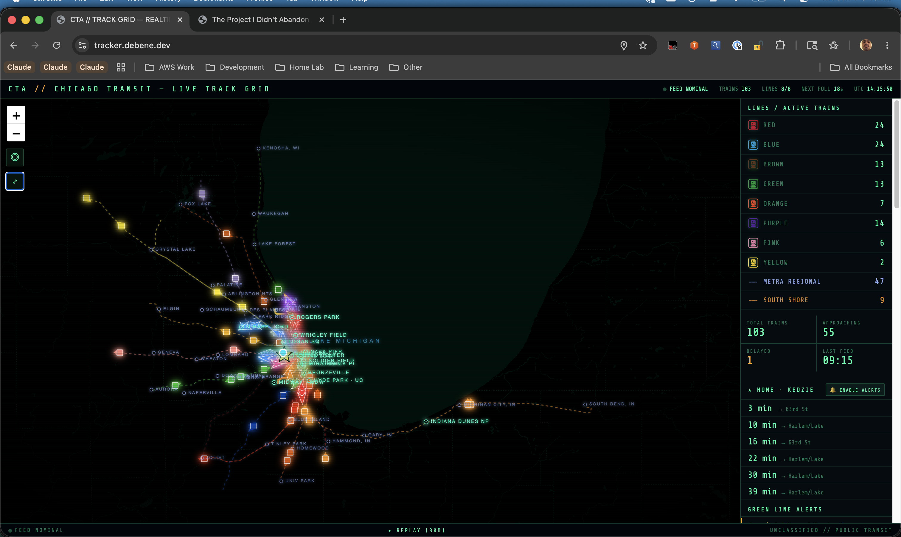

*103 trains moving through Chicago right now — Red Line bunching in the Loop, Blue Line stretching to O'Hare, Metra commuter rail fanning out to the suburbs*

I moved to Chicago in 2018 and discovered two things immediately: this city is a train hub, and I fucking love trains.

Not in a "trains are neat" way. In a "I will stand on the platform and watch the Red Line snake through the Loop until Sara texts me asking why I'm late" way. In a "I need to know where every train is, right now, all the time" way.

I'm a Cloud Architect with ADHD. My brain works in patterns and movement. Static things bore me. Things in motion — especially things on rails moving through a predictable but complex network — light up every neuron I have. Chicago has 8 CTA lines, 11 Metra commuter lines, and the South Shore Line. That's over 100 trains moving through the city at any given moment during rush hour.

The CTA has an API. It gives you train positions. It updates every 30 seconds. I built [tracker.debene.dev](https://tracker.debene.dev) because I needed to see all of them, moving, on a map, in real-time, with zero bullshit.

This is about that tracker. But also about the specific shape of obsession that makes you build something because the existing solutions aren't *quite right*.

## What was wrong with the official tracker

The CTA has a train tracker. It's fine. It does the job. But it's designed for "when is my train coming?" — you pick a station, you get a list of arrival times. It's utilitarian.

It doesn't show you *the system*. It doesn't show you the Red Line bunching at Fullerton during evening rush. It doesn't show you the moment when three Blue Line trains converge at the Loop. It doesn't let you watch the entire network breathe.

There are third-party apps. Most are iOS/Android only. Most show one line at a time. Most have ads. None of them have the aesthetic I wanted: the map, the movement, the information density, the *vibe*.

I wanted something that looked like a NORAD display. Real-time. All trains. No compromise.

## The part where I admit I didn't build this alone

I used Claude. Heavily. The architecture, the API integration, the Leaflet map logic, the WebSocket polling, the color-coding — I designed all of it. But Claude wrote probably 70% of the actual code.

Here's why that worked: I knew exactly what I wanted. In 2022, I decided to live without a car — fresh from Mexico, thinking the CTA was all I needed. Four years later, I know which stations are transfer points, which lines run express, which stations are elevated vs. underground. I know the *shape* of the system in my head. Claude doesn't know Chicago. But it knows Leaflet, it knows how to parse GTFS-RT feeds, it knows how to build real-time web apps.

I'd describe the feature: "I want trains to show as animated markers moving along the line paths, color-coded by route, with a tail effect to show direction." Claude would write the implementation. I'd test it, find the gaps (markers jumping when data updates, colors bleeding between lines, performance tanking when 100+ trains render), describe the problem, and Claude would iterate.

The part Claude pushed back on: feature creep. I wanted to add:
- Historical playback (where were all the trains 2 hours ago?)
- Delay heatmaps (which segments of which lines are slowest?)
- Predicted arrival time overlays for every station
- User accounts with saved "favorite" stations
- Push notifications when your train is 5 minutes out

Claude's response every time: "That's a different product. Ship this one first."

And it was right. Every time I tried to expand the scope, Claude asked: "Does this serve the core use case — seeing where trains are right now?" If the answer was no, it got deferred.

Except for one feature. The replay.

## The replay feature I couldn't let go of

Halfway through the project, I got obsessed with the idea of time-travel. What if you could rewind the tracker to any point in the last 30 days and watch the system as it was?

Claude's first response was skeptical: "You'd need to store every train position update, every 30 seconds, for 30 days. That's ~2.8 million records per line per month. Storage cost, query complexity, UI challenges. Are you sure?"

I was sure. Because I wanted to answer questions like:
- What did the system look like during the snowstorm on March 3rd?
- How does rush hour on Tuesday compare to Friday?
- Did that Red Line delay on Thursday ripple through the whole system?

We went back and forth. Claude wrote out the storage cost ($0.50/mo in Cloudflare D1), query performance (needs indexing on timestamp + route_id), and UI implications (separate replay mode to avoid confusing live vs. historical).

I pushed. Claude refined. We built it. It's now my favorite feature.

You can go to [tracker.debene.dev/replay](https://tracker.debene.dev/replay), pick any date in the last 30 days, drag a timeline scrubber, and watch the system exactly as it was. Rush hour at 8:07 AM on a random Wednesday. 2 AM on a Saturday when only the Blue Line is running. The moment a delay cascaded through the Loop.

It's useless. It's beautiful. I love it.

## The decisions that make it mine

The version of the tracker that shipped is different from the version I would've shipped if I'd coded it solo in a hyperfocus weekend:

**The map is dark.** Not "dark mode" dark. NORAD dark. Black background, neon-colored train lines, labels in terminal green, "UNCLASSIFIED // PUBLIC TRANSIT" stamped at the bottom like a military briefing. I wanted it to feel like you're monitoring infrastructure, not booking a ride.

**No user accounts.** Your "home station" is stored in localStorage. You pick one, it shows up in the sidebar with real-time arrivals. No login, no database, no tracking. If you clear your browser data, it's gone. That's fine.

**No ads. No analytics.** I self-host the tracker on Cloudflare Workers. The only tracking is anonymous aggregate stats in D1 (number of page loads, which lines people click on). No Google Analytics. No cookies. No consent banner. The privacy page is four sentences.

**Alerts are opt-in, local-only.** The "🔔 Enable alerts" button triggers browser push notifications when your home station train is approaching. But it's entirely client-side. The server never knows your station, your location, or your notification preferences. It's just JavaScript and the Push API.

**All data is public.** The CTA API is public. The GTFS feed is public. The tracker is open-source (repo: [github.com/felipedbene/cta-tracker](https://github.com/felipedbene/cta-tracker)). If the CTA wanted to shut this down, they could. But why would they? I'm making their data more accessible.

**Metra and South Shore are toggleable.** CTA is rapid transit (8 lines, frequent service). Metra is commuter rail (11 lines, suburban, less frequent). They serve different purposes. Showing both at once clutters the map. So there's a toggle. CTA defaults to ON. Metra defaults to OFF. You can turn them on if you care about regional rail.

## What this isn't

It's not a startup. I'm not monetizing it. There's no business model. It costs me $2/month to run (Cloudflare Workers + D1 storage). I built it because I wanted it.

It's not perfect. The map sometimes renders lines slightly wrong when the train is at a junction. The real-time feed occasionally drops trains for a few seconds (that's the CTA API, not my code). The mobile version works but isn't optimized — it's meant for desktop.

It's not going to replace the official CTA app for most people. If you just want to know "when is my train coming?", use the official tracker. It's faster for that.

But if you want to see the *system* — all the trains, all the time, moving like blood through the city's veins — this is the tool I wanted and couldn't find. So I built it.

## The technical post is also coming

If you're here for the architecture — Cloudflare Workers + D1 for storage, GTFS-RT parsing, Leaflet for mapping, WebSocket-style polling without actual WebSockets, the replay time-travel logic, performance optimization for 100+ simultaneous animated markers — that's the next post.

But I wanted to write this one first. Because the tracker exists because I love trains, and I love Chicago, and I needed to see both of them in a way that didn't exist yet.

Worth building.

[tracker.debene.dev](https://tracker.debene.dev) · [repo](https://github.com/felipedbene/cta-tracker)

---

*Update (June 2026): The replay feature now stores 30 days of data. Storage cost is still under $1/month. Claude was right to push back, but I'm glad I didn't listen.*
