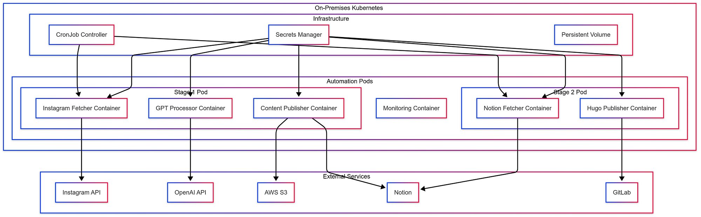
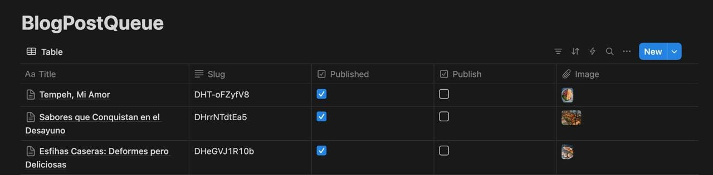
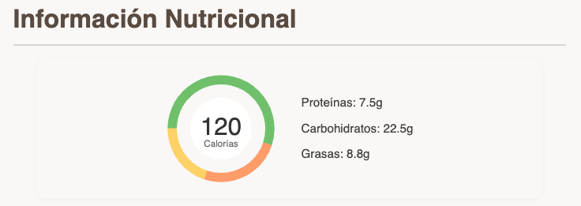

## The Recipe for Modern Content Creation (Now with Extra Bytes!)

In the world of food blogging, freshness isn't just about ingredients — it's about content too. What if you could automate your recipe blog to be as efficient as a well-oiled kitchen? That's exactly what we've cooked up with 'Los Platos de Sara.' Join us as we dive into the technical ingredients that make this automated recipe blog pipeline a true chef-d'oeuvre of modern web development.

Ever thought about turning your food pics into a full-fledged recipe empire? Well, grab your apron and your favorite IDE, because we're about to whip up a tech soufflé that'll make your taste buds AND your CPU cores tingle!

## The Ingredients (Tech Stack à la Mode)

- **Frontend:** Hugo (because static sites are the new black)
- **AI Brain:** OpenAI GPT-4 Turbo (smarter than your average kitchen appliance)
- **Content Management:** Notion (where ideas marinate)
- **Data Extraction:** Apify (the sous chef that never sleeps)
- **Image Storage:** AWS S3 (infinite pantry space!)
- **Hosting:** GitLab Pages (serving up hot content 24/7)
- **Automation:** Python scripts (slithering through your content pipeline)

## The Secret Sauce: Two-Stage Automation (Double the Flavor, Double the Fun)

### Stage 1: From Instagram to Notion (The Content Harvester)

The first stage fetches Instagram posts, uses GPT-4 to transform captions into structured recipes, uploads images to S3, and stores everything in Notion for review and editing.

```python
import apify
import openai
import boto3
from notion_client import Client

def instagram_to_notion():
    # Fetch those tasty Instagram morsels
    insta_posts = apify.run('instagram-scraper', 
        {'username': 'los_platos_de_sara'})
    
    for post in insta_posts:
        # Let GPT-4 work its magic
        recipe_markdown = openai.ChatCompletion.create(
            model="gpt-4-turbo",
            messages=[{
                "role": "user", 
                "content": f"Convert this to a recipe: {post['caption']}"
            }]
        )
        
        # Upload images to S3
        s3 = boto3.client('s3')
        image_url = s3.upload_file(
            post['image'], 
            'my-recipe-bucket', 
            f"{post['id']}.jpg"
        )
        
        # Serve it up to Notion
        notion = Client(auth=os.environ["NOTION_TOKEN"])
        notion.pages.create(
            parent={"database_id": os.environ["NOTION_DATABASE_ID"]},
            properties={
                "Title": {"title": [{"text": {"content": post['title']}}]},
                "Content": {"rich_text": [{"text": {"content": recipe_markdown}}]},
                "Image": {"files": [{"name": f"{post['id']}.jpg", 
                          "external": {"url": image_url}}]}
            }
        )
```

### Stage 2: From Notion to Production (The Content Sommelier)

Once recipes are reviewed and marked "Ready to Publish" in Notion, the second stage automatically deploys them to the Hugo site via GitLab.

```python
from notion_client import Client
import gitlab
import frontmatter

def notion_to_gitlab():
    notion = Client(auth=os.environ["NOTION_TOKEN"])
    gl = gitlab.Gitlab(private_token=os.environ["GITLAB_TOKEN"])
    project = gl.projects.get(os.environ["GITLAB_PROJECT_ID"])
    
    # Fetch the crème de la crème from Notion
    recipes = notion.databases.query(
        database_id=os.environ["NOTION_DATABASE_ID"],
        filter={"property": "Status", 
                "select": {"equals": "Ready to Publish"}}
    )
    
    for recipe in recipes.results:
        # Transform to Hugo-friendly Markdown
        hugo_content = frontmatter.dumps(
            frontmatter.loads(recipe.properties["Content"].rich_text[0].plain_text)
        )
        
        # Deploy to GitLab
        project.files.create({
            'file_path': f'content/recipes/{recipe.properties["Title"].title[0].plain_text}.md',
            'branch': 'main',
            'content': hugo_content,
            'commit_message': f'Add new recipe: {recipe.properties["Title"].title[0].plain_text}'
        })
        
        # Mark as published
        notion.pages.update(
            recipe.id, 
            properties={"Status": {"select": {"name": "Published"}}}
        )
```

## The Infrastructure Behind It

### The Presentation Layer (Because We Eat with Our Eyes First)

Our Notion-powered frontend is dressed to impress:



- Responsive design (looks good on everything from smartphones to smart fridges)
- Custom donut charts for nutritional info (because pie charts were too on-the-nose)



- High-quality images (food porn, but make it classy)
- Social media integration (spread the flavor!)
- SEO optimization using Schema.org (Google's gotta eat too)

## Why This Matters (or: How I Learned to Stop Worrying and Love the Bot)

This automation pipeline is the kitchen gadget you never knew you needed:



1. **No more copy-pasta** from Instagram (unless it's an actual pasta recipe)
2. **Consistent formatting** (because messy recipes are for your kitchen, not your blog)
3. **Lightning fast publishing** — From Insta-story to published glory faster than you can say "Bon Appétit!"
4. **AI-assisted processing** (it's like having Gordon Ramsay as your personal editor, minus the yelling)
5. **Scales faster** than your waistline during the holidays

## The Technical Benefits (Nerdy, but Nice)

- **Separation of Concerns:** Like keeping your peas from touching your mashed potatoes
- **Scalability:** It can handle more recipes than your grandmother's cookbook
- **Maintainability:** Easier to update than your relationship status
- **Reliability:** More dependable than your sourdough starter
- **Flexibility:** Bends like a pizza maker tossing dough

## A Feast for the Senses (and the Servers)

By marrying the power of social media, AI, and static site generation, we've created a content kitchen that's always open. It's a testament to how modern tools can turn even the most complex recipes into a piece of cake.

The full recipe (I mean, code) is available on [GitLab](https://gitlab.com/felipedbene/los-platos-de-sara), and you can taste the final product at the [live site](http://sari.debene.dev). 

Now, if you'll excuse me, all this coding has made me hungry. Time to Instagram my lunch and watch it magically appear on the blog!

Bon appétit and happy coding! 🍳💻🥘

---

**Source code:** [gitlab.com/felipedbene/los-platos-de-sara](https://gitlab.com/felipedbene/los-platos-de-sara)

*Originally published on [Medium](https://medium.com/@felipedebene/from-instagram-to-web-cooking-up-an-automated-recipe-blog-pipeline-162d02ddb743).*
