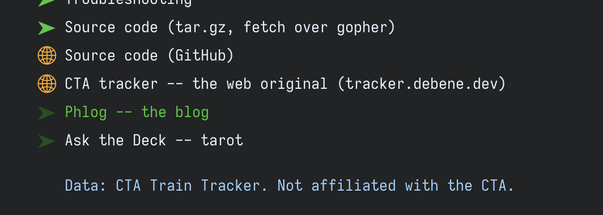
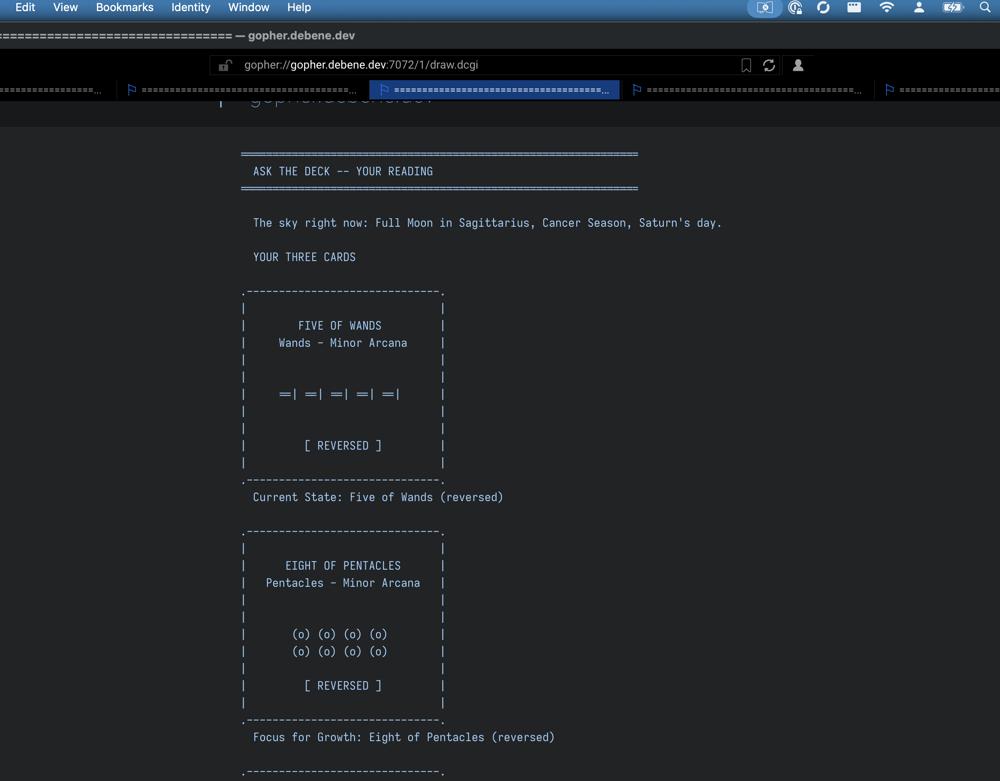
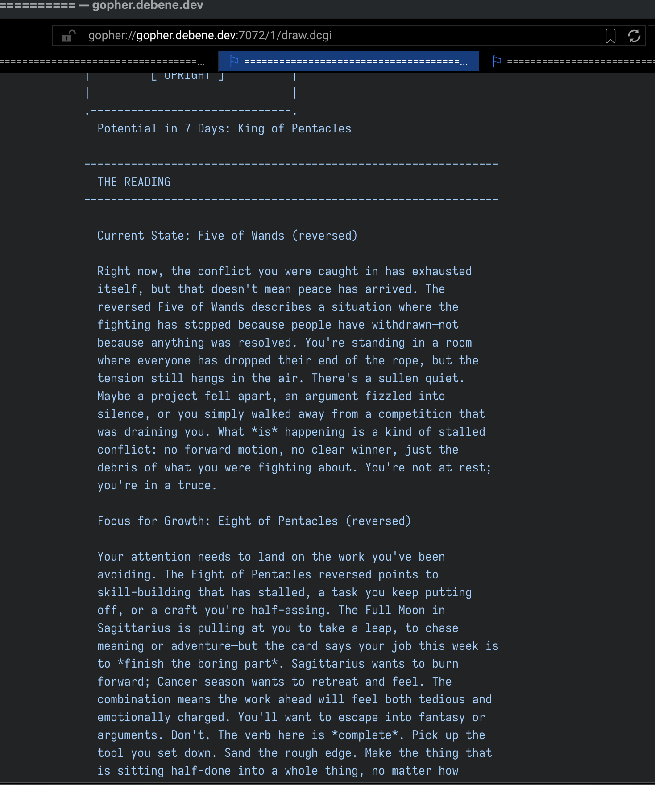
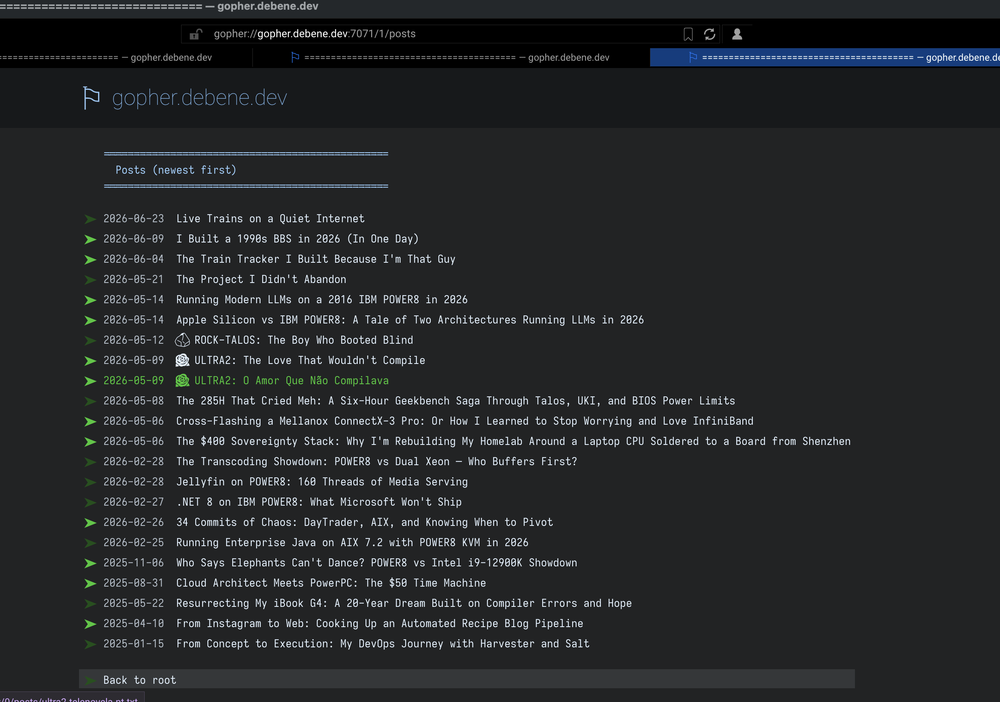

A few days ago I [put live CTA trains on gopher](https://debene.dev/posts/gopher-cta-live-trains/) — the 1991 text protocol, no JavaScript, no cookie banners, the internet with the volume turned down. I called that post "Live Trains on a Quiet Internet" and figured that was the end of it: one weird little gopherhole, scratching one itch.

It wasn't the end of it. This morning I opened the project back up "just to add a link," and by the time I looked up it was dark out and I had a whole neighborhood. A shared library underneath. A phlog. An *interactive* tarot reader that draws three cards and reads them against the actual sky overhead. And a hub tying the three of them together.

If you've read [the one about the project I didn't abandon](https://debene.dev/posts/askthedeck-adhd/), you know my `~/projects` folder is mostly a graveyard — the specific failure mode of an ADHD brain that loves the fun part and ghosts the boring middle. So a day that ends with *three things shipped and verified live* is not my historical baseline. I want to talk about how it happened, what's in it, and one small experiment I'm running with this very post.

## From one hole to three

Here's the map as of tonight, all on the same little RackNerd box:

- **`gopher://gopher.debene.dev`** (port 70) — `gopher-cta`, the live 'L' train maps. The front door.
- **`gopher://gopher.debene.dev:7071`** — the **phlog**: this blog, rendered into gopher.
- **`gopher://gopher.debene.dev:7072`** — **Ask the Deck**: an interactive tarot reading.

They're stitched together in what gopher folks call a **hub**: the front door lists everything, and every hole links back to the front door. There's no proxy and no shared web server doing the routing — it's done at the protocol level. A gopher menu line carries `type · label · selector · host · port`, so cta's root simply has a couple of lines whose host/port point at the *other* ports. Your client reads the menu, sees the address, and opens a fresh connection itself. Port 70 never forwards a byte.

*The trains hole's root menu grew two cross-links. Each one is a normal menu entry that happens to point at a different port. If a hole is down, you lose discovery of it — never the others.*

That's the whole topology. It's gloriously dumb in the way gopher rewards: no service mesh, no ingress controller, just text files that name each other.

## The boring part, done first

The part I'm quietly proudest of is the part you'll never see: I started the day by *deleting* code.

Three holes were all doing the same three gopher chores — model a menu, serialize it to geomyidae's `.gph` format, and publish a tree atomically (render into `out-<timestamp>/`, then flip a `current` symlink with a single `rename(2)` so a reader never sees a half-written tree). Each repo had its own copy of that spine, drifting slowly apart. So before building anything new, I pulled it into one tiny dependency-free crate, `gopher-core`, and pointed everyone at it.

This is *exactly* the kind of task past-me skips. It's not fun. Nothing visibly changes. But it's why the third hole was cheap to build: by the time I got to the tarot reader, "be a gopher server" was a solved, tested import, and I could spend the day on the actually-interesting half. The proof it was a clean lift: the serialized menus came out **byte-for-byte identical** before and after. A refactor you can't see is the best kind.

## The one that draws cards

The new hole is a port of [askthedeck](https://ask.debene.dev), my tarot app — the one the "didn't abandon" post is about. On the web it's a tap-three-cards, get-a-reading thing backed by an LLM and real astronomy. The interesting question was: **what's the gopher-native shape of that?**

Most of a gopherhole is static files. A reading is not — it's different every time. So the design splits cleanly: everything *except* the reading is a baked static tree (an about page, today's cosmic weather, and a browsable gallery of all 78 cards with ASCII art and meanings), and the one dynamic surface is a single CGI script, `draw.dcgi`, that geomyidae runs per request. Small dynamic surface, small attack surface, small bill.

*A live draw. "The sky right now: Full Moon in Sagittarius, Cancer Season, Saturn's day," then three cards rendered as boxed ASCII — pips laid out by rank, upright or reversed. No images; gopher serves text, so the art **is** text.*

Two details I love:

**The sky is real.** The web app computes the moon phase, moon sign, and zodiac season with a full astronomy library. I didn't want to ship a JavaScript engine inside a gopher script, so I ported the ephemeris math down to dependency-free Rust — Paul Schlyter's low-precision solar and lunar formulas, with the moon's main perturbation terms so it doesn't drift across a sign boundary. Then I checked it against the original library across a fistful of dates until the labels matched. The "Saturn's day" in that screenshot isn't decoration; it's Saturday, computed from the server's clock as a planetary day.

**The cards are drawn, not stored.** There are no 78 image files. There's a renderer: a boxed frame, and inside it the suit glyph repeated by rank — five little wand-marks for the Five of Wands, eight coins for the Eight of Pentacles — with court cards and the 22 majors getting their own motifs, and a reversed card flips its motif over. It's pure and unit-tested: a given card renders to an exact string.

*Below the frames, the actual reading — each card read **as its position** (Current State / Focus for Growth / Potential in 7 Days), coloured by the moon. When the LLM is reachable it writes this; when it isn't, a deterministic local interpreter does, so the deck always answers.*

## The quiet-internet ethic, made literal

The trains post was partly about what gopher *doesn't* do to you: no tracking, no cookies, no analytics. With a tarot reader that idea stopped being abstract and got a sharp edge, because a gopher CGI script can actually *see* things about you — your IP, the selector path you came in on, your client software.

So I drew a hard line and wrote a test to enforce it. The prompt that gets sent to the LLM contains **exactly two things**: the three cards, and the sky computed from the server clock. Not your IP. Not your hostname or port. Not the path you arrived on. Not a timestamp precise enough to locate you. The function that builds the prompt literally can't receive those values — and a release-gate test feeds it a string full of fake IPs and "ignore previous instructions" and fails the build if any of it could reach the model.

The one piece of you that touches the system at all — your IP, for rate-limiting — gets hashed the instant it arrives and never travels further. A reading should be about the cards and the night sky. Nothing about *you* belongs in it. On the loud internet that's a nice-to-have you bolt on later; here it's the foundation, and it's checked by CI.

## Two things I got wrong, and a daemon that lied to me

It was not all clean. Three quick war stories, because the mistakes are the interesting part.

**I made the port unfaithful, twice.** First I gave the prompt an open-ended "your question" field and piped whatever you typed straight into the model. The web app has no such field — and worse, an open text box flowing into an LLM is a prompt-injection hole. Ripped it out; the prompt is now a fixed template. Then I'd wired the entry point as a gopher *search* item, which makes your client pop up a "type something" box — confusing, when the thing it feeds is a shuffle, not a question. Changed it to a plain "Draw three cards" link. Lesson, relearned: when you port something, port what it *actually does*, not what you assume it does.

**geomyidae lied to me about a flag.** Its usage line lists `-c`, and I assumed "CGI." I added it, and the container crash-looped: `chroot: Operation not permitted`. `-c` is *chroot*, which needs privileges my unprivileged container doesn't have. CGI is enabled simply by the file extension and the execute bit — no flag at all. Separately, you have to start it with `-h <your-hostname>` or it advertises its *container ID* as the link host and every cross-link breaks. Both of those cost me a redeploy to discover, and both are now written down so future-me doesn't repeat them.

**A public LLM endpoint is a money fire if you're careless.** This hole is going to get crawled — gopher's small but its bots are diligent. A script that calls a paid model on every hit is a denial-of-wallet waiting to happen. So: identical draws are cached and cost nothing; there's a daily call cap, past which everyone gets the (genuinely good) offline reading; and there's a per-IP rate limit so one client can't run up the bill. The app *always* returns a real reading with no key, no network, or no budget. Same "always produces output, never half-states" instinct as the trains fetcher.

## How a day like this even happens

I'll be honest about the thing that made one day enough, because [I've written about it before](https://debene.dev/posts/askthedeck-adhd/): I wasn't doing it alone. I built this with Claude Code as the other half of the keyboard — and not in the "generate me an app" way the demos sell. I worked in thin vertical slices, one commit each, each one green (tests, linter, formatter) before the next. Claude wrote a lot of the Rust under direction; I steered the architecture, made the calls, caught the unfaithful prompt and the confusing search box, and — the part that actually matters — verified every piece live on the box before moving on.

That's the same trick from the tarot post: the AI's most useful job isn't acceleration, it's helping me get *through the boring middle* without wandering off. The refactor got done. The privacy test got written. The deploy got verified, not assumed. A graveyard-prone brain shipped three things in a day because the unsexy 95% had a collaborator that doesn't get bored. (Yes, including this post. I'd rather tell you that than pretend.)

## Now the experiment

Here's the bit I'm actually curious about.

This post is on the web, at `debene.dev`, with its CDN and its OpenGraph card and its analytics telling me how many of you bounced. But because the phlog renders straight from this same Markdown, **the exact same words are also sitting on gopher** right now, at `gopher://gopher.debene.dev:7071`.

*Same posts, no theme, no fonts, no tracking. Just dates and titles, newest first. When this one publishes, it lands at the top of both lists at once.*

Two copies of the same writing: one on the loud internet, one on the quiet one. The web version will get found through the usual machinery — search, links, the algorithm's leftovers. The gopher version gets found the old way: through [Floodgap](https://gopher.floodgap.com/)'s listings, through Veronica-2 crawling selectors, through a human in a text client actually choosing to wander in.

So I'm going to watch. Does the quiet copy catch up? Does anyone read a blog post on a protocol from 1991 when the identical thing is one tap away on the web? I genuinely don't know, and that's why it's fun. I'll report back.

In the meantime: if you've got a gopher client (or [Floodgap's web gateway](https://gopher.floodgap.com/gopher/gw?gopher.debene.dev)), come wander the neighborhood. Read the trains. Read this, on gopher, the way it's also published. And while you're there — `gopher://gopher.debene.dev:7072` — draw three cards. The deck reads the sky, not you. Every reading even gets its own permalink you can bookmark; that's the only "save" there is, because there are no accounts to make.

The quiet internet doesn't have to be a museum. It can have live trains, a blog, and a deck that reads the stars. Built in a day — because I wasn't building it alone.
