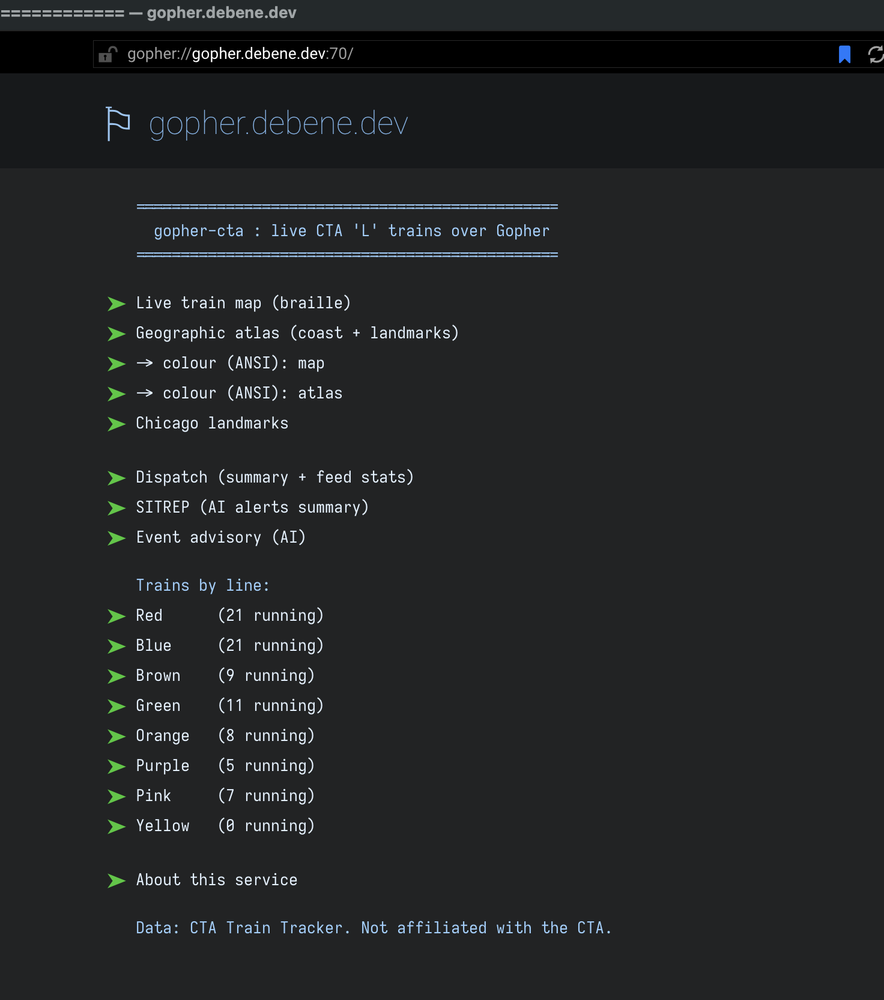
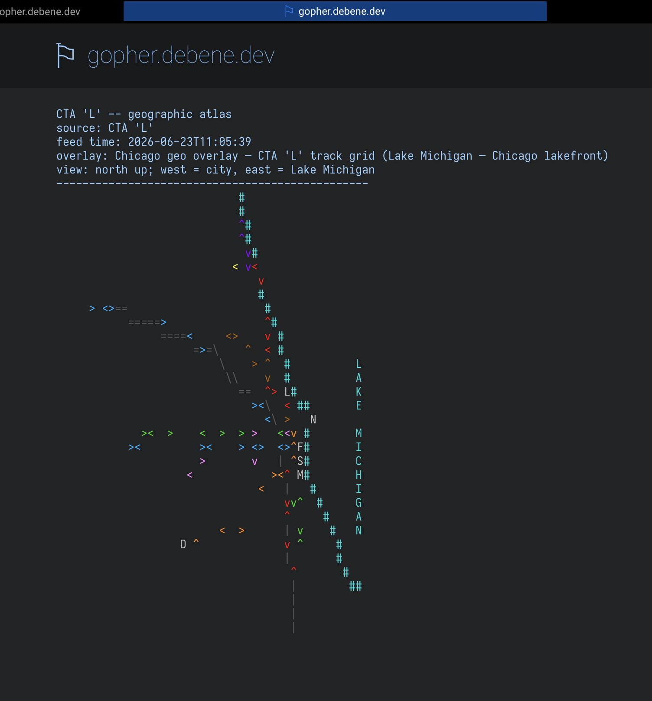
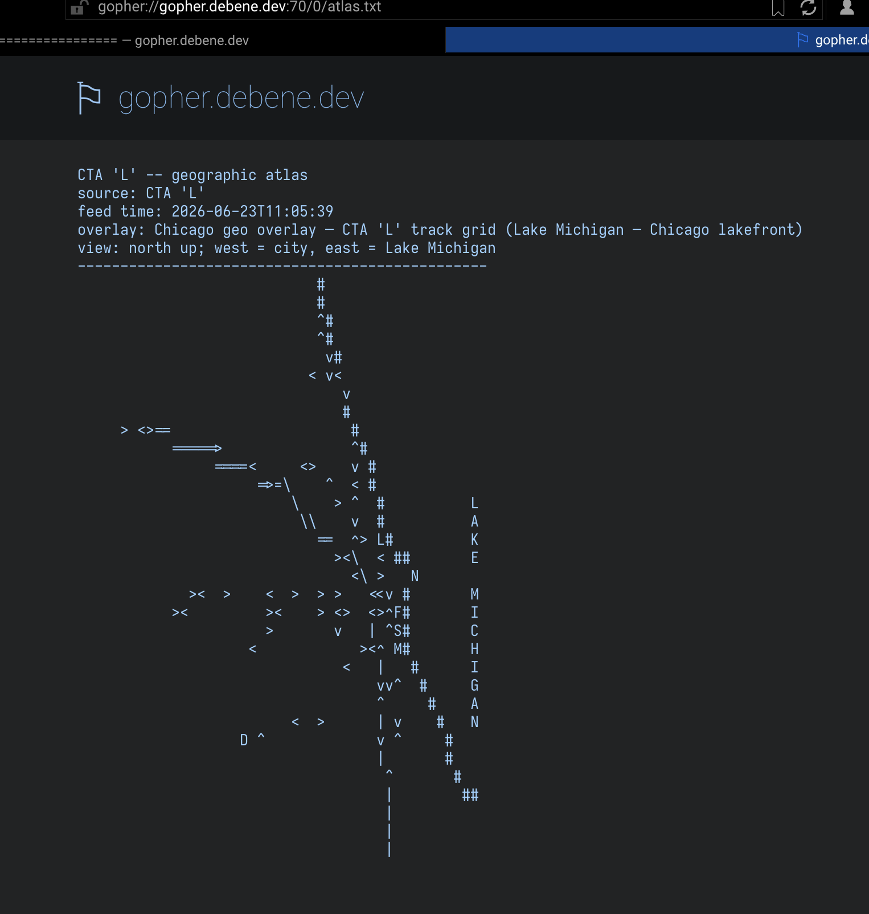
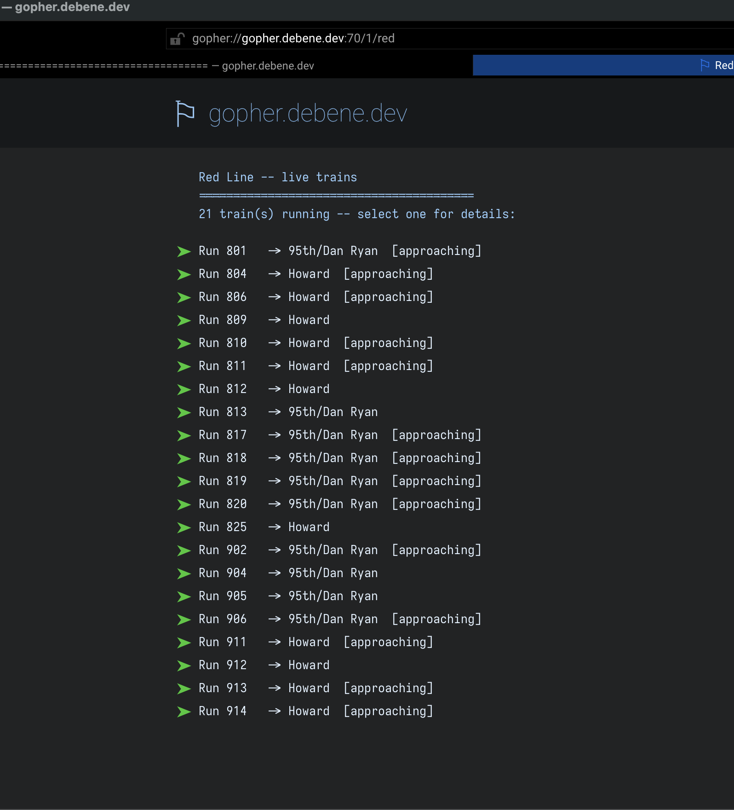
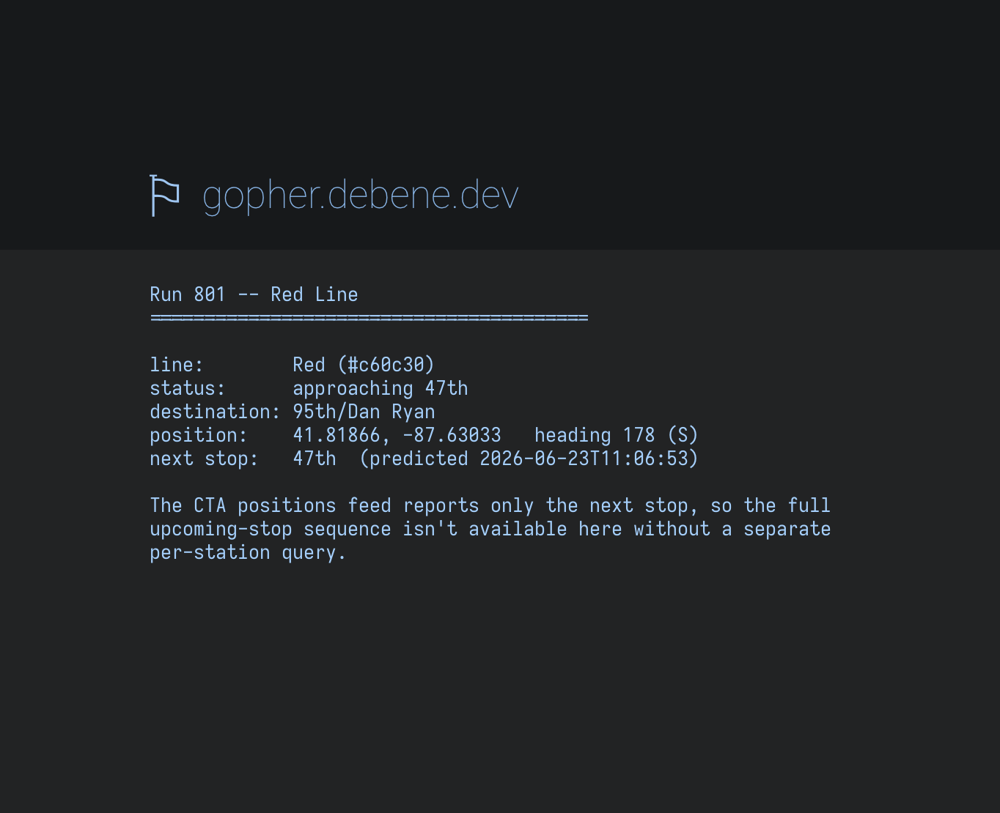

I spend my days in cloud control planes, dashboards that auto-refresh, tabs that beg for attention. So when I go home to tinker, I keep reaching for the opposite: machines and protocols that sit still until you ask them something. Vinyl instead of an infinite feed. A POWER8 box humming in the corner instead of someone else's serverless. And lately — gopher.

If you've never used it: gopher is a protocol from 1991, older and simpler than the web. No JavaScript. No ads. No cookie banner asking permission to track you while pretending it's about your "experience." No fonts loading from six CDNs. You connect to a server on port 70, send it a short string called a *selector*, and it hands back either a menu or a plain text file. That's the whole thing. A menu is just lines; some lines are links to other selectors. You navigate a worldwide information system by reading and pressing enter.

People hear "1991 text protocol" and assume it's a museum piece. It isn't, or not only that. There's a small, stubborn community still publishing on it — phlogs (gopher blogs), weather, news digests, recipes, code. It's the internet with the volume turned down to where you can hear yourself think. For someone who finds the modern web genuinely tiring, that's not nostalgia. It's relief.

## So why not bring it something useful?

Here's the thing I kept turning over: a quiet medium doesn't have to mean a *dead* one. The people reading gopher today still ride buses. They still wait on platforms in the cold. Real-time information isn't antithetical to a calm internet — it's exactly the kind of thing a calm internet should be allowed to have, without dragging in a 4 MB single-page app to deliver it.

And I love trains. Chicago's 'L' is right outside, the CTA publishes a live Train Tracker feed, and I had a question I couldn't stop poking at: **what does live transit data look like when you strip away every pixel that isn't information?**

That became `gopher-cta` — a gopherhole that plots every 'L' train in service, live, over a protocol from before the web existed.



## The dotted map

The part I'm proudest of, and the part I personally can't stop opening, is the map.

Gopher serves text. So how do you draw a *map* in text? You cheat, beautifully. There's a block of Unicode called Braille Patterns (U+2800–U+28FF), and every glyph in it is a 2×4 grid of dots that can each be on or off. That's 256 combinations — which means each character is secretly an eight-pixel bitmap. Pack them in a grid and a monospace terminal becomes a tiny dot-matrix display:

```
⠀⠀⢀⣀⠤⠤⠒⠒⠉⠉⠁⠀⠀⠀⠀⠀
⠀⢠⠊⠀⠀⠀⠀⠀⠀⠀⠉⠢⡀⠀⠀⠀
⢀⠇⠀⠀⠀⠀●⠀⠀⠀⠀⠀⠈⢆⠀⠀
```

So I take each train's latitude and longitude, project it onto a fixed canvas sized to Chicagoland, and light up the braille dot that falls under it. The shoreline and a handful of landmarks go down first as a static layer; the live trains get painted on top. The result is a recognizable map of the city, drawn entirely in dots, that redraws itself as the trains move.



There's a colour (ANSI) variant too, but the plain dotted one is the one I love — it looks like something a weather station would've spat out in 1985, and it works in any terminal with a half-decent font.



Under the map: a per-line breakdown (Red, Blue, Brown…), and each line drills down to individual trains — destination, heading, next stop, predicted arrival. Quiet, fast, complete.





## How it actually serves

Worth a paragraph for the infra people. gopher-cta doesn't speak gopher itself — that job belongs to [geomyidae](https://r-36.net/scm/geomyidae/), a lovely sub-1000-line C daemon. My part is a small Rust fetcher that, every 30 seconds, renders the whole tree into a fresh snapshot directory and then atomically flips a `current` symlink to point at it. geomyidae serves `current/`. Because the swap is a single `rename(2)`, a reader always sees a complete tree, never a half-written one. Old snapshots get garbage-collected. No database, no in-place mutation, no half-states. It's the kind of boring-on-purpose design that lets you sleep.

## I emailed a legend

A gopher server isn't really *part* of gopherspace until it's listed, and the canonical list — "New Gopher servers since 1999" — lives at Floodgap, the largest and longest-running gopher site there is. It's maintained by Cameron Kaiser.

If that name doesn't land for you, let me explain what it did to me. Cameron Kaiser runs Floodgap and its gopher-to-web gateway, wrote Veronica-2 (the search engine for all of gopherspace), and — this is the part that made me sit up — authored **TenFourFox**, the Firefox fork that kept PowerPC Macs on the modern web for the better part of a decade after Mozilla and everyone else had left them for dead. I own those PowerPC Macs. His software is *why they still work*. So writing him a submission email was less "filing a form" and more "mailing a hero of the retro net and hoping he writes back." He wrote back.

And his reply turned out to be the most interesting part of the whole project:

> Are the selectors permanent, or only temporary? … I prefer not to index ephemeral selectors in the first place.

It's a deceptively deep point about protocol design. His crawler, Veronica-2, indexes selectors so people can search gopherspace. If I let it index every train, those entries would be *dead within minutes* — because here's the catch I'd half glossed over: a train's selector is its CTA *run number*, and run numbers churn as trains enter and leave service. `/train/906.txt` is real right now and gone after rush hour. Index that and you've just poured dead links into a public search engine.

The fix is older than the web's version of it: a `robots.txt`. Same idea you know from HTTP, ported to gopher — the crawler fetches the `robots.txt` selector and obeys it. Mine is three lines:

```
User-agent: *
Disallow: /train/
Crawl-delay: 30
```

This draws exactly the right line. The maps, the atlas, the landmarks, the per-line menus — those selectors are **permanent**. Their *contents* change every 30 seconds, but the paths never move, so they're perfect to index. Only the per-train leaves are ephemeral, and now they're fenced off. The `Crawl-delay` is a courtesy: the tree only republishes every 30s, so there's nothing to gain by hammering it faster.

There's a neat lesson buried in there: **"the data changes" and "the address changes" are completely different things, and only the second one is a problem for a crawler.** A live map at a fixed selector is fine. A page whose very name expires is not.

## It belongs on the good hardware

Here's where the loop closes. The whole point of a quiet, text-first protocol is that it asks almost nothing of the machine on the other end — which means gopher-cta's natural habitat isn't a modern laptop at all. It's the PowerPC Macs TenFourFox kept alive.

The dotted map glowing on a period screen, in a period browser, on a machine old enough to vote — that's not a compromise, that's the *correct* way to view this. And it's not just browsing: the fetcher itself is small enough to run on the iron. It's Rust with barely any dependencies, and there's a dedicated build path for big-endian PowerPC baked into the project — the default TLS stack doesn't support big-endian, so the G5 gets a vendored-OpenSSL build instead. That detail is in the `Cargo.toml` on purpose: I wanted the thing that serves live trains to be able to run on a 2005 PowerMac G5, not just talk down to one.

The current fleet:

- **iBook G4** — the little white workhorse, perfect for sitting on the couch and watching the Red Line crawl up the north side in braille.
- **PowerMac G5** — the big-endian beast; the reason that OpenSSL build path exists.
- **Clamshell** — incoming. It's on its way to me as I write this, and getting gopher-cta running on something that old and that gorgeous deserves its own post. Next time.

There's something fitting about all of it. A protocol from 1991, a city's trains in real time, dots for pixels, served and read on Apple hardware from the era when computers still came in colors. None of it should fit together. All of it does.

## Worth it

So that's gopher-cta: live Chicago 'L' trains, rendered as braille dots, served over a protocol older than the web, fenced politely from search crawlers, on a $26/year VPS. By any reasonable product metric it's pointless. By the only metric I care about on a weekend, it's perfect — it does one quiet, specific, beautiful thing, and it's mine, and it'll keep doing it without asking anyone for attention.

### How to watch

If you've never used gopher before, here's where to start:

**GUI clients (beautiful and modern):**
- **[Lagrange](https://gmi.skyjake.fi/lagrange/)** — Gorgeous, fast, supports both Gopher and Gemini. Runs on everything from PowerPC Macs to modern Linux. This is the one I use on the iBook G4.

**Terminal clients (fast and everywhere):**
- **lynx** — `lynx gopher://gopher.debene.dev`
- **curl** (yes, really) — `curl gopher://gopher.debene.dev/0/map.txt`

**The raw way (no client needed):**

```bash
# Root menu
printf '\r\n' | nc gopher.debene.dev 70

# Live braille map
printf '/map.txt\r\n' | nc gopher.debene.dev 70

# Watch trains move in real-time (30s refresh)
watch -n 30 "printf '/map.txt\r\n' | nc gopher.debene.dev 70"

# Red Line only
printf '/red\r\n' | nc gopher.debene.dev 70

# Specific train (run number changes!)
printf '/train/906.txt\r\n' | nc gopher.debene.dev 70
```

That last one — the watcher — is my favorite. Open a terminal, run it, and just leave it there. Every 30 seconds the map redraws itself with fresh train positions. No JavaScript. No websockets. No battery drain. Just dots, quietly updating, while you work on something else.

And if you've never spent an evening on the quiet internet — maybe start now. It's still there. It's been waiting.
