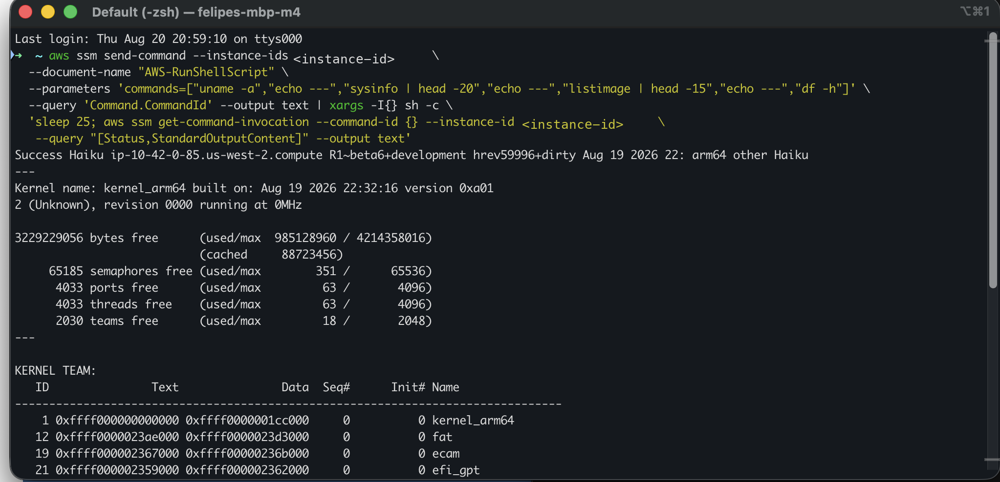
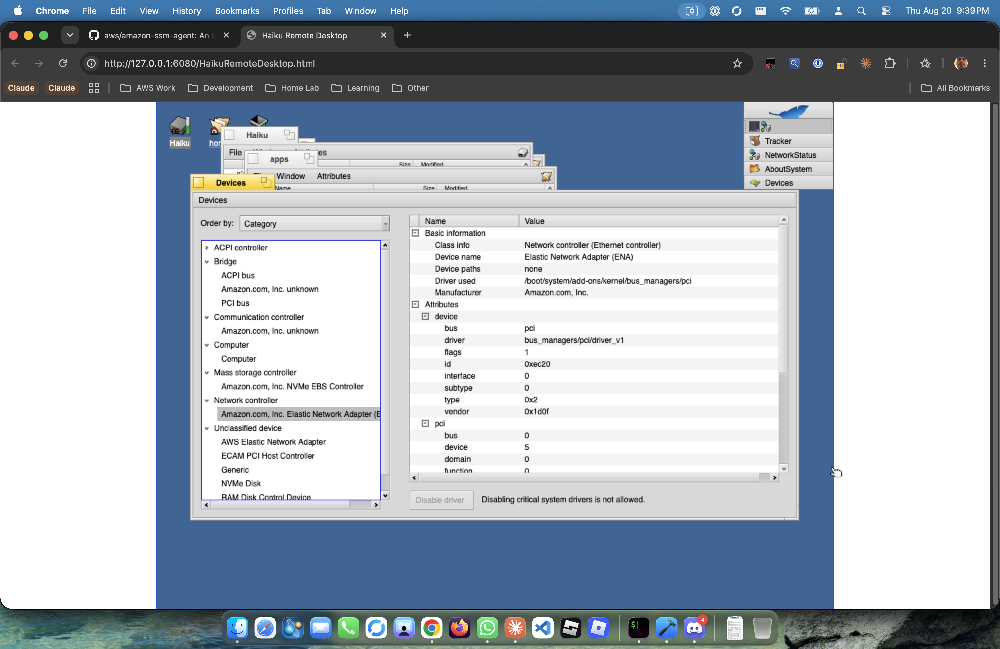
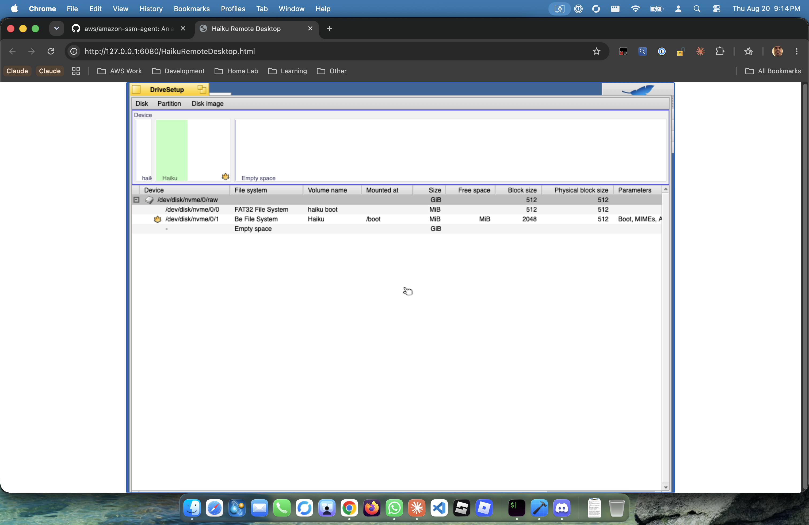
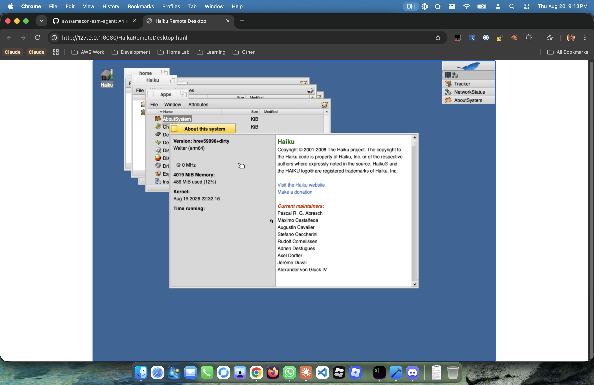

There's a terminal on my screen I keep re-running just to watch it happen.

I fire `aws ssm send-command` at an instance id, ask for `AWS-RunShellScript`, and poll the invocation. What comes back isn't a timeout. It's `uname`, a `sysinfo` dump, `listimage`, `df` — a whole health check, executed remotely, from an operating system whose family tree starts at BeOS in the 1990s:

Read that output for a second. `Success Haiku ip-10-42-0-85 ... hrev59996+dirty ... arm64`. A `kernel_arm64` built the night before. Eighteen teams alive out of a possible 2048, 63 ports, a couple thousand semaphores. And, deadpan in the middle of it, **`running at 0MHz`** — because nobody has taught this kernel to read the clock speed off a Graviton core yet. That's AWS Systems Manager — the thing enterprises use to patch ten thousand Linux boxes — delivering a shell command to a Haiku box on a Graviton instance, over a network card whose driver I wrote.

Because here's the other thing that box is doing: it *sees* the hardware it's sitting on.

That's Haiku's own Devices utility, and it's claiming the entire Nitro platform without blinking: an **Elastic Network Adapter (ENA)** listed as a plain Ethernet controller, Manufacturer *Amazon.com, Inc.*, `vendor 0x1d0f` — Amazon's real PCI vendor ID — bound to a driver I wrote and loaded out of `/boot/system/add-ons/kernel/bus_managers/pci`. Below it, the **NVMe EBS Controller** and the **ECAM PCI host** that the arm64 boot path enumerates. A desktop OS from 2001 looking at Nitro silicon and going *yeah, I know what all of this is.*

The instance shows up in Fleet Manager. `PlatformName: Haiku`. Ping status: Online. It sits in the console next to actual Linux boxes and the console does not care.

It started, as these things do, with a dumb question at 11 PM: *could amazon-ssm-agent run on my Haiku port?*

## No. Obviously no. Interesting no.

The answer is no twice over.

First: the SSM agent is ~99% Go, and there is no Go toolchain for haiku/arm64. The Haiku community's Go port exists — you can `pkgman install` it — but it's x86_64 only. Cross-compiling doesn't save you: you'd need the Go *runtime* ported to haiku/arm64 (syscall layer, signal handling, thread spawning through `spawn_thread`), which is a porting project comparable to the one I'd already done for the OS itself. Stacking a language runtime port under a management agent port, just to run commands remotely, is how projects go to the graveyard.

Second: even if it compiled, the agent assumes Linux with its whole chest. systemd lifecycle, `ssm-user` provisioning with sudo, Linux PTY ioctls, `/etc/amazon/ssm`, rpm/deb packaging. None of that maps.

But here's what *does* work on a Haiku EC2 instance for free: IMDSv2. The instance metadata service is plain HTTP on a link-local address — instance identity, region, IAM role credentials, all reachable with the curl that already ships in the AMI. And Haiku's C++ toolchain is first-class; it built the operating system.

So the question changed shape: not "can I run the agent," but "how much of the agent's *protocol* do I actually need?"

## Reading the agent so I didn't have to port it

amazon-ssm-agent is Apache-2.0, so the wire protocol is sitting right there in the source. I spent an evening reading it, and the load-bearing discovery was this: **the agent picks its own delivery channel, and the service is built to handle an agent that only speaks the old one.**

Modern agents prefer MGS — a websocket control channel — and fall back to MDS, a plain HTTPS long-poll against `ec2messages.<region>.amazonaws.com`. The release notes describe MGS as an optimization ("receive run command documents through MGS if connected and fallback to MDS otherwise"), the agent literally reports which channel it's on via an `SSMConnectionChannel` field, and MGS failure is explicitly non-fatal in the source. An agent that only ever says "ec2messages" is describing a supported state, not a degraded one.

That collapses the problem. Run Command over MDS needs exactly: SigV4 signing, a `GetMessages` long-poll, a shell executor, and `SendReply`/`AcknowledgeMessage`. No websockets, no binary framing, no plugin architecture. That's not a port. That's a weekend.

A few wire details for anyone else who ends up here (nobody publishes this; you derive it from Go source):

- The API target header is `X-Amz-Target: EC2WindowsMessageDeliveryService.GetMessages` — on *every* platform. The `Windows` is a fossil from 2015 and it is the target for Linux, macOS, and now Haiku. I love this detail beyond reason.
- The reply ordering is mandatory and race-prone if you get it wrong: `SendReply(InProgress)` → `AcknowledgeMessage` → execute → `SendReply(terminal)`. The visibility timeout is 10 seconds, so an un-acked message comes back — dedup by CommandId is a day-one requirement, not hardening.
- `PlatformType` is a closed enum (`Windows | Linux | MacOS`) and the service rejects anything else. But `PlatformName` and `PlatformVersion` are free strings. So: `PlatformType: Linux, PlatformName: Haiku`. Compatible where I must, honest where I can. The console renders it exactly like that, deadpan, next to a fleet of actual Linux boxes.

## haiku-mgmt-agent

The whole thing — the agent, the AMI notes, and the Haiku arm64 port it rides on — lives at **[felipedbene/Haiku-Graviton](https://github.com/felipedbene/Haiku-Graviton/tree/graviton)** (the `graviton` branch).

The result is a single C++ binary, about 1.35 MB, statically carrying mbedTLS (which cross-compiled for Haiku on the first try — even `net_sockets.c` — and I'm still a little suspicious about that). HTTP/1.1, SigV4, and the JSON handling are hand-rolled, ~600 lines total, because pulling in a dependency tree to speak AWS JSON 1.1 to one endpoint felt like missing the point.

It gets role credentials from IMDSv2, registers with `UpdateInstanceInformation`, long-polls MDS, runs `AWS-RunShellScript` documents through `/bin/sh`, and reports back. That first screenshot up top? That *is* the loop closing: a `send-command` in, `/bin/sh` runs the health check, `SendReply` carries the `sysinfo` back out. Anything it doesn't support — inventory associations, agent self-update — fails *loudly*, per-plugin, visible in the console. Never a silent skip. A management agent that quietly drops commands is worse than no agent.

launch_daemon starts it at boot. Timeouts SIGTERM the child's process group and Haiku reaps the whole tree immediately — I had a SIGKILL escalation ready and it never fired, which honestly surprised me more than anything else in this project. The kernel's process semantics are *solid*.

## The two things the OS taught me

**Haiku on EC2 boots in 1970.** No RTC read on the arm64 path, no NTP client anywhere in the image. Which means every TLS handshake fails — certificates from the future — and every SigV4 signature is garbage. The agent's fix is my favorite kind of ugly: before anything else, it reads the `Date` header off an IMDS response. IMDS is plain HTTP, so it works precisely when nothing else can, and the clock gets close enough for X.509 and SigV4 to function. It re-checks every health cycle. The real fix belongs in the OS boot path, and it's on the list.

**BFS journals metadata, not data.** I learned this the way you learn filesystem semantics: the hard way.

There's the layout: a small FAT32 `haiku boot` ESP on `/dev/disk/nvme/0/0`, and the real system — **Be File System**, 2048-byte blocks — on `/dev/disk/nvme/0/1`, mounted at `/boot`, straight off the EBS-backed NVMe. Now: a forced stop (there's a teardown quirk that eats ACPI reboot on arm64, so power cycling means stop/start) corrupted the agent's launch_daemon job file. Correct length, garbage content — the size update hit the journal, the data blocks never flushed, and the file came back full of stale freed blocks containing fragments of the agent binary itself. It presented as "launch_daemon rejects my job definition" and cost a full debugging cycle before anyone thought to hexdump the file. `sync` before you stop a Haiku instance. It's in the README in bold now.

## The Desktop

Same week, different bug, and the best root-cause of the month. The browser remote desktop — Haiku's own app_server remote protocol, tunneled over SSH into websockify — had always needed you to hand-launch apps in a live session. Fresh boots gave you a connected socket and a black screen.

Everyone (me) assumed a repaint issue. It wasn't. Haiku's launch_daemon starts Tracker and Deskbar under a clean service environment — which doesn't carry `TARGET_SCREEN`. Apps read that variable to decide *which* desktop to attach to, and on a machine with no framebuffer, the NULL-target desktop can't exist at all. So Tracker asked for a desktop that can never be created, got `B_ENTRY_NOT_FOUND`, and died. launch_daemon restarted it with no backoff. The PIDs climbed past 44,000. And our own startup script's "already running" guard saw the broken instances and dutifully declined to start working ones. The system wasn't failing to draw — it was succeeding, forever, at starting the wrong thing.

The fix is one file in the image, using Haiku's own environment hook. No source patch. And now a fresh instance boots straight to this, in a browser tab:

A full BeOS-descendant desktop — Tracker, Deskbar, wallpaper — drawn by a server with no GPU and no display, streaming into Chrome. AboutSystem lays it out: `hrev59996+dirty`, **Walter (arm64)**, `4019 MiB` of memory with 486 used, kernel built the same night as everything else. And there it is again, in the graphical stack this time: **@ 0 MHz**. Same lie the `sysinfo` told over Run Command, told a second way. Nobody's taught the kernel to parse a Neoverse MIDR yet, so every readout of the clock comes back zero. I'm leaving it in the screenshot. It's earned.

## Known sharp edges

In the spirit of documenting the mess: `ifconfig down/up` churn can strand DHCP (net_server issue — recovery is stop/start), the remote desktop is single-session (first client wins the stream) and a reconnect can need a nudge to force a full repaint, five copies of a virtual-screen error still print at early boot, and the clock fix currently lives in the agent instead of the OS where it belongs. All in [the repo's notes](https://github.com/felipedbene/Haiku-Graviton/tree/graviton). If you hit something not on the list, that's a bug report I want.

## What's next

Session Manager needs MGS's websocket protocol and a KMS handshake, and it's staying parked — SSH and the browser desktop cover interactive access. The MIDR fix will make both `sysinfo` and AboutSystem stop lying about the megahertz. And somewhere upstream there's a proper home for the boot-time clock fix.

But the milestone stands: an operating system that spent 25 years as a desktop cult classic now sits in an enterprise fleet console, pingable, patchable in the loosest sense of the word, reporting for duty next to the Linux boxes. It knows its own ENA. It answers Run Command. It draws its desktop into a browser. And it does all of it convinced its CPU runs at 0 MHz.

`PlatformName: Haiku`. Status: Online.

That's the whole joke, and I built it because nobody was going to stop me.
