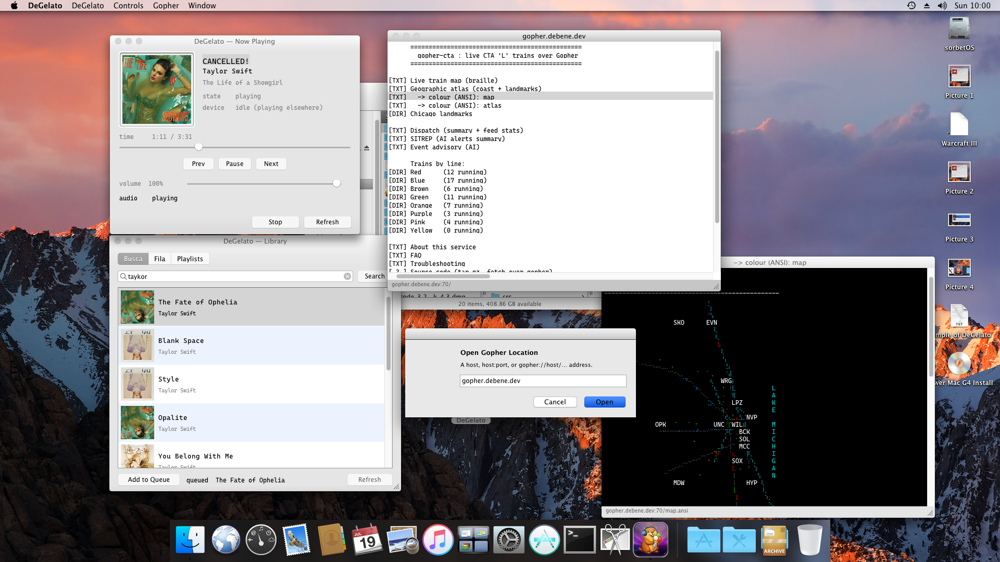
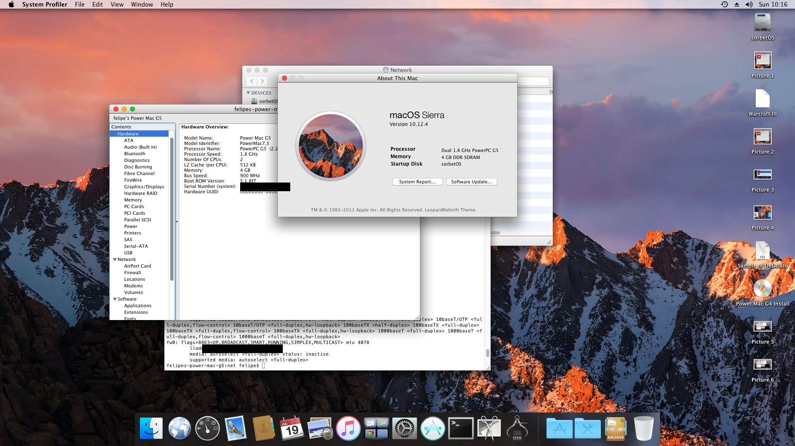
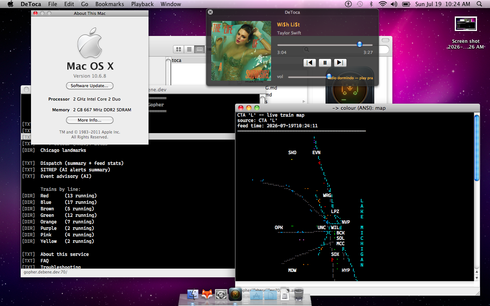

Here is the whole idea in one sentence: **I control Spotify from a Mac OS 9 machine, over the Gopher protocol.**


*This is a real System 9 desktop. The now-playing, the search, the queue — all of it is plain Gopher menus going to a box in my closet.*

That screenshot is the fun part. The load-bearing part is duller and more useful, and it's the reason a 2001 Power Mac and a 2024 Android phone can both talk to the same server without sharing a single line of code.

## The seam: a frozen text API

A while back I [put the live CTA 'L' trains on Gopher](https://debene.dev/posts/gopher-cta-live-trains/), and then [that gopherhole grew a whole neighborhood](https://debene.dev/posts/gopher-constellation-one-day/) — a phlog, a tarot reader, a shared Rust core. The trains taught me something I keep re-learning: Gopher's constraint *is* the feature. A menu line is just `type · label · selector · host · port`. There is nowhere to hide a framework.

So when I wanted to drive Spotify from old machines, I didn't build an app with an SDK. I built a **machine-readable Gopher API** — `/spot/api/1` — and then I *froze* it. Ask for now-playing, get back a handful of `key<TAB>value` lines. Send a transport command as a selector. That's the entire contract, and it's written down as a client pattern in [`fhb`](https://github.com/felipedbene/fhb) so future-me can't drift it.

The backend ([`gopher-spot`](https://github.com/felipedbene/gopher-spot)) is a small Rust binary that `geomyidae` execs per connection. It holds the Spotify Connect session; audio flows separately as `librespot → ffmpeg → Icecast`, so the ancient clients just decode an MP3 stream. Credentials live in a `chmod 600` file (or a Kubernetes Secret built straight from it) and never leave the box. The whole thing is LAN-only. No client ever sees a token.

The payoff: writing a new client is a weekend, not a project. There's no OAuth, no SDK to port to a dead platform, no TLS stack to babysit. If your machine can open a TCP socket and read tab-separated text, it can be a Spotify remote.

## The clients: four platforms, ~24 years apart

So I wrote four native Gopher clients. Three of them double as Spotify remotes — the *radinhos* — and each one is written the way its era wanted, not the way 2026 wants:

- **[Casquinha](https://github.com/felipedbene/casquinha)** — Mac OS 9.2, plain **C99**, Open Transport for the socket, `minimp3` decoding the stream in-app, classic Toolbox UI. The oldest machine yet. ([the build diary](https://debene.dev/posts/casquinha-macos9/))
- **[DeGelato](https://github.com/felipedbene/degelato)** — Mac OS X **10.5 on a Power Mac G5** (PowerPC, 32-bit), Cocoa/Objective-C with no ARC and no blocks, GCC 4.2, CoreAudio on the Icecast stream.
- **[DeToca](https://github.com/felipedbene/detoca)** — Mac OS X **10.6** (Snow Leopard), Cocoa/Objective-C again, plus a 256-color ANSI/braille renderer for the rest of gopherspace.
- **[DeBurrow](https://github.com/felipedbene/deburrow)** — the modern bookend: an **Android** Gopher client in Kotlin + Compose.

Here's DeGelato on the G5, driving the player *and* browsing `gopher.debene.dev` (the CTA map is in that black window) at the same time:


*One backend, several windows: the same little server is serving now-playing to the player and menus to the browser.*

And because someone always asks "is that really running on the old hardware or is it a skinned VM?" — no, it's the real thing. Left is a Power Mac G5 (Sorbet Leopard themed to look like Sierra); right is a MacBook2,1 on genuine 10.6.8:




The thing I find quietly satisfying: **none of these clients know about each other, and the server doesn't know about any of them.** They agree on `/spot/api/1` and nothing else. A protocol from 1991 turns out to be a great lingua franca precisely because it's too dumb to have opinions.

## The rest of the neighborhood

The Spotify bridge is one hole in a larger [constellation](https://debene.dev/posts/gopher-constellation-one-day/), all on the same box, all cross-linked at the protocol level (a menu line on the front door just points at another port — no proxy, no ingress):

- **[gopher-cta](https://github.com/felipedbene/gopher-cta)** — live Chicago 'L' trains as a Unicode-braille map.
- **[gopher-askthedeck](https://github.com/felipedbene/gopher-askthedeck)** — an [interactive tarot reading](https://debene.dev/posts/askthedeck-adhd/) drawn against the actual sky.
- **[gopher-blog](https://github.com/felipedbene/gopher-blog)** — this blog, rendered to a phlog.
- **[gopher-core](https://github.com/felipedbene/gopher-core)** — the shared Rust spine underneath them.

Which sets up the kicker: **you can read this exact post on Gopher.** It flows through `gopher-blog` onto the phlog, so the write-up about a quiet protocol also lives *on* the quiet protocol —

```
gopher://gopher.debene.dev:7071
```

If you've got a Gopher client handy (or one of these four you can now build), point it there. If you don't, that's the whole pitch, really: the internet still has a volume knob, and it turns down further than you'd think.

*Code's all on [GitHub](https://github.com/felipedbene) — start with [`gopher-spot`](https://github.com/felipedbene/gopher-spot) for the backend or [`fhb`](https://github.com/felipedbene/fhb) for the client pattern. Built in the open with Claude Code.*
