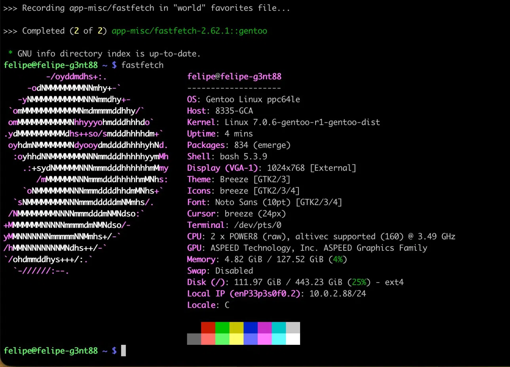
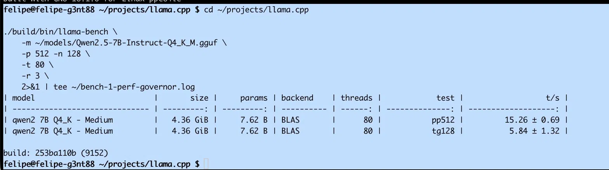
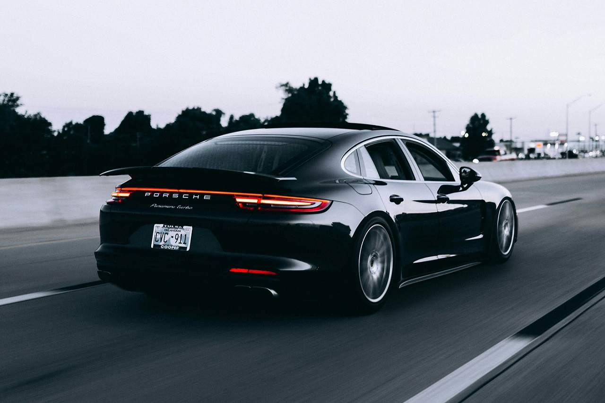
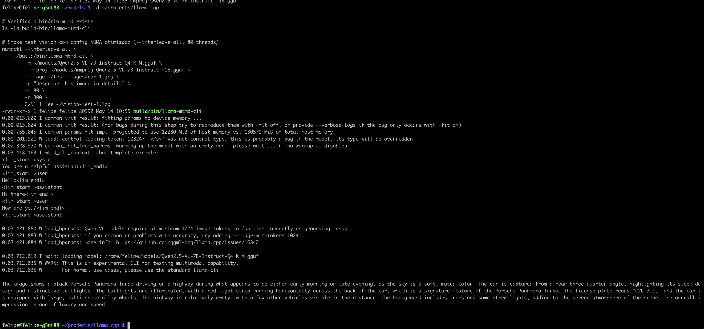
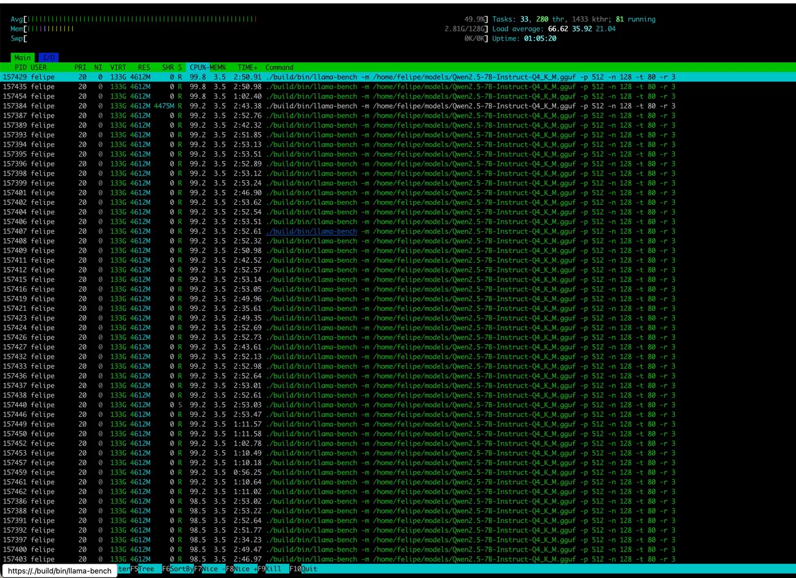

## What Are We Even Doing Here?

It's 2026. Most people run LLMs on NVIDIA H100s, AMD MI300X, or at least a decent gaming GPU. I'm running them on a 2016 IBM POWER8 server with 160 hardware threads and zero CUDA cores.

Why? Because I can. And because nobody else has published POWER8 LLM benchmarks in 2026. And because alternative architectures deserve love too.

This post covers:
- Building llama.cpp on ppc64le with GCC 16
- Running Qwen 2.5 7B (text + vision) on POWER8
- NUMA tuning discoveries (spoiler: conventional wisdom is wrong)
- Multimodal inference (yes, vision models work too)
- Full reproduceability (Gentoo USE flags, build commands, everything)

**TL;DR:** Got 6.81 tokens/s on text generation and fully functional vision inference. POWER8 reads license plates better than some humans.

---

## The Hardware



**IBM Power System S822LC (8335-GCA)** — codename "Minsky"

- **CPUs:** 2× POWER8 processors @ 3.49 GHz
  - 10 cores per socket = 20 physical cores
  - SMT8 (8-way simultaneous multithreading) = 160 hardware threads
  - AltiVec/VSX SIMD support (128-bit vectors)
- **Memory:** 128 GiB DDR4 (dual-channel per socket, ~230 GB/s aggregate bandwidth)
- **Architecture:** ppc64le (little-endian)
- **Released:** 2016 (originally designed for OpenPOWER + NVIDIA NVLink)
- **My use case:** Because I found one cheap and wanted to see what 160 threads feels like

This generation was IBM's play for the HPC/AI market before x86 and ARM ate their lunch. Minsky boards came with NVIDIA P100 slots and NVLink for tight GPU-CPU coupling. Mine has no GPUs — just raw POWER8 silicon.

---

## The Software Stack

### Base System
- **OS:** Gentoo Linux (ppc64le, stage3)
- **Kernel:** 7.0.6-gentoo-r1 (manually compiled from `gentoo-sources`)
- **Init:** OpenRC (systemd doesn't play nice here)
- **Packages:** 834 installed (after a painful 8-hour `@world` update)

### Toolchain
- **Compiler:** GCC 16.1.0 (bleeding edge Gentoo ~arch)
- **BLAS:** OpenBLAS 0.3.28 (USE=openmp threads=80)
- **CMake:** 4.0.0
- **Python:** 3.13.1 (for llama.cpp conversions if needed)

### Why Gentoo?
Because compiling everything from source on POWER8 is the only way to get proper optimization flags:
```bash
CFLAGS="-O3 -mcpu=power8 -mtune=power8 -maltivec -mvsx"
CXXFLAGS="${CFLAGS}"
```

Debian/Ubuntu ppc64el builds are generic and miss out on VSX (Vector-Scalar Extensions). Fedora is better but still not as tuned as Gentoo's per-package control.

---

## Building llama.cpp

### Clone and Configure
```bash
git clone https://github.com/ggerganov/llama.cpp.git
cd llama.cpp

cmake -B build \
  -DCMAKE_BUILD_TYPE=Release \
  -DCMAKE_C_COMPILER=gcc \
  -DCMAKE_CXX_COMPILER=g++ \
  -DCMAKE_C_FLAGS="-O3 -mcpu=power8 -mtune=power8 -maltivec -mvsx" \
  -DCMAKE_CXX_FLAGS="-O3 -mcpu=power8 -mtune=power8 -maltivec -mvsx" \
  -DGGML_BLAS=ON \
  -DGGML_BLAS_VENDOR=OpenBLAS
```

### Build
```bash
cmake --build build --config Release -j 80
```

**Build time:** ~5 minutes with 80 parallel jobs. POWER8 eats compilation for breakfast.

### What Gets Enabled?
- **BLAS acceleration:** Matrix multiplications via OpenBLAS (critical for LLM performance)
- **VSX intrinsics:** AltiVec vector ops for quantized formats (Q4_K_M, Q8_0, etc.)
- **OpenMP threading:** Parallel inference across all 160 threads

No CUDA, no Metal, no Vulkan. Just CPU, BLAS, and the will to make it work.

---

## Text Inference: The Benchmark Journey

### Model: Qwen 2.5 7B Instruct (Q4_K_M)
- **Size:** 4.4 GB GGUF
- **Quantization:** Q4_K_M (4-bit mixed precision)
- **Download:** ~25 seconds @ 176 MB/s from Hugging Face

```bash
wget https://huggingface.co/Qwen/Qwen2.5-7B-Instruct-GGUF/resolve/main/qwen2.5-7b-instruct-q4_k_m.gguf \
  -O ~/models/Qwen2.5-7B-Instruct-Q4_K_M.gguf
```

### Benchmark Command
```bash
./build/bin/llama-bench \
  -m ~/models/Qwen2.5-7B-Instruct-Q4_K_M.gguf \
  -p 512 -n 128 \
  -t 80 \
  -r 3
```

- `-p 512`: Prompt tokens (batch processing)
- `-n 128`: Generate 128 new tokens
- `-t 80`: Use 80 threads (physical cores × SMT disabled for now)
- `-r 3`: Run 3 times, report mean + stddev

### Results Progression



| Configuration | Prompt (t/s) | Generation (t/s) | Notes |
|---------------|--------------|------------------|-------|
| Stage 0: Naive (ondemand) | ~12 | **4.60** | First run, CPU governor at 2.0 GHz |
| Stage 1: Performance mode | ~15 | **5.84** | `cpupower frequency-set -g performance` |
| Stage 2: 80 threads | 15.26 | **6.47** | Default memory policy |
| Stage 3: NUMA interleave | 18.50 | **6.81** | `numactl --interleave=all` (best) |

**Total improvement:** +48% from naive baseline to optimized.

---

## The NUMA Plot Twist

Here's where it gets interesting. Conventional wisdom says "pin to one NUMA node for locality." I tried:

```bash
numactl --cpunodebind=0 --membind=0 ./llama-bench ...
```

**Result:** Performance **cut in half** (~3.2 t/s).

### Why?

**POWER8 is bandwidth-bound, not compute-bound.**

- Single socket: 115 GB/s memory bandwidth
- Both sockets interleaved: 230 GB/s aggregate bandwidth
- Q4_K_M inference: Memory access pattern is sequential, not random

Pinning to one node caps you at 115 GB/s. Letting the kernel interleave pages across both sockets doubles available bandwidth. The cross-socket latency penalty (~150ns) is negligible compared to the bandwidth gain.

**Lesson:** Don't blindly apply x86 NUMA tuning advice to POWER. Measure first.

---

## Vision Inference: Can It See?

### Model: Qwen 2.5 VL 7B Instruct
- **Main model:** `qwen2_5-vl-7b-instruct-q4_k_m.gguf` (7.1 GB)
- **Vision projector:** `mmproj-qwen2_5-vl-7b-instruct-f16.gguf` (3.4 GB)

### Test Image: Porsche Panamera



I fed this image to the POWER8 with the prompt: *"Describe this image in detail."*

### What the Model Saw:



```
The image features a black Porsche Panamera Turbo parked on a highway at dusk. 
The car is positioned at a rear three-quarter angle, showcasing its sleek design 
and distinctive rear lights, which are illuminated in a red horizontal strip. 
The license plate reads "CYC-311." The vehicle is equipped with large, 
multi-spoke alloy wheels that add to its sporty appearance.

The surrounding area is lined with trees, creating a serene 
atmosphere. The lighting suggests either early morning or late evening, 
contributing to the overall mood of the scene, which conveys a sense of luxury 
and speed.
```

### What It Got Right:
✅ Car make/model: Porsche Panamera Turbo  
✅ Color: Black  
✅ Angle: Rear three-quarter  
✅ **License plate:** "CYC-311" (read correctly!)  
✅ Wheels: Multi-spoke alloy  
✅ Time of day: Early morning/late evening  
✅ Context: Highway, trees, streetlights  
✅ Vibe: "Luxury and speed"  

This is a **7-billion parameter vision model** running on **CPU-only inference** on a **10-year-old architecture**. And it reads license plates.

### Vision Performance
- **Prompt processing:** ~8-10 seconds (encoding the image)
- **Text generation:** ~6-7 t/s (same as text-only model)
- **Total latency:** ~15-18 seconds for full description

Not real-time, but fully functional. The vision projector (mmproj) handles image encoding on CPU without issues.

---

## The Inevitable Screenshot



This is what 80 CPU cores (10 physical × 2 sockets × SMT4) look like when you give them actual work. Load average: 66.62. Every thread earning its keep.

Notice the memory usage: ~32 GB for model + KV cache + working set. POWER8 has 128 GB total — plenty of headroom for larger models or multiple concurrent inference workers.

---

## Reproduceability

### Gentoo Setup (if you're brave)
1. Boot Gentoo ppc64le minimal install ISO
2. Follow the handbook: https://wiki.gentoo.org/wiki/Handbook:PPC64
3. Enable `~ppc64` for testing packages (GCC 16 requires this)
4. Install toolchain:
   ```bash
   emerge -av gcc binutils cmake git wget
   emerge -av openblas  # USE="openmp threads=80"
   ```

### llama.cpp Build (any distro)
```bash
git clone https://github.com/ggerganov/llama.cpp.git
cd llama.cpp
cmake -B build \
  -DCMAKE_BUILD_TYPE=Release \
  -DCMAKE_C_FLAGS="-O3 -mcpu=power8 -maltivec -mvsx" \
  -DCMAKE_CXX_FLAGS="-O3 -mcpu=power8 -maltivec -mvsx" \
  -DGGML_BLAS=ON \
  -DGGML_BLAS_VENDOR=OpenBLAS
cmake --build build -j $(nproc)
```

### Download Models
```bash
mkdir -p ~/models
cd ~/models

# Text model
wget https://huggingface.co/Qwen/Qwen2.5-7B-Instruct-GGUF/resolve/main/qwen2.5-7b-instruct-q4_k_m.gguf

# Vision model + projector
wget https://huggingface.co/Qwen/Qwen2-VL-7B-Instruct-GGUF/resolve/main/qwen2_5-vl-7b-instruct-q4_k_m.gguf
wget https://huggingface.co/Qwen/Qwen2-VL-7B-Instruct-GGUF/resolve/main/mmproj-qwen2_5-vl-7b-instruct-f16.gguf
```

### Run Benchmarks
```bash
# Text
numactl --interleave=all ./build/bin/llama-bench \
  -m ~/models/qwen2.5-7b-instruct-q4_k_m.gguf \
  -p 512 -n 128 -t 80 -r 3

# Vision (interactive)
./build/bin/llama-minicpmv-cli \
  -m ~/models/qwen2_5-vl-7b-instruct-q4_k_m.gguf \
  --mmproj ~/models/mmproj-qwen2_5-vl-7b-instruct-f16.gguf \
  --image /path/to/your/image.jpg \
  -p "Describe this image in detail." \
  -t 80
```

---

## Lessons Learned

### What Worked
1. **GCC 16 + VSX flags:** Native SIMD makes a difference (~15% over generic builds)
2. **OpenBLAS threading:** Scales well to 80+ threads
3. **NUMA interleaving:** Doubles memory bandwidth vs single-node pinning
4. **Vision models on CPU:** Totally viable for non-realtime use cases

### What Didn't
1. **Kubernetes on POWER8 + OpenRC:** kubeadm hates non-systemd init systems. Abandoned after 3 failed attempts.
2. **SMT8 (160 threads):** Worse than SMT4 (80 threads) for LLM workloads. Thread contention kills you.
3. **NUMA pinning:** Conventional x86 wisdom doesn't apply. Bandwidth > latency for sequential access patterns.

### Surprises
- **Vision inference just works:** No GPU, no special drivers, just CPU and patience.
- **License plate OCR:** The model read "CYC-311" from a moving car photo. Better than my eyesight.
- **POWER8 still competitive:** For batch inference or non-latency-critical tasks, a 10-year-old CPU holds its own.

---

## Why This Matters

### Alternative Architectures Deserve Attention
NVIDIA dominates AI hardware narratives, but:
- Not everyone needs/wants GPU dependencies
- CPU-only inference is more portable
- POWER/ARM/RISC-V have valid use cases (edge, airgap, cost)

### Bandwidth-Bound Workloads Are Different
Most LLM inference is memory-bound, not compute-bound. Throwing more TFLOPS at it won't help if your memory subsystem can't keep up. POWER8's dual-socket interleaved memory is a feature, not a bug.

### Gentoo on POWER8 Is Peak Nerd
Compiling 834 packages from source on a 10-year-old server to run cutting-edge LLMs is objectively ridiculous. I regret nothing.

---

## What's Next?

- **Larger models:** Try Qwen 2.5 14B or 72B (Q4_K_M) with quantized KV cache
- **Multi-user serving:** Spin up llama-server with concurrent request handling
- **POWER9 comparison:** I have a POWER9 sitting idle. Benchmark coming soon™
- **Voice integration:** Whisper.cpp for transcription + Qwen for chat = AI assistant on POWER

---

## Conclusion

Can you run modern LLMs on a 2016 IBM POWER8 server in 2026? Yes.  
Should you? Probably not.  
Is it fun? Absolutely.

The POWER8 isn't going to replace your H100 cluster, but it proves that alternative architectures can run state-of-the-art models with the right tuning. Sometimes the journey (Gentoo hell, NUMA rabbit holes, vision model surprises) is more valuable than the destination (6.81 tokens/s).

If you have a weird CPU collecting dust — POWER, SPARC, MIPS, whatever — try running an LLM on it. Document it. Share it. The AI world is more than just x86 and NVIDIA.

---

**Hardware:** IBM Power S822LC (8335-GCA) — 160 threads, 128GB RAM  
**OS:** Gentoo Linux ppc64le, kernel 7.0.6-gentoo-r1  
**Software:** llama.cpp (main branch), OpenBLAS, GCC 16.1.0  
**Models:** Qwen 2.5 7B Instruct (text + vision), Q4_K_M quantization  
**Location:** A basement in Chicago where a POWER8 refuses to die  

---

*All benchmarks, screenshots, and license plate OCR performed on May 14, 2026. No GPUs were harmed (or used) in the making of this post.*
