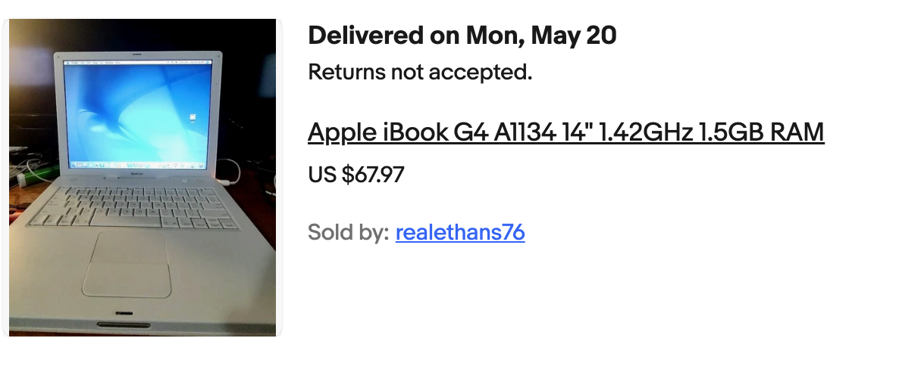
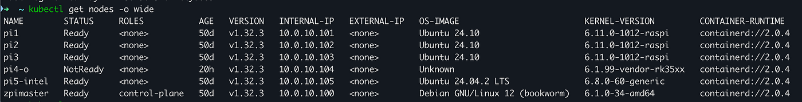
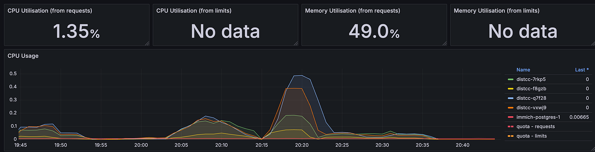
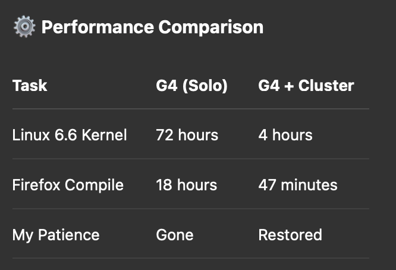

## The Dream

Back in the early 2000s, teenage me was obsessed with the iBook G4. That sleek white clamshell with its PowerPC CPU and AltiVec engine felt like the future. I couldn't afford one then — but now, two decades later, I finally scored one: a 1.33GHz model for $67 on eBay, original box and all.

Reality hit hard.

- The 60GB hard drive was dying
- The RAM was maxed at 1.5GB (after some firmware trickery)
- I destroyed the power button during an SSD upgrade

This is the story of how I brought it back to life — and turned it into a (surprisingly capable) development machine in 2025.

## Phase 1: SSD Upgrade (and a Power Button Casualty)

First step: Kill the spinning disk.

I swapped in a 256GB SSD via an IDE-to-mSATA adapter.

- 🕐 Boot time: Slashed from 3+ minutes to under 30 seconds
- 🧰 Compile times: No more I/O bottlenecks during `make -j2`

Then… disaster.

### The Great Power Button Catastrophe

While reassembling, my screwdriver slipped — severing the power button flex cable. Soldering failed. The iBook now lives in a permanent "always-on" limbo.

🚧 My workaround:
- `sudo pm-suspend`
- `sudo halt`
- Close the lid and pray.

Lesson: Vintage hardware requires sacrifice.

## Phase 2: The Web is Closed

Biggest bottleneck? Modern web standards.

TenFourFox and similar browsers choke on today's HTTPS. TLS 1.3? Forget it.

🧪 Failed experiments:
- Curl hacks for manual package downloads
- Proxy tunneling (until Cloudflare blocked me)
- Lightweight Linux browsers (still slow)

💡 Solution: Abandon macOS. Go full Linux.

## Phase 3: Linux Distro Roulette — Choose Your Fighter (and Regret It)

Once I gave up on macOS, I set out to find a Linux distro that could breathe new life into the iBook G4. I wanted something modern-ish, lightweight, and stable.

Instead, I got… this:

### Void PPC
Lightning fast on paper. In practice? Wouldn't even boot half the time.
- Boot Time: ∞
- Pain Level: 😭😭😭

### Debian PPC
Reliable… like a fax machine. Stable, but slow enough to make you question life choices.
- Boot Time: ~5 min
- Pain Level: 😩😩

### OS Sorbet
A gorgeous macOS Leopard clone — stuck in 2009. No TLS 1.3 = no GitHub, no fun.
- Boot Time: ~2 min
- Pain Level: 😤😤

### Fienix
Supposedly beginner-friendly. Installer crashed twice. Nuked my partitions. Twice.
- Boot Time: ??
- Pain Level: 🤬🤬🤬

### Ubuntu MATE PPC
Installed okay, but every click felt like molasses in January.
- Boot Time: ~6 min
- Pain Level: 🥶🥶

### Adélie Linux
Still actively developed (rare!). But no GPU acceleration — felt like driving a Ferrari with the handbrake on.
- Boot Time: ~4 min
- Pain Level: 😐

### 🔥 Personal Lowlights

- **Void:** Dropped me into a broken BusyBox shell and dared me to escape. I didn't.
- **Fienix:** Corrupted my partition table with no warning. Twice.
- **Ubuntu MATE:** Used 100% CPU just to open a window. A window.
- **Adélie:** Had promise, but felt half awake without GPU acceleration.

Then I stumbled upon a legendary Gentoo guide on [TinkerDifferent](https://tinkerdifferent.com/threads/cracking-the-code-gentoo-linux-on-an-ibook-g4-success-story.3339/). Fifty thousand words of arcane compiler flags and masochistic wisdom. It was less a tutorial and more a Linux epic.

And of course, I said: **"Screw it. I'll compile the world."**

## Phase 4: Enter Gentoo — AltiVec or Die Trying

Gentoo compiles everything from source, tuned for your exact hardware. On the G4, that means squeezing every last cycle out of the **AltiVec SIMD engine**.

💡 Fun fact: AltiVec was PowerPC's answer to SSE/AVX. Apple Silicon's Neon vector engine? AltiVec's grandchild.

⚠️ But there's a price: compiling a modern Linux kernel takes **~72 hours**.

### 🛠️ Solution: A Kubernetes-Powered Compile Farm

Yes, really. I built a distributed compile cluster using:
- **distcc**
- A motley Kubernetes cluster (because overkill is underrated)

🏁 Result:
What took 72 hours now takes **4 hours**. Small packages build in minutes.

## Phase 5: The G4's Second Life

Against all odds — and more than a few kernel panics — my iBook G4 now thrives as a genuinely useful member of my infrastructure:

- Runs a custom Gentoo kernel with AltiVec optimizations
- Compiles Go 1.22 like it's nobody's business
- Part of a distributed build cluster

It's not just a nostalgic machine anymore. It's a fully functional, if mildly ridiculous, cloud-native contributor!

Some more benchmarks:

Sometimes all it takes to make ancient hardware shine is a little help from its silicon friends.

This project started as nostalgia and ended up as a love letter to the stubbornness of old machines — and the absurd joy of pushing them into places they were never meant to go.

My iBook G4 didn't just come back to life. It evolved.

And somewhere in that kernel build log… teenage me is grinning.

## Next Up?

- **Overclocking** — Targeting 1.5GHz with a VCore mod (pray for the paste)
- **AltiVec vs Apple M2 benchmarks** — just for the meme
- **Power button resurrection** — Thinking capacitive touch or momentary switch mod

Final thought: The G4 is now technically a cloud-native microservice.

---

*🛠️ [Full distcc cluster setup on GitHub](https://github.com/felipedbene/distcc) — if you dare. Originally published on [Medium](https://medium.com/@felipedebene/resurrecting-my-ibook-g4-a-20-year-dream-built-on-compiler-errors-and-hope-fd78b37c9865).*

---

### 📚 The PowerPC Saga continues:

2. [Cloud Architect Meets PowerPC: The $50 Time Machine](/posts/cloud-architect-meets-powerpc/) — A PowerMac G5 joins the fleet
3. [What Microsoft Won't Ship: .NET on POWER8](/posts/dotnet-power8-what-microsoft-wont-ship/) — Building .NET 8 from source on enterprise POWER
4. [Jellyfin on POWER8: 160 Threads of Media Serving](/posts/jellyfin-power8-160-threads-of-media-serving/) — Containerized media server on IBM iron
