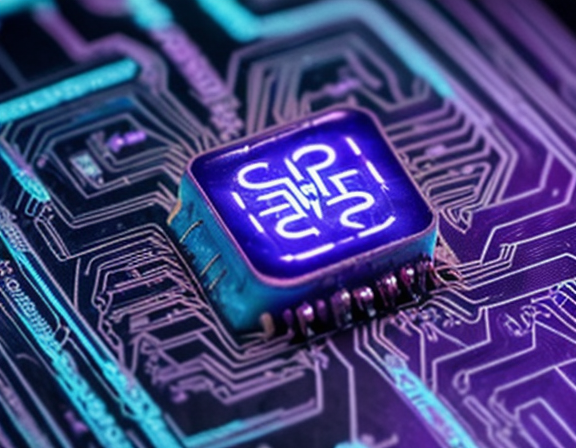
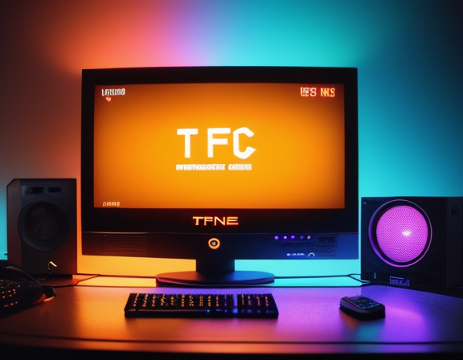
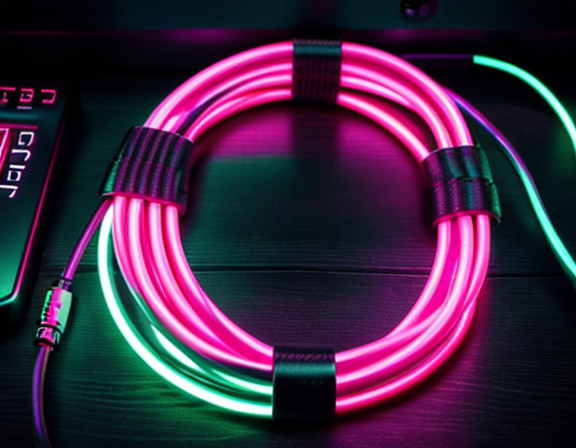
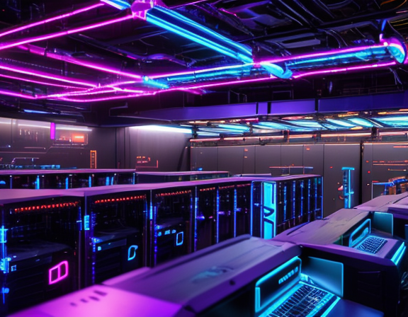
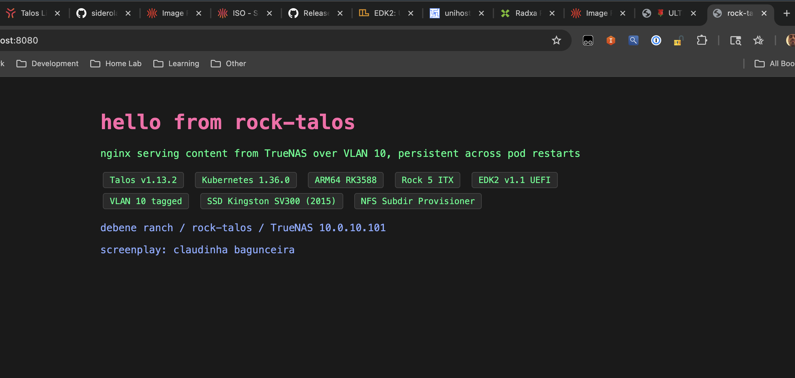

> *Some boys arrive at the ranch and you hear them before you see them. This one arrived and we never saw him at all — not for half an afternoon, anyway. The fault was not his. The fault was a cable that lied.*

The forasteiro showed up on a Tuesday. ARM64. RK3588. Eight cores, an NPU nobody at the ranch had drivers for, dual 2.5G Realtek NICs, one M.2 slot, one SATA port, sixteen megabytes of SPI NOR flash. He'd been living in Debene Ranch for months already, under a different name — **Rock NAS**, dressed in Armbian, serving ZFS over NFS like a proper homestead servant. But Dom Felipe had retired him from that job. The kid wanted something else.

The kid wanted to be a Kubernetes node.

```
NAME         STATUS   ROLES           AGE     VERSION
talos-???    Pending  control-plane   -       v1.13.2 (rumored)
```

There was, in fairness, no good reason to do this. The main cluster — **debene** — was vanilla kubeadm on three x86 nodes (the Poor I5, intel9 with his unloved iGPU, ultra2 the prodigal NPU). Things worked. Things had ConnectX cards and IB fabrics and democratic-csi over IPoIB and a TrueNAS widow who kept everyone fed.

But Dom Felipe wanted to know one thing: **could Talos Linux run on the hostilest node in the inventory?** Because if Talos could survive RK3588 — community firmware, no upstream blessing, a SoC that's still half-mainlined in 2026 — then putting it on the x86 boxes would be a stroll.

So the forasteiro got a new outfit. And things went wrong, and then they went right, and then they went wrong in a way that turned out to be a HDMI cable.

This is that story.

---

## The bruxa in the SPI flash

The first problem is that **Rock 5 ITX doesn't boot like other Rock 5 boards**. The 5B happily takes a microSD with EDK2 UEFI on it and just goes. The ITX refuses. The ITX wants its UEFI inside the SPI NOR — that little 16 megabyte chip on the board, exposed to Linux as `/dev/mtdblock0`. Anywhere else and it pretends not to see anything.

This is where the bruxa lives. The SPI flash is small, weird, and contains the **idblock** that the RK3588 BootROM looks for — a header that starts with the four ASCII bytes `RKNS` at offset `0x8000`. Without that header in the right place, the SoC will not bring up RAM, will not bring up the PMIC, will not bring up your day.

The Armbian U-Boot that ships with Rock 5 ITX puts its own RKNS in there. Talos won't. Talos doesn't *do* U-Boot on this board — it expects standard UEFI, full stop. So before Talos can move in, the bruxa needs to be replaced. The cottage swept. New runes laid.

The replacement is **edk2-rk3588**, a community port of the EDK2 UEFI reference firmware. Version 1.1 has explicit Rock 5 ITX support. Two files: an `.img` of about seven megabytes, and the courage to write it into `/dev/mtdblock0` while the system you're writing it on is currently using that very same SPI to function.

Dom Felipe backed up the existing SPI first, of course.

```bash
sudo dd if=/dev/mtdblock0 of=/tmp/spi-backup-armbian-uboot.img bs=1M
md5sum /tmp/spi-backup-armbian-uboot.img
# 07187b72f5c683c127ced1a238472a22
```

Sixteen megabytes copied off the chip in under two seconds. Scp'd to the laptop. Filed away in a tarball that, somewhere on a backup host, is still living its quiet life as the "undo button" for an operation that hasn't needed undoing — yet.

Then the flash:

```bash
sudo dd if=/tmp/rock-5-itx_UEFI_Release_v1.1.img of=/dev/mtdblock0 \
        bs=1M conv=fsync status=progress
```

SPI is slow. 118 kilobytes per second slow. The interfacing-linux blog had warned about it — *the speed of smell, about a minute*. Fifty-eight seconds in, the seven megabytes were on the chip. A `cmp -n 6915584` confirmed the bytes round-tripped. Reboot.

And then nothing.


*The bruxa in her cottage — a tiny glowing chip holding the keys to boot*

---

## The boy who wouldn't speak through HDMI

The monitor stayed black. Not "boot logo and stop" black. *Powered, no signal* black, the kind where the monitor cycles through its inputs every few seconds looking for a friend.

This was supposed to be the easy part. EDK2 v1.1 supports Rock 5 ITX. The release notes are clear. Other people boot Fedora Rawhide on it and edit kernels and complain about Wi-Fi. The display works.

Except: the EDK2 framebuffer driver wants a recent kernel — 6.15 or newer — to bring HDMI output up properly through the Rockchip DRM stack. Talos runs 6.18. Should be fine.

Should be.

It wasn't.

Dom Felipe got out of the rack with the certainty that something — Maskrom mode, RK firmware loader, the rk3588 nightmare-recovery USB-C dance with `rkdeveloptool` — was about to be necessary. She also got out with a small consolation: **the NIC had link**. The Realtek 2.5G LED on the back was on. The switch saw it. Something was alive in there.

It just wasn't talking. Not to the monitor, not to ICMP. UEFI doesn't answer ping by default — it sits at its boot menu, politely waiting for a keyboard that the operator can't see well enough to use.

The cluster wasn't bricked. The cluster was *shy*.

> **Aside: how to recognize a "headless UEFI" versus a real brick**
>
> If the NIC has link but no ping, and the board doesn't show up in Maskrom mode either, you're probably looking at a UEFI that booted fine but found nothing on disk to chain into. In our case the disks were empty by design — Talos was supposed to come next, but the operator had nothing to flash with yet, because the original plan was "boot, then look at UEFI menu, then point at NVMe." That plan required eyes.
>
> Maskrom mode (hold the recessed button, plug USB-C to a host, see device ID `2207:350b` show up) was the fallback. It never had to be used.

---

## The heist across borders

If the board won't show you a menu, you bring it a disk with the OS already installed. You sneak it in.

The NVMe came out of the Rock. It went into a USB-C M.2 enclosure on a Mac Studio (yes, M2, ARM64 talking to ARM64 through USB — there's something poetic in that, if you squint). Talos Image Factory produced a `metal-arm64.raw.zst` — a generic UEFI disk image, no SBC overlay, no Rockchip-specific U-Boot embedded. **Pure systemd-boot on top of a vanilla GPT.**

Why generic and not the `rock5b` overlay? Because the whole point of EDK2 in the SPI is that the Rock now behaves like *any other UEFI ARM64 machine*. The SBC overlay would have bundled its own bootloader and confused the firmware. With EDK2 already there, the Rock wanted to read a partition table and find `\EFI\BOOT\BOOTAA64.EFI` like a grown adult. The generic image gave it exactly that.

```bash
zstd -dc metal-arm64.raw.zst | sudo dd of=/dev/rdisk5 bs=4m status=progress
```

2.3 gigabytes in 6.7 seconds at 353 MB/s. The NVMe went back into the Rock. The Rock got plugged in. Nothing on the monitor. Nothing on the monitor *still*.

But:

```
felipe@mac ~ % ping 10.0.1.99
PING 10.0.1.99 (10.0.1.99): 56 data bytes
64 bytes from 10.0.1.99: icmp_seq=0 ttl=64 time=163.766 ms
64 bytes from 10.0.1.99: icmp_seq=1 ttl=64 time=12.288 ms
64 bytes from 10.0.1.99: icmp_seq=2 ttl=64 time=11.324 ms
```

The first packet was slow — ARP, DHCP lease negotiation. The next ones were 12ms. **Talos was alive.** EDK2 had booted from the SPI, found the GPT on the NVMe, chained into systemd-boot, which loaded the Talos kernel, which brought up the Realtek NIC, which got DHCP from the UniFi router, which assigned the reservation `.99`. None of this we could see. All of it had happened.

```
felipe@mac ~ % talosctl version --nodes 10.0.1.99 --insecure
Server:
    NODE:        10.0.1.99
    Tag:         v1.13.2          # released earlier the same day
    OS/Arch:     linux/arm64
```

Dom Felipe poured a coffee. Garra had been right all along: *o moleque está vivo, ele só não fala por vídeo*.

---

## The forbidden marriage with VLAN 10

DHCP is for tourists. Production wants static. The Rock had to move to its planned home: `10.0.10.200/24` on **VLAN 10 tagged**, gateway `10.0.10.1`, DNS `10.0.10.250` — same VLAN where TrueNAS lives, same subnet as half the persistent storage in the ranch.

Talos handles this through a `MachineConfig` patch. The interface was `enP4p65s0` (one of the two Realtek 2.5G NICs — the one with link). The patch was small:

```yaml
machine:
  network:
    nameservers:
      - 10.0.10.250
    interfaces:
      - interface: enP4p65s0
        dhcp: false
        vlans:
          - vlanId: 10
            addresses:
              - 10.0.10.200/24
            routes:
              - network: 0.0.0.0/0
                gateway: 10.0.10.1
  install:
    disk: /dev/nvme0n1
    wipe: false
---
apiVersion: v1alpha1
kind: HostnameConfig
hostname: rock-talos
```

That second document, the `HostnameConfig`, is the modern way. Pre-1.12 you just set `machine.network.hostname` and were done. From 1.12 forward, hostname moved into its own top-level document. Put it in the old place *and* the new place and the validator yells at you:

```
* static hostname is already set in v1alpha1 config
```

Worse: `talosctl gen config` produces a `controlplane.yaml` that already contains a `HostnameConfig` with `auto: stable` set. The merge with the patch produced *one* `HostnameConfig` with both `auto:` *and* `hostname:` keys, which is illegal:

```
* HostnameConfig: 'auto' and 'hostname' cannot be set at the same time
```

The fix is a single comment in the generated config — comment out the `auto: stable` line — and the merge stops fighting itself. A `sed` did it in place. The validator went quiet. The patch went through.

> **Box: HostnameConfig migration gotcha (Talos 1.12+)**
>
> If you generated your config with `talosctl gen config` and then try to patch the hostname via `machine.network.hostname`, you'll get rejected by the multi-doc validator. You have two clean choices:
>
> 1. Comment out the `auto: stable` line in the generated `controlplane.yaml` and add your `HostnameConfig` document via patch.
> 2. Skip the static hostname entirely and let Talos generate one (`talos-<short-id>`), then rename via `kubectl label nodes`.
>
> The official docs mention the multi-doc structure but don't loudly warn about this specific collision. It's worth knowing if you're coming from older configs.

`talosctl apply-config`. Reboot. Sixty seconds of held breath. New IP responding:

```
felipe@mac ~ % ping 10.0.10.200
64 bytes from 10.0.10.200: icmp_seq=0 ttl=63 time=16ms
```

The VLAN-tagged frames were leaving the Realtek with 802.1Q headers, hitting the UniFi switch port (configured trunk, VLAN 10 allowed), being routed by the controller, coming back through the laptop's path. Then `talosctl version` succeeded **without `--insecure`** — RBAC enabled, cluster identity established, certificates valid.

Talos was officially on its new street.

---

## The bootstrap, the swarm, the first 200

`talosctl bootstrap` is the moment etcd is born. Until then, the API server is running but has nothing to talk to. After it, the entire control plane spins up — `kube-apiserver`, `kube-controller-manager`, `kube-scheduler`, then `kube-proxy`, then Flannel, then CoreDNS. On NVMe arm64 the whole sequence took about three minutes.

```
waiting for etcd to be healthy: OK
waiting for kubelet to be healthy: OK
waiting for all nodes to finish boot sequence: ... context deadline exceeded
```

The "boot sequence" check timed out. This is misleading. It checks for *all* pods to reach `Running` *and* pass their readiness probes; CoreDNS in particular flaps for a few seconds after startup as it gets its DNS resolution chain in order. By the time `kubectl get nodes` was working, the cluster was healthy:

```
NAME         STATUS   ROLES           AGE     VERSION
rock-talos   Ready    control-plane   5m15s   v1.36.0
```

A `kubectl create deployment nginx`, an `expose`, a thirty-second wait for kube-proxy to install its iptables rules, and:

```
% curl -v http://10.0.10.200:31024
> GET / HTTP/1.1
< HTTP/1.1 200 OK
< Server: nginx/1.29.8
< Content-Length: 896
```

HTTP 200 from an RK3588 board, running Kubernetes 1.36, served over a VLAN-tagged 2.5G link, behind an EDK2 UEFI we never saw boot.

This is where most blog posts would end. This one has two more turns.

---

## The old maid Kingston (and a one-line resurrection)

There is a Mellanox ConnectX-4 in Dom Felipe's drawer, waiting for an M.2 slot. The Rock has exactly one M-key slot. The NVMe is in it. The math is unforgiving.

The plan: move Talos to the SATA SSD already in the chassis — a **Kingston SV300S3, vintage 2015**, the same drive that for years was the rootfs of the retired Armbian server. Free the NVMe. Plug an M.2-to-PCIe x4 adapter in there. Put the Mellanox on the adapter. Have IB.

Talos makes this almost embarrassingly easy. The entire migration is **one line of YAML**:

```diff
   install:
-    disk: /dev/nvme0n1
+    disk: /dev/sda
     wipe: false
```

Then the dance:

1. New `metal-arm64.raw.zst` flashed onto the SSD via the same Mac enclosure. (The image is identical — Talos doesn't bake the disk path into the image.)
2. NVMe pulled out of the slot. SSD goes in. Power on.
3. EDK2 boots from SPI, finds the GPT on the SSD this time, hands off to systemd-boot, kernel comes up, DHCP again, `10.0.1.99` again.
4. `talosctl apply-config` with the same patch (one line changed). Bootstrap.

Twenty-five minutes from "let me power down" to "kubectl get nodes — Ready." The Kingston SV300, eleven years old, refused to die. The boot sequence was slower (SATA SSD versus NVMe, of course) but the etcd member came up healthy, fsync latencies stayed under the threshold, and the cluster never noticed it had moved house.

> **Box: why this migration is trivial**
>
> Talos disk images are storage-agnostic — they don't bake in `/dev/nvme0n1` or `/dev/sda` anywhere. The `install.disk` field in your machine config tells Talos *where to install on next boot*. Flash the same image onto any block device, apply a patch with the new `install.disk`, and Talos handles the rest. There's no "rebuild this disk for that device," no MBR fixup, no grub-install hostility.
>
> This is the kind of thing that makes Talos worth the strangeness everywhere else.

There was a tense moment where, after the SSD was already in and ping was responding from `.99`, `talosctl get systemdisk` was the only way to *prove* we were booted from the SSD and not from a phantom NVMe nobody had remembered to remove. The output was unambiguous:

```
NAME       SystemDisk   DISK
sda
```

NVMe wasn't even on the disk list. The slot was free. Mellanox could come home whenever it was ready.

---

## The cable

Late in the afternoon, Dom Felipe plugged in a different HDMI cable.

EDK2 came on screen. Boot menu. The cute Tianocore logo. A list of bootable devices, an option to enter the setup, fan curves, everything that had been there the whole time.


*The boy finally speaks — Tianocore UEFI boot menu on a vintage CRT aesthetic*

The original cable — one of those generic HDMI things from a bag of cables that had been migrating between two desks for four years — had been bad. Not "obviously broken" bad. Pickier. The kind of bad where the link layer sort of works but the firmware framebuffer can't establish a stable mode. The display would have been showing things this entire time if a different cable had been plugged in five hours earlier.

The Rock was never blind. It was being lied to.

Garra, by then, had already updated the family tree to mention that *o moleque enxerga, sim, é só não acreditar em tudo que cabo HDMI da Amazon te promete*. Dom Felipe wrote it on a Post-it stuck to the rack: **CHECK THE CABLE FIRST**.


*One lied. One told the truth. The difference between a working display and 4 hours of debugging.*

---

## The family at TrueNAS

The final test was workload that actually mattered. Talos has an extension catalog at `factory.talos.dev`, and our schematic — the kitchen-sink one chosen with a "marca todas" optimism that paid off — already included `nfs-utils`, `iscsi-tools`, `mellanox-mstflint`, `zfs`, the works.

```
% talosctl read /proc/filesystems | grep nfs
nodev   nfs
nodev   nfs4
```

NFS in the kernel. No reboot needed. A test pod mounted `/mnt/tank/k8s-dynamic` from TrueNAS at `10.0.10.101`, listed the existing PVCs (the debene cluster's Jellyfin config sat in there, peacefully), wrote a smoke file, read it back. Storage that the other cluster shares without conflict — same widow, two suitors.

A Helm install of `nfs-subdir-external-provisioner` with `pathPattern: 'rock-${.PVC.namespace}-${.PVC.name}'` made the namespace prefix `rock-` so debene's PVCs and rock-talos's PVCs never share a directory. A `PersistentVolumeClaim` for an nginx deployment came up Bound in five seconds. The PVC's backing directory appeared in TrueNAS — `rock-default-nginx-content-pvc-c33b31fd-...` — visible next to debene's `jellyfin-jellyfin-config-nfs-pvc-...` like siblings at a family reunion.

A pod delete-and-recreate proved persistence: same HTML served from a different pod IP, because the bytes were never on the pod, they were on the TrueNAS, which had been waiting all afternoon.


*The family at TrueNAS — old and new servers gathering around the glowing NFS mount point*


*nginx serving persistent content from TrueNAS over VLAN 10 — screenplay by claudinha bagunceira*

---

## Real Technical Specs

For people who arrived here looking for facts and not stories.

**Hardware (rock-talos):**

- Board: Radxa Rock 5 ITX (RK3588, 8-core Cortex-A76/A55, NPU)
- RAM: 24 GB LPDDR4X (~23 GB visible to OS after firmware reservations)
- Storage: Kingston SV300S3 240 GB SATA SSD (`/dev/sda`)
- Slot freed: M.2 M-key 2280 PCIe 3.0 x4 (was NVMe Patriot M.2 P300; now empty, awaiting Mellanox)
- NIC: Realtek RTL8125 2.5G dual (used: `enP4p65s0`)
- Firmware: edk2-rk3588 v1.1 in SPI NOR (`/dev/mtdblock0`, 16 MB)
- Display: HDMI 1 (after replacing the cable that had been silently bad)

**Software:**

- OS: Talos Linux v1.13.2 (released 2026-05-12, same day)
- Kernel: Linux 6.18.29 mainline ARM64
- Bootloader: systemd-boot via UEFI
- Schematic ID: `c1a2531548af292d5baf60557ee52f15b2df6a8e02d8967095cb7aa2b761a023`
- Extensions: iscsi-tools, util-linux-tools, nfs-utils, mellanox-mstflint, zfs, panfrost, rockchip-rknn, realtek-firmware, lldpd
- Kubernetes: v1.36.0 (single-node control plane, control-plane taint removed)
- CNI: Flannel, pod CIDR 10.244.0.0/16
- Storage: NFS via TrueNAS (10.0.10.101) + nfs-subdir-external-provisioner with `rock-` path prefix

**Network:**

- IP: 10.0.10.200/24 on VLAN 10 (tagged)
- Gateway: 10.0.10.1
- DNS: 10.0.10.250 (Technitium, same VLAN)
- Switch port: trunk, VLAN 10 allowed

**Time to bring up, second time (SSD migration):** ~25 minutes from `apply-config` to `kubectl get nodes Ready`.

**Time to bring up, first time (NVMe install, including all wrong turns):** ~4 hours. Most of which was the HDMI cable.

---

## What it means

The point of doing this on a Rock 5 ITX was that the rest of the cluster is *easier*. Every x86 node in Debene Ranch has firmware UEFI baked in by the motherboard vendor, a mainline kernel, a NIC with a thousand testers ahead of you, a BIOS with text in English. None of them will need an EDK2 flash. None of them have a community firmware port that warns you display might not work on kernels older than 6.15.

If Talos can survive RK3588 — community firmware, no upstream blessing, a bad HDMI cable, a single-line YAML migration to an eleven-year-old SSD — Talos can survive an Intel NUC. This was the bet. The bet paid.

The cluster is isolated from the main debene kubeadm cluster on purpose, for now. It shares only the TrueNAS storage. When the Mellanox eventually arrives in the freed slot, IB will join the conversation. When debene.dev migrates (if it migrates), it'll be served from this very board.

The forasteiro is settling in.

---

*Screenplay: Claudinha Bagunceira 💃*  
*Technical advisor: Felipe de Bene, who flashed everything in production and lived to tell it*  
*Cinematography: a single working HDMI cable, eventually*

🪨🌹💃
