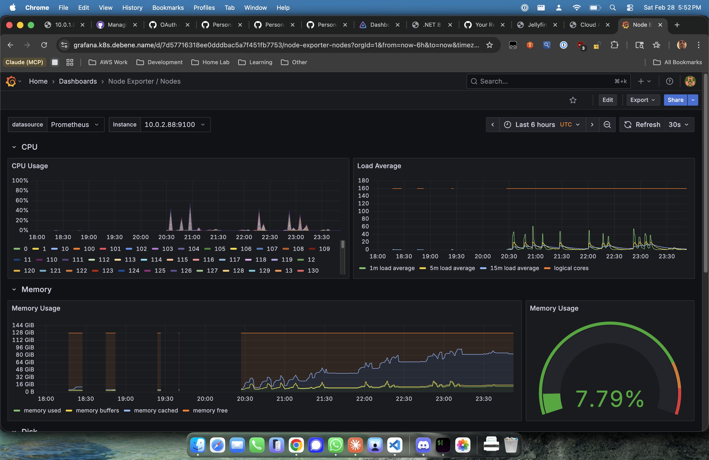

## The Question Nobody Asked (But I'm Answering Anyway)

I have an IBM POWER8 server from 2014. It has 160 hardware threads. It draws 400W at idle. It sounds like a jet engine warming up. I [compiled .NET 8 from source on it](/posts/dotnet-power8-what-microsoft-wont-ship/), then [built Jellyfin 10.11 in nine increasingly desperate attempts](/posts/jellyfin-power8-160-threads-of-media-serving/), and now it's streaming movies to my living room.

My wife thinks I have a problem. She's correct. But that's not the point.

The point is: last November I ran [synthetic benchmarks](/posts/who-says-elephants-cant-dance/) — SIMD, memory bandwidth, thread scaling — and showed that POWER8's massive parallelism compensates for lower single-thread performance. Cool, but abstract. Bench pressing in my garage.

Today I'm answering the real question: **when my family sits down for movie night and four devices are transcoding simultaneously, which server actually keeps up?**

## The Fight Card

In the red corner, weighing in at 45 pounds and drawing enough power to heat a small apartment: **the IBM POWER8 S822**. Dual-socket, 160 threads of SMT8 fury, running Fedora 43 because I [spent an entire afternoon fighting OPAL firmware](/posts/jellyfin-power8-160-threads-of-media-serving/#from-gentoo-to-fedora-the-great-migration) over XFS boot partitions to install it.

In the blue corner, the reigning champion of my media stack: **Dual Intel Xeon E5-2680 v4**. 28 threads, AVX2, the kind of chip that libx264 was hand-tuned for in assembly over the past 20 years. Currently running my Jellyfin instance in Kubernetes like a responsible adult.

| | 🔴 IBM POWER8 S822 | 🔵 Dual Xeon E5-2680 v4 |
|---|---|---|
| **Architecture** | ppc64le | x86_64 |
| **Cores / Threads** | 20 / 160 (SMT8) | 14×2 / 28 (HT) |
| **Clock** | 3.49 GHz | 2.40 GHz |
| **RAM** | 128 GB DDR3 | 96 GB DDR4 |
| **SIMD** | AltiVec/VSX (128-bit) | SSE4.2/AVX2 (256-bit) |
| **Year** | 2014 | 2016 |
| **What IBM designed it for** | DB2 for Fortune 500 companies | ... also DB2, honestly |
| **What I'm using it for** | Streaming Shrek to my Fire TV | Streaming Shrek to my Fire TV |



## Methodology (or: How to Waste an Evening Scientifically)

Custom benchmark script ([on GitHub](https://github.com/felipedbene/jellyfin-power8/blob/main/transcode-bench.sh)) using `ffmpeg` directly. Same synthetic test files generated identically on each host using `testsrc2` (1080p and 4K, 24fps). Three tests:

1. **Single stream**: One transcode at a time. The "it's just me watching a movie" test.
2. **Parallel streams**: 1, 2, 4, 8 simultaneous transcodes. The "movie night" test.
3. **HEVC decode**: 1080p HEVC → H.264. The "Fire TV can't play this codec" test.

All CPU-only. No hardware acceleration on either machine. Pure silicon grudge match.

### A Note About x264 and POWER

Before we begin — I can't show `ultrafast` preset results for POWER8 because **libx264 literally crashes** on ppc64le with that preset:

```
x264_8_rc_analyse_slice: Assertion 'cost >= 0' failed
Aborted
```

This is a bug in x264's rate control code on POWER — likely related to floating-point rounding differences or an assembly code path that assumes x86 semantics. x264 has been hand-tuned for x86 for two decades. The POWER code paths are... less battle-tested.

All POWER8 results use `fast` or slower presets. This matters — ultrafast is typically 2-3x faster than fast. Keep that in mind when comparing.

## Round 1: Single Stream

The simplest case. You sit down, hit play on Jellyfin, your Fire TV demands a transcode. One stream. All cores. May the best architecture win.

### 1080p H.264 → H.264

| Target | Preset | 🔴 POWER8 | 🔵 Xeon | Winner |
|--------|--------|-----------|---------|--------|
| 1080p | fast | 1.71x | 2.97x | 🔵 by 1.7x |
| 1080p | medium | 1.47x | 2.58x | 🔵 by 1.8x |
| 1080p | slow | 1.18x | 1.15x | 🤝 **Tied** |
| 720p | fast | 3.02x | 4.45x | 🔵 by 1.5x |
| 720p | medium | 2.37x | 4.22x | 🔵 by 1.8x |
| 720p | slow | 1.86x | 2.50x | 🔵 by 1.3x |
| 480p | fast | 5.12x | 7.12x | 🔵 by 1.4x |
| 480p | medium | 4.26x | 6.75x | 🔵 by 1.6x |
| 480p | slow | 3.03x | 5.06x | 🔵 by 1.7x |

*Speed shown as multiples of real-time. 1.0x = transcodes exactly as fast as the video plays. Above 1.0x = no buffering.*

Intel sweeps Round 1. No surprise — this is like challenging a sushi chef to a sushi-making contest. libx264 has 20 years of x86 assembly optimization baked in. Every SSE register, every AVX2 lane, every branch prediction hint — hand-tuned by obsessive codec engineers.

**But look at `slow` preset at 1080p: dead heat at ~1.15x.** When the encoder has to *think* — more reference frames, subpixel motion estimation, trellis quantization — raw IPC matters less and POWER8's wider superscalar pipeline starts to show. The gap narrows from 1.8x to essentially zero.

The good news: **every result on both machines is above 1.0x real-time.** Your movie plays without buffering on either server, at any quality setting, at any resolution. For single-viewer scenarios, both work fine.

### 1080p HEVC → H.264 (The "Fire TV Can't Play This" Scenario)

Half the files in my library are HEVC. Fire TV chokes on them. Jellyfin has to decode HEVC and re-encode to H.264. This tests both decode AND encode.

| Target | Preset | 🔴 POWER8 | 🔵 Xeon | Gap |
|--------|--------|-----------|---------|-----|
| 1080p | fast | 2.39x | 2.92x | 🔵 by 1.2x |
| 1080p | medium | 1.91x | 2.52x | 🔵 by 1.3x |
| 720p | fast | 2.98x | 4.49x | 🔵 by 1.5x |
| 480p | fast | 3.92x | 7.15x | 🔵 by 1.8x |

Interesting — **HEVC decoding narrows the gap at higher resolutions.** At 1080p the Xeon is only 1.2x faster instead of 1.7x. HEVC is compute-heavy, and POWER8's wider pipeline helps with the decode step. The bottleneck shifts from "how fast can you encode" to "how fast can you decode AND encode" — and POWER8 handles that pipeline better.

**Round 1 verdict: Intel wins, but it's not a knockout.** Both machines serve a single client without breaking a sweat. The Xeon is faster by 1.3-1.8x depending on preset and resolution.

## Round 2: Movie Night 🍿

Here's where it gets real.

It's Friday night. I'm watching a movie in the living room. Sara is watching a show in the bedroom. Sofia is watching Bluey on the iPad. A friend is streaming remotely because I made the mistake of sharing my server URL.

**Four simultaneous transcodes.** This is what media servers actually do. And this is where 160 threads start to matter.

### Parallel Stream Scaling (1080p → 720p, fast preset)

| Streams | 🔴 P8 / stream | 🔴 P8 total | 🔵 Xeon / stream | 🔵 Xeon total | Winner |
|---------|----------------:|------------:|-----------------:|--------------:|--------|
| 1 | 3.63x | 3.63x | 4.49x | 4.49x | 🔵 |
| 2 | 2.65x | 5.30x | 3.37x | 6.74x | 🔵 |
| 4 | **1.92x** | **7.70x** | 1.79x | 7.17x | **🔴 POWER8** |
| 8 | **1.09x** ✅ | **8.99x** | 0.89x ❌ | 7.27x | **🔴 POWER8** |

Read that again. **At 4 simultaneous streams, POWER8 overtakes the Xeon in total throughput.**

And at 8 streams — the number that matters:

- **POWER8: 1.09x per stream** — every single client gets real-time playback. No buffering. No spinner. The elephant has **20 threads per stream** and isn't breaking a sweat.
- **Xeon: 0.89x per stream** — below real-time. Buffering. The pause that kills the mood. The reason your partner asks *"why don't we just use Netflix?"* The Xeon has 3.5 threads per stream and they're all maxed out.

The crossover happens at exactly 4 streams. Below that, Xeon's per-thread performance wins. Above that, POWER8's thread count dominates. The Xeon is a sprinter. The POWER8 is a marathon runner.

### The Math

At 8 parallel streams:
- Xeon: 28 threads ÷ 8 streams = **3.5 threads per stream**. At 100% utilization.
- POWER8: 160 threads ÷ 8 streams = **20 threads per stream**. At 5% utilization per stream.

Extrapolating the scaling curve: the POWER8 could theoretically handle **12-16 simultaneous streams** before any client drops below real-time. The Xeon tops out at 6-7.

**Round 2 verdict: POWER8 wins decisively.** The elephant dances when the dance floor gets crowded.

## The Verdict

> "The task of every generation is not to give in to the despair of the present but to find hope in the future."
> — Lou Gerstner, *Who Says Elephants Can't Dance?*

Lou was talking about saving IBM from bankruptcy in 2002. I'm talking about streaming movies from a server that was destined for a recycler. Same energy.

**For 1-2 viewers:** The Xeon wins. Faster per stream, optimized codecs, lower power draw. Use the right tool for the job.

**For a household full of screens** — kids, partners, guests, the friend who won't stop mooching your Jellyfin — **the POWER8 wins.** It was designed for enterprise workloads with hundreds of concurrent connections. It just doesn't know those connections are sending *Frozen* instead of SQL queries.

The elephant doesn't sprint. It marches. And when everyone else is out of breath, it's still going.

## What I Learned

1. **Thread count matters for parallel workloads.** Obvious in retrospect, but it's satisfying to prove with real data. SMT8 was designed for database connection handling — turns out media transcoding has the same pattern.

2. **x86 codec optimization is decades ahead.** libx264's POWER assembly paths are an afterthought. If they got the same love as x86, single-stream numbers would be dramatically different. The `ultrafast` crash is just the most visible symptom.

3. **HEVC decode narrows the architecture gap.** The more complex the codec pipeline, the less single-thread IPC matters. As media moves toward AV1 and VP9, POWER's disadvantage in decode+encode scenarios may shrink further.

4. **Power efficiency is a real argument for x86.** The Xeon does 4-7 streams within real-time at ~150W TDP. The POWER8 does 8+ streams at ~400W. Per-watt, the Xeon is vastly more efficient. But I don't pay for electricity by the transcode.

5. **Alternative hardware is viable for media serving.** Not optimal, not efficient, but *viable*. If you have a POWER8 sitting around (and who doesn't?), it can absolutely run Jellyfin and serve your entire household.

## What's Next

The x264 `ultrafast` crash on ppc64le nags at me. If someone fixes that upstream, POWER8 single-stream numbers could jump 2-3x. I'm also curious about building ffmpeg with aggressive VSX/AltiVec optimizations — the Fedora package likely doesn't target POWER8 specifically.

But for now, this 2014 IBM server is my media server. 22TB over NFS, Jellyfin in a container [built from source and published to GHCR](https://github.com/felipedbene/jellyfin-power8), transcoding for every device in the house.

Is it the most efficient way to stream media? Not even close. Is it the most *fun*? Without question.

## Try It Yourself

**Pull the container:**
```bash
podman pull ghcr.io/felipedbene/jellyfin-power8:latest
```

**Run the benchmark:**
```bash
curl -O https://raw.githubusercontent.com/felipedbene/jellyfin-power8/main/transcode-bench.sh
chmod +x transcode-bench.sh && ./transcode-bench.sh
```

I dare you to find a machine with more threads. Hit me up — I want to see numbers from POWER9, s390x, RISC-V, whatever you've got.

---

### 📚 The PowerPC Saga

The complete journey from a $67 iBook to a $30,000 enterprise server:

1. 🍎 [Resurrecting My iBook G4](/posts/resurrecting-my-ibook-g4/) — A teenage dream fulfilled, two decades late
2. 🖥️ [Cloud Architect Meets PowerPC: The $50 Time Machine](/posts/cloud-architect-meets-powerpc/) — A PowerMac G5 and the forgotten world of Big Endian
3. 📊 [Who Says Elephants Can't Dance?](/posts/who-says-elephants-cant-dance/) — POWER8 vs i9-12900K: synthetic benchmarks
4. ⚡ [What Microsoft Won't Ship: .NET on POWER8](/posts/dotnet-power8-what-microsoft-wont-ship/) — Building .NET 8 SDK from source. 6 hours, 7 patches.
5. 🎬 [Jellyfin on POWER8: 160 Threads of Media Serving](/posts/jellyfin-power8-160-threads-of-media-serving/) — Nine build attempts and a working media server
6. 🥊 **The Transcoding Showdown** ← You are here. The elephant dances when the floor gets crowded.

---

*Benchmarked on an IBM S822 (8335-GCA) — Dual POWER8, 160 threads, 128GB RAM, Fedora 43, and an unreasonable amount of stubbornness.*

*— Felipe De Bene, Chicago, February 2026*
