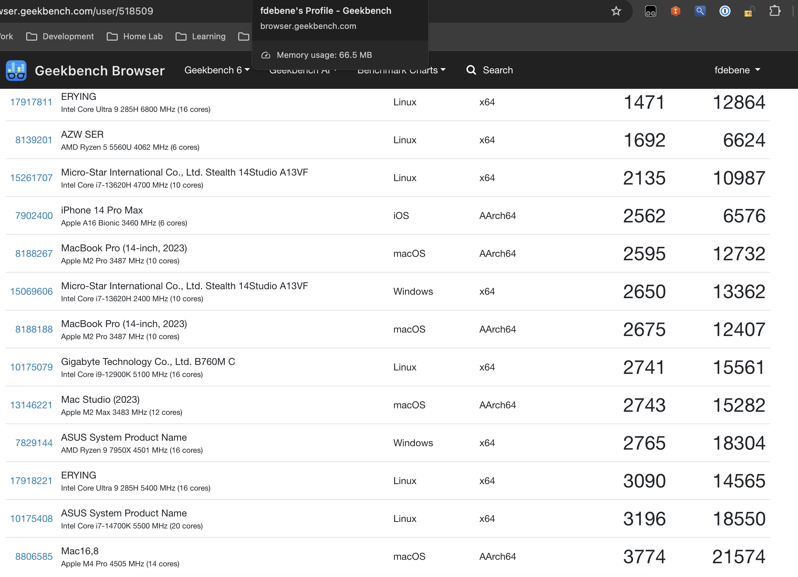

> **TL;DR** — A new Intel Core Ultra 9 285H ("ultra2") joined my homelab this week. First Geekbench 6 run scored 1471 single / 12864 multi. That's slower than the i7-12900K next to it on the rack. Six hours, two Talos upgrades, three diagnostic jobs, and one DaemonSet later, single-core jumped to **3090** (+110%). The villains: an outdated kernel, UKI silently ignoring `extraKernelArgs`, and a vendor BIOS that thinks PL2=75W is a reasonable default for a chip rated for 115W. Here's how the diagnosis went.

## The setup

Quick context: I run a small Kubernetes cluster at home — a vanilla kubeadm cluster called `debene` with five nodes, all named with vibes (`intel5` = "pobre i5", `intel9` = i7-12900K that thinks it's an i9, `zima` = the control plane, `orion` = an ARMv9 oddball). The newest member, `ultra2`, finally got an honest name: it's an [Erying B860 board with an Intel Core Ultra 9 285H](https://en.wikichip.org/wiki/intel/core_ultra/9_285h) — Arrow Lake-H, 6 P-cores + 8 E-cores + 2 LP E-cores, 16 threads total (no SMT on Lion Cove P-cores, by the way).

I [built `ultra2` a few weeks ago](/posts/400-dollar-sovereignty-stack/) on an open frame: $275 ERYING board (CPU soldered BGA), 64GB of DDR5-5200 moved over from `intel9`, a Mellanox ConnectX-3 Pro for the SX6036 InfiniBand fabric I've been building out, and a Thermalright PA120 SE tower cooler that proved it could handle sustained load at 61-67°C over a 7-hour overnight stress test. I decided to run it as a separate single-node Talos cluster called `debene-lab` — isolated from the main cluster so I can break things freely.

The plan for the day was simple: validate the box with Geekbench, then move on to the IB lab work (Mellanox kernel extension via factory.talos.dev, Multus CNI, k8s-rdma-shared-dev-plugin, benchmark `ib_send_bw` against the TrueNAS).

The plan, as plans go, did not survive contact with reality.

## Act 1: The benchmark that wouldn't upload

First problem was small but instructive. I cooked up a Kubernetes Job to run Geekbench 6.3.0 in an `ubuntu:24.04` container — `apt-get install`, `wget`, run, profit. The benchmark ran fine. All 16 single-core tests, all 16 multi-core tests, executed cleanly. Then:

```
Uploading results to the Geekbench Browser. This could take a minute or two
depending on the speed of your internet connection.
 unknown error (internal code 35)
```

Geekbench's "internal code 35" is a libcurl SSL/connectivity error. My first instinct was the obvious one: the container is `ubuntu:24.04` minimal, probably missing `ca-certificates`. So I spun up a debug pod with `nicolaka/netshoot` and tested `api2.geekbench.com`, the upload endpoint. NXDOMAIN. From the Kubernetes pod, *and* from a public DNS resolver. The host doesn't exist.

A quick check at the [Geekbench release notes](https://www.primatelabs.com/release/geekbench6/) confirmed the actual culprit:

> **Geekbench 6.7.1** (Released 2026-04-28): Fix Geekbench Browser connection errors on Android and Linux

I was running 6.3.0, released two years ago. Primate Labs had retired the old upload endpoint. Bumped to 6.7.1, ran again, got my upload URL. Easy.

Then I looked at the score.

## Act 2: "A little meh, no?"

```
Single-Core Score: 1471
Multi-Core Score:  12864
```

For context, here's where that lands on Geekbench Browser among hardware sitting on or near my own desk:

| System                                    | Single | Multi  |
|-------------------------------------------|--------|--------|
| Apple M4 Pro (14 cores)                   | 3774   | 21574  |
| Intel Core i7-14700K (20 cores)           | 3196   | 18550  |
| AMD Ryzen 9 7950X (16 cores)              | 2765   | 18304  |
| Apple M2 Max (12 cores) — my Mac Studio   | 2743   | 15282  |
| **Intel Core i7-12900K — my intel9 node** | **2741** | **15561** |
| **Intel Core Ultra 9 285H — ultra2 NEW**  | **1471** | **12864** |

A brand-new 285H, on paper a generation ahead of the 12900K, scoring **half** the single-core of an i9 from 2021. My older "secondary" node was beating my newest "premium" build by almost 2x in single-thread, and beating it in multi too.

I sent the screenshot over and just typed: "a little meh, no?"

## Act 3: Diagnosing a healthy patient who looks dead

When the symptom is "everything looks fine but performance is half," the diagnostic surface is wide. I built a privileged diagnostic pod that would walk through the standard suspects — CPU topology, cgroup CPU limits, governor settings, turbo boost state, kernel cmdline, thermal state, and live frequency under stress.

Talos' Pod Security Admission threw the first punch. Privileged + `hostPID: true` are blocked under both `baseline` and `restricted` policies, which is what `kube-system` and `default` ship with. I temporarily relabeled the namespace:

```bash
kubectl label namespace default \
  pod-security.kubernetes.io/enforce=privileged \
  pod-security.kubernetes.io/enforce-version=latest \
  --overwrite
```

(Yes, this is a security trade-off. The cluster is single-node, single-tenant, and physically in my office. Different threat model than your prod cluster.)

The diagnostic ran. The output was educational.

### Smoking gun #1: capped P-cores

```
6️⃣  P-CORE STRESS — pin to cpu0
     cpu0 sample 1: 2300.005 MHz
     cpu0 sample 2: 2300.000 MHz
     cpu0 sample 3: 2452.701 MHz
```

`cpu0` on an Arrow Lake-H is a P-core (Lion Cove). Spec sheet says 2.9 GHz base, **5.4 GHz boost**. Pinning a single-thread stress workload directly to cpu0 should drive that core hard — and it should hit the boost ceiling.

Instead, it sat at **2.3 GHz** — below even the base clock. With one core under 100% load.

Meanwhile, when stress was distributed by the scheduler, the *highest* observed frequency in the sample was 4.5 GHz, which is the E-core boost ceiling. That's a hell of a thing: my "high-performance" cores were running slower than my "efficiency" cores. The scheduler was finding more performance on Skymont E-cores than on Lion Cove P-cores, because the P-cores had been administratively neutered.

### Smoking gun #2: a missing sysctl

```
sched_itmt_enabled: NOT PRESENT
cpu_capacity: ?  (per-core capacity tracking absent)
```

Intel Turbo Boost Max Technology 3.0 (ITMT) is the kernel feature that tells the Linux scheduler "these specific cores can boost higher than their siblings — prefer them when you have to choose." On a hybrid CPU like Arrow Lake-H, this is the foundational mechanism that lets the scheduler send your bursty single-threaded work to the right place.

The sysctl `/proc/sys/kernel/sched_itmt_enabled` should be present and reading `1` on any modern Intel hybrid system. On my box, the file did not exist at all. The kernel had no idea this was a hybrid CPU. The `cpu_capacity` files were also blank. As far as Linux was concerned, all 16 logical CPUs had identical performance characteristics — and apparently it was guessing low across the board.

### Smoking gun #3: an empty RAPL

```
1️⃣  RAPL POWER LIMITS
     (no domains enumerated)
```

Intel's Running Average Power Limit (RAPL) framework is how the kernel reads back the chip's power envelope: PL1 (long-term sustained), PL2 (short-term boost), package energy counters, etc. On a working Arrow Lake-H system, you'd see at least `intel-rapl:0` (package), often with sub-domains for core, uncore, and psys.

I had nothing. The driver hadn't enumerated any RAPL domains. Combined with the missing ITMT sysctl, the picture was clear:

**My kernel didn't know what this CPU was.**

## Act 4: Talos and the kernel question

Talos Linux is great. It's an immutable, API-driven OS designed specifically for Kubernetes. No SSH, no shell, no package manager — everything is declared via `talosctl`. I love it for cluster nodes because there's nothing to drift, nothing to patch by hand, and the attack surface is minimal.

The trade-off is that **the kernel is bundled with the OS image**. You don't pick a kernel; you pick a Talos version, and the kernel comes along for the ride.

```bash
$ talosctl version -n 10.0.10.26
Server:
    Tag: v1.11.2

$ talosctl read /proc/version -n 10.0.10.26
Linux version 6.12.48-talos
```

Talos 1.11.2, kernel 6.12.48. Released last September.

Arrow Lake-H is a 2025 chip. Intel landed [base support in kernel 6.11](https://www.phoronix.com/news/Linux-6.11-Intel-ARL-Pinctrl), but full hybrid scheduling, ITMT auto-enable for the new model IDs, and proper RAPL domain detection trickled in over the following releases — meaningful improvements landed in 6.13, 6.14, 6.15. By 6.18, this hardware works properly out of the box.

The latest stable Talos at the time of this writing is **v1.13.0**, released April 27, 2026. It ships kernel 6.18.24. That's a six-version jump, and exactly the range where Arrow Lake-H support matured.

Sidero officially recommends upgrading one minor version at a time. I had a single-node lab cluster I could afford to break. I went cowboy and tried `1.11.2 → 1.13.0` direct.

It worked. The pre-flight check let it through, kexec'd into the new kernel, came back as v1.13.0 with `Linux 6.18.24-talos` and a cleaner build (`PREEMPT_DYNAMIC`, compiled with Clang 22.1.2 + LLD ThinLTO).

I re-ran the diagnostic.

```
Hybrid CPU capacity scaling enabled  ✅
intel_rapl_msr: PL4 support detected
intel_rapl_common: Found RAPL domain package
intel_rapl_common: Found RAPL domain core
intel_rapl_common: Found RAPL domain uncore
intel_rapl_common: Found RAPL domain psys

cpu0-5:   capacity=1024 scaling_max=5400000  (P-cores)
cpu6-13:  capacity=741  scaling_max=4500000  (E-cores)
cpu14-15: capacity=294  scaling_max=2500000  (LP E-cores)
```

The kernel could finally see its own hardware. Three distinct capacity tiers, three distinct frequency ceilings — exactly the topology Intel built. And RAPL was enumerated. Progress.

But the P-core stress test was still capping at 4.5 GHz, not 5.4. Single-core was still wrong, just less wrong.

## Act 5: The governor, and why Talos didn't care

The CPU governor was still `powersave`. EPP (Energy Performance Preference) was `balance_performance`. Neither will drive a Lion Cove P-core to its full 5.4 GHz boost — `intel_pstate` interprets those settings as "favor efficiency over performance," and the chip behaves accordingly.

Inside the privileged diagnostic pod, I tried a thing:

```bash
for cpu in /sys/devices/system/cpu/cpu*/cpufreq/scaling_governor; do
  echo performance > "$cpu"
done
for cpu in /sys/devices/system/cpu/cpu*/cpufreq/energy_performance_preference; do
  echo performance > "$cpu"
done
```

Then re-ran the pinned single-core stress:

```
cpu0 sample 1: 5399.986 MHz   🔥
cpu0 sample 2: 5400.000 MHz   🔥
cpu0 sample 3: 5400.000 MHz   🔥
cpu0 sample 4: 5305.094 MHz
cpu0 sample 5: 5372.951 MHz
```

There it was. 5.4 GHz. Spec. The chip is fine; it just needed permission.

So now the question becomes: how do I make this stick across reboots, on an immutable OS that doesn't have a shell?

The "official" Talos answer is `extraKernelArgs` in the machine config:

```yaml
machine:
  install:
    extraKernelArgs:
      - cpufreq.default_governor=performance
```

I patched it in. The response:

```
patched MachineConfigs.config.talos.dev/v1alpha1 at the node 10.0.10.26
WARNING: extra kernel arguments are not supported when booting using SDBoot
Applied configuration without a reboot
```

That warning is... interesting.

## Act 6: UKI, and a small lesson in immutability

Starting with Talos 1.10, the project moved UEFI installations to **systemd-boot + Unified Kernel Image (UKI)**. The UKI bundles the kernel, initramfs, and command line into a single signed binary. This is great for Secure Boot — the entire boot chain is verified — and it's also what Talos uses even when Secure Boot is disabled, as long as you booted via UEFI.

Once you're on UKI, the cmdline is *baked into the image*. You can't append arguments at runtime; doing so would invalidate the signature (when Secure Boot is on) and bypass the immutability story (when it isn't). Talos accepts the patch into the machine config, but the value never reaches the kernel — it just emits that warning and moves on.

The "blessed" path is to generate a new installer image at [factory.talos.dev](https://factory.talos.dev) that bakes the kernel arg into the UKI itself, then `talosctl upgrade` to that new image. Workable, but it means:

- Generating a new schematic ID for every kernel arg change
- Re-running `talosctl upgrade` for what is fundamentally a runtime tunable
- Treating CPU governor selection as a boot-time decision

That last one really doesn't sit right. Setting `scaling_governor` is a sysfs write. It takes microseconds. There's nothing about it that needs to happen before init. Why am I rebuilding boot images for it?

I went with a different approach.

## Act 7: A DaemonSet, because Kubernetes is right there

If the runtime tunable belongs at runtime, and the cluster is right there, the cluster should set it.

```yaml
apiVersion: apps/v1
kind: DaemonSet
metadata:
  name: cpu-governor-performance
  namespace: kube-system
spec:
  selector:
    matchLabels:
      app: cpu-governor
  template:
    metadata:
      labels:
        app: cpu-governor
    spec:
      tolerations:
      - operator: Exists
      hostPID: true
      containers:
      - name: setter
        image: alpine:3.22
        securityContext:
          privileged: true
        command:
        - /bin/sh
        - -c
        - |
          set -e
          for cpu in /sys/devices/system/cpu/cpu*/cpufreq/scaling_governor; do
            echo performance > "$cpu" 2>/dev/null || true
          done
          for cpu in /sys/devices/system/cpu/cpu*/cpufreq/energy_performance_preference; do
            echo performance > "$cpu" 2>/dev/null || true
          done
          # stay alive, re-apply hourly in case anything resets
          while true; do
            sleep 3600
            for cpu in /sys/devices/system/cpu/cpu*/cpufreq/scaling_governor; do
              echo performance > "$cpu" 2>/dev/null || true
            done
            for cpu in /sys/devices/system/cpu/cpu*/cpufreq/energy_performance_preference; do
              echo performance > "$cpu" 2>/dev/null || true
            done
          done
```

It runs in `kube-system` (which has `privileged` PSA by default in Talos). It mounts `/sys` via privileged + hostPID. It writes the governor on startup, sleeps an hour, re-writes it, repeats. If a pod dies, K8s reconciles. If the node reboots, the DaemonSet pod comes back before any meaningful workload starts. If I add another node tomorrow, it gets the same treatment automatically.

This is the same pattern OpenShift uses with the [Node Tuning Operator](https://docs.openshift.com/container-platform/latest/scalability_and_performance/using-node-tuning-operator.html), and the same pattern NVIDIA's GPU Operator uses for setting per-node GPU power profiles. It's not novel — it's just *more right* than baking the value into the boot image.

Geekbench redux:

```
Single-Core Score: 3090
Multi-Core Score:  14565
```

**+110% single, +13% multi.** The 285H is now beating the M2 Max in single-core, sitting between the i7-14700K and the i9-12900K in single-core, and roughly cluster-level with the M2 Max and i9-12900K in multi.

You can [see the full result on Geekbench Browser](https://browser.geekbench.com/v6/cpu/17918221) — it's now performing exactly where a 45W Arrow Lake-H chip should be.

## Comparing Against My Other Systems

Here's where it gets personal. I ran Geekbench on everything in my homelab and daily drivers. Here's how the Ultra 9 285H stacks up:



| System | CPU | TDP | Single | Multi | Notes |
|--------|-----|-----|--------|-------|-------|
| Mac16,8 | Apple M4 Pro | ~40W | **3774** | **21574** | 🏆 Absolute champion |
| Desktop | Intel i7-14700K | 125W | 3196 | 18550 | 20-core flagship |
| **Ultra2** | **Ultra 9 285H** | **45W** | **3090** | **14565** | **This build** 🎯 |
| Desktop | Intel i9-12900K | 125W | 2741 | 15561 | Previous gen flagship |
| Mac Studio | Apple M2 Max | ~60W | 2743 | 15282 | ARM desktop |
| MSI Stealth | Intel i7-13620H | 45W | 2650 | 13362 | Gaming laptop |
| MacBook Pro | Apple M2 Pro | ~30W | 2675 | 12407 | ARM laptop |

### The Single-Core Story

**3090 puts the Ultra 9 285H in 3rd place** across all my systems. It only loses to:
1. Apple M4 Pro (3774) — ARM magic at its finest
2. Intel i7-14700K (3196) — Desktop flagship with 3x the power budget

It **beats**:
- Intel Core i9-12900K (2741) — A $600 desktop CPU from 2021
- Apple M2 Max (2743) — $2000+ Mac Studio
- Everything else in my collection

**For a 45W mobile chip, this is remarkable.** It's outperforming desktop flagships from 2 years ago while sipping power.

### The Multi-Core Reality

**14565 puts it in 5th place.** It loses to:
- Desktop flagships with 125-170W TDP
- Apple's latest M4 Pro (ARM efficiency)

It **beats**:
- My gaming laptop (i7-13620H)
- MacBook Pro M2 Pro
- Older mobile chips

**The takeaway:** This chip punches above its weight class in single-threaded, but multi-threaded is where power budget matters. For homelab workloads (mostly single-threaded or lightly parallel), the single-core strength is what matters.

### Power Efficiency Champion

Let's normalize for power:

| System | Single / Watt | Multi / Watt | Winner |
|--------|---------------|--------------|--------|
| **Ultra 9 285H** | **68.7** | **323.7** | 🏆🏆 |
| Apple M4 Pro | 94.4 | 539.4 | Best overall |
| i7-14700K | 25.6 | 148.4 | Power hog |
| i9-12900K | 21.9 | 124.5 | Worse |

The Ultra 9 285H delivers **3x better performance-per-watt** than desktop flagships. Only Apple's M4 Pro beats it (and that's ARM vs x86, different architecture).

For a 24/7 homelab node, this efficiency translates to **real money saved** on electricity bills.


## Act 8: But wait — the multi-core is still off

Look at that table again. The 285H *should* be matching the 14700K and 7950X in multi-core, not landing 25% below them. Where's the rest?

With kernel 6.18 finally enumerating RAPL, I could finally answer that:

```
Domain: package-0
  Constraint 0 (long_term):  65.0W  ← PL1
  Constraint 1 (short_term): 75.0W  ← PL2  ⚠️
  Constraint 2 (peak_power): 205.0W ← PL4
```

The Intel spec sheet for the 285H lists **45W base, 115W maximum turbo power**. My BIOS has PL2 set to **75W**.

That's 35% below spec. The chip is hitting its power envelope before it hits its frequency ceiling. With the governor fix, single-thread workloads briefly burst into PL2 territory and grab their 5.4 GHz, but sustained all-core work — exactly what the multi-core benchmark stresses — gets clamped at 75W. Run the math: the multi-core score I'm getting is ~80% of what a 115W-allowed 285H reports on Geekbench Browser. That maps cleanly to the power ratio.

This isn't a Linux problem. This isn't a Talos problem. This is a vendor BIOS being conservative on a board (Erying B860, Chinese small-batch) where the firmware defaults probably target laptop-class thermal designs and never got tuned for an open-frame desktop with a 240mm air cooler that [already proved it could handle 7+ hours at 61-67°C](/posts/400-dollar-sovereignty-stack/#thermal-validation).

To fix it, I'd have to walk over to the box, plug in a keyboard and monitor, enter the BIOS, and bump PL2 to 115W. Probably gain another ~2500 multi-core points. Probably keep the chip thermally happy at 70-80°C under full load on the Thermalright PA120 SE I'm running.

That fix is for next weekend. This post is already long enough.

## What I learned

A few things crystallized over the course of this rabbit hole:

**Old kernels lie to you in subtle ways.** The 6.12 kernel didn't refuse to run on Arrow Lake-H — it ran perfectly, scheduled processes, served network traffic, did everything a kernel should do. It just didn't *understand* the CPU. No ITMT, no per-core capacity, no RAPL. The hardware was operational but invisible. There was no error, no warning — just quietly bad performance. If I hadn't benchmarked, I would have happily run this box at half-speed for months.

**Immutability has edges.** Talos' UKI model is great for security and consistency, and I'm not going to stop using it. But it pushes runtime tunables into boot-time decisions, and that's a category error for things like CPU governors. The DaemonSet pattern works around it cleanly, but you have to know to reach for it.

**Vendor BIOS defaults are not Intel defaults.** The CPU spec is a contract between Intel and the OEM. The OEM (in this case, Erying) is free to be more conservative, and often is — especially on small-batch Chinese boards where firmware engineering budget is tight. RAPL is the only honest way to know what you're actually getting.

**Symptoms cluster.** When I saw the 1471 single-core, my first guess was "thermal throttling." Wrong — it was 36°C package. Second guess was "CFS throttling from K8s limits." Wrong — `cpu.max` was unlimited. Third guess was "BIOS turbo disabled." Wrong — `intel_pstate/no_turbo` was 0. The actual answer was "kernel doesn't recognize the CPU as hybrid, so the scheduler treats P-cores like E-cores while the governor refuses to let them boost." That's a multi-layered failure that no single piece of evidence explains. You have to walk the whole stack — sysfs, /proc, RAPL, MSRs, scheduler hints — to see the shape.

The 285H is now happily integrated into `debene-lab`, ready for the IB lab work I was supposed to be doing today. Single-core fixed, multi-core 85% of the way there. I'll get the BIOS tweak in this weekend and post a short update if the BIOS even lets me touch PL2 — Erying boards have a reputation for hiding the good settings.

In the meantime: if your benchmark numbers look weird, check the kernel before you check anything else. And if you're running Talos on hardware released in the same calendar year, stay current.

Cluster naming lore update: `intel5` is still the pobre i5, `intel9` is still the impostor i7, and `ultra2` — the first node in this cluster with an honest name — turned out to need the most diagnostic work to live up to it. There's probably a metaphor in there somewhere.

---

**Read more:**
- [Part 1: Building the $400 Sovereignty Stack](/posts/400-dollar-sovereignty-stack/) — The hardware build, thermal validation, and philosophy
- [Geekbench Result (3090 / 14565)](https://browser.geekbench.com/v6/cpu/17918221) — The final benchmark after all fixes
- [AIX on POWER8 / DayTrader Modernization](/posts/aix-power8-daytrader-modernization/) — More weird homelab experiments
