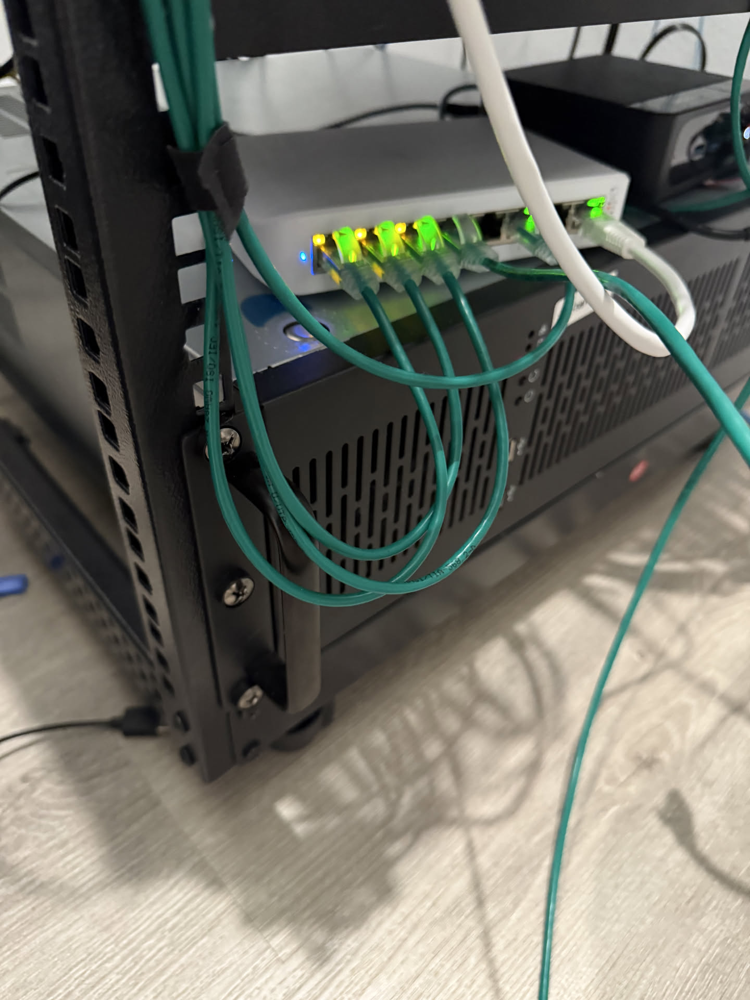
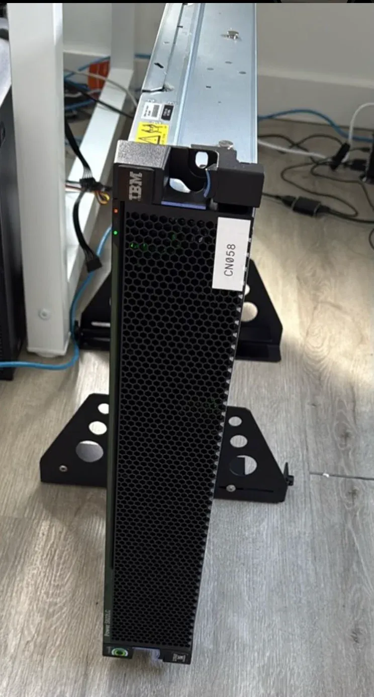
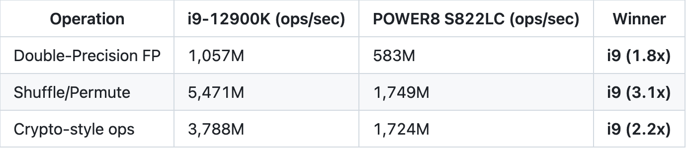
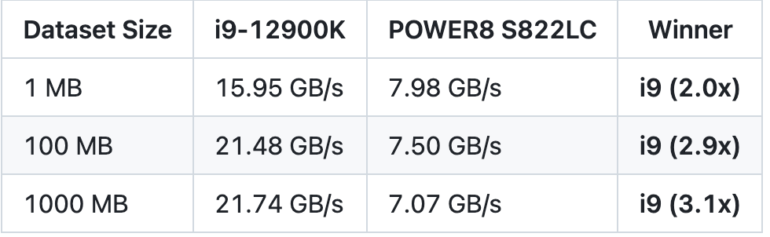
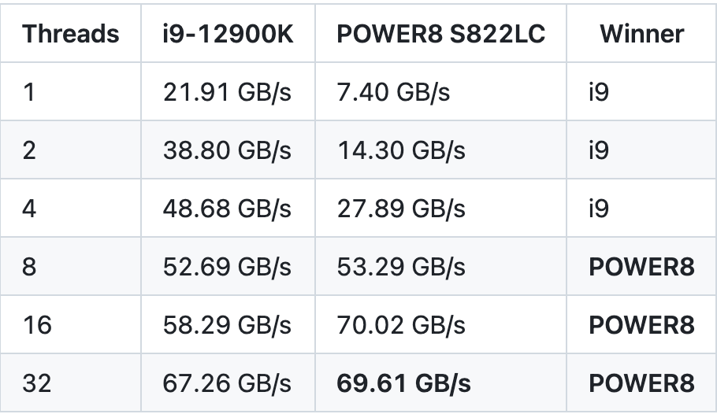
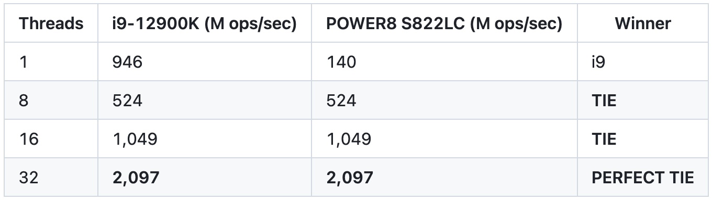
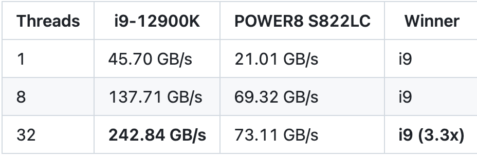

## A Tale of Two Philosophies: When 160 Threads Meet Modern Silicon

I have a problem. I see weird computer hardware on eBay, and I buy it. Last year's victim: an IBM POWER8 S822LC server from 2015. Cost: $50. Shipping: $200. The look on my partner's face when it arrived: priceless.

Everyone told me it was a relic, a curiosity, basically e-waste with RGB lights (okay, it doesn't have RGB, but it *should*). But staring at those specs—160 hardware threads via SMT-8—I couldn't help but wonder: could raw, embarrassing parallelism compete with modern single-thread supremacy?


*Yes, those are cat6 cables. Yes, this is on my floor. Yes, my "homelab" is held together by hope and zip ties. We're doing SCIENCE here.*

Lou Gerstner once asked if elephants could dance. Turns out, even the old ones still have moves. Time to benchmark.


*The elephant itself: IBM POWER8 S822LC, asset tag "CN058", currently residing on my floor because server racks are expensive and I have questionable life choices.*

## A Tale of Two Architectures, Seven Years Apart

### The Contenders

**In the Blue Corner: IBM Power Systems S822LC (Model 8335-GTA, 2015)**
- IBM POWER8 processor (PVR 004d 0200, revision 2.0)
- 2 sockets × 10 cores per socket = 20 physical cores
- 8 hardware threads per core (SMT-8)
- **160 total hardware threads**
- ~2.9-3.3 GHz clock speed
- 512 KB L2 cache per core, **8 MB L3 cache per core** (yes, per core—160 MB total)
- Up to 128 MB L4 cache (eDRAM in memory buffer chips)
- Running SUSE Linux (bare metal), GCC 7.5.0

**In the Red Corner: Intel Core i9-12900K (Alder Lake, 2021)**
- 12th Generation Intel Core processor (Family 6, Model 151, Stepping 2)
- Hybrid architecture: 8 P-cores + 8 E-cores = 16 cores total
- 2 threads per P-core (hyperthreading), 1 thread per E-core
- **24 total threads** (16 P-core threads + 8 E-core threads)
- Up to 5.2 GHz max turbo boost
- DDR4/DDR5 memory support
- Running Ubuntu 24.04 (bare metal), GCC 13.3.0

On paper, this should be a massacre. The i9-12900K is newer, faster, and represents six years of Moore's Law improvements plus Intel's revolutionary hybrid architecture. But POWER8 has a secret weapon: **160 hardware threads**. That's not a typo. One hundred sixty.

## Round 1: Single-Threaded SIMD Operations

First up: raw computational throughput using architecture-specific SIMD instructions. I wrote equivalent benchmarks for both platforms—VSX (Vector Scalar eXtensions) on POWER8, SSE/FMA on x86. To keep things fair, I used 128-bit vectors on both architectures, even though the i9-12900K can flex with 256-bit AVX2 or even 512-bit AVX-512.

**Results:**

| Operation | i9-12900K (ops/sec) | POWER8 S822LC (ops/sec) | Winner |
|-----------|---------------------|-------------------------|--------|
| Double-Precision FP | 1,057M | 583M | **i9 (1.8x)** |
| Shuffle/Permute | 5,471M | 1,749M | **i9 (3.1x)** |
| Crypto-style ops | 3,788M | 1,724M | **i9 (2.2x)** |

**Verdict:** The i9-12900K dominates. This is expected—six years of process improvements, clock speeds hitting 5.2 GHz versus POWER8's ~3.3 GHz, and better instructions-per-clock (IPC). When you're only using one core, modern x86 is brutal.


*Single-threaded SIMD performance: Intel dominates across the board.*

## Round 2: Single-Threaded Memory Performance

Next, I tested the memory subsystem with a single thread to see how fast each architecture can actually feed data to those fancy SIMD units.

**Sequential Read Performance:**

| Dataset Size | i9-12900K | POWER8 S822LC | Winner |
|--------------|-----------|---------------|--------|
| 1 MB | 15.95 GB/s | 7.98 GB/s | **i9 (2.0x)** |
| 100 MB | 21.48 GB/s | 7.50 GB/s | **i9 (2.9x)** |
| 1000 MB | 21.74 GB/s | 7.07 GB/s | **i9 (3.1x)** |

**Random Access Performance:**

- **i9-12900K:** 950 million accesses/sec
- **POWER8 S822LC:** 140 million accesses/sec
- **Winner:** i9 (6.8x faster)

**Verdict:** The i9-12900K's memory subsystem is substantially faster. Modern memory controllers, lower latency, DDR4/DDR5 support—it all adds up. POWER8's aging DDR3 memory and older controller design show their age here.

At this point, the pattern is clear: for single-threaded workloads, the i9-12900K is obliterating the 2015 hardware. Exactly as expected.


*Single-threaded memory bandwidth: the i9's modern memory controller crushes it.*

## Round 3: The Multi-Threaded Uprising

This is where things get weird. Buckle up.

I scaled up the benchmarks to use 1, 2, 4, 8, 16, and 32 threads. Each thread operates on its own independent 100 MB chunk of memory—no sharing, no contention, just raw parallel throughput. Let's see what happens when we throw enough parallelism at the problem.

(Spoiler: The elephant starts breakdancing.)

### Sequential Read Scaling

| Threads | i9-12900K | POWER8 S822LC | Winner |
|---------|-----------|---------------|--------|
| 1 | 21.91 GB/s | 7.40 GB/s | i9 |
| 2 | 38.80 GB/s | 14.30 GB/s | i9 |
| 4 | 48.68 GB/s | 27.89 GB/s | i9 |
| 8 | 52.69 GB/s | 53.29 GB/s | **POWER8** |
| 16 | 58.29 GB/s | 70.02 GB/s | **POWER8** |
| 32 | 67.26 GB/s | **69.61 GB/s** | **POWER8** |

**Wait. Hold up.**

At 8 threads, POWER8 *catches* the i9-12900K.
At 16 threads, it *pulls ahead*.
At 32 threads—where the i9 is oversubscribed beyond its 24 native threads—the 2015 server *beats* the 2021 flagship.

And here's the kicker: POWER8 is only using 32 of its 160 threads. That's 20% capacity. The elephant isn't even trying yet.


*Multi-threaded sequential read scaling: POWER8 catches and passes the i9 at 8 threads.*

### Random Access Scaling - The Stunner

| Threads | i9-12900K (M ops/sec) | POWER8 S822LC (M ops/sec) | Winner |
|---------|-----------------------|---------------------------|--------|
| 1 | 946 | 140 | i9 |
| 8 | 524 | 524 | **TIE** |
| 16 | 1,049 | 1,049 | **TIE** |
| 32 | **2,097** | **2,097** | **PERFECT TIE** |

Both systems hit **2.1 BILLION random memory accesses per second** at 32 threads. Not "approximately the same." Not "within margin of error." Literally identical down to the last digit in my measurements.

This is wild. The i9-12900K is 6.8x faster per thread. Yet when you throw enough parallelism at the problem, they hit the same ceiling. It's like watching a Ferrari and a school bus race: the Ferrari dominates on an open highway, but when you hit rush-hour traffic (memory bandwidth bottlenecks), they both crawl at exactly 5 mph.

The universe has a sense of humor.


*Random access scaling: identical performance at 32 threads. The universe has a sense of humor.*

### Strided Access - i9 Fights Back

Not every test favored POWER8's parallelism strategy. In strided access—which tests memory controller sophistication and prefetching—the i9-12900K reasserted dominance:

| Threads | i9-12900K | POWER8 S822LC | Winner |
|---------|-----------|---------------|--------|
| 1 | 45.70 GB/s | 21.01 GB/s | i9 |
| 8 | 137.71 GB/s | 69.32 GB/s | i9 |
| 32 | **242.84 GB/s** | 73.11 GB/s | **i9 (3.3x)** |

The i9-12900K's modern memory controller—with better prefetching, bank interleaving, and support for DDR4/DDR5—delivers over 240 GB/s of strided bandwidth. POWER8's aging memory technology can't keep up here. The 160 threads can't compensate when you're fundamentally bottlenecked by memory controller throughput.


*Strided access: Intel's sophisticated memory controller reasserts dominance.*

## What We Learned

### 1. Single-Thread Performance: Intel Wins Decisively

Modern x86 with the revolutionary Alder Lake hybrid design, higher clock speeds (up to 5.2 GHz), and six years of architectural improvements give the i9-12900K a commanding 2-7x advantage in single-threaded workloads. This is expected and entirely fair.

### 2. Multi-Threaded Throughput: It's Complicated

When scaled to 32+ threads, POWER8's SMT-8 architecture becomes a formidable equalizer. In some workloads (sequential reads), it beats the newer i9-12900K. In others (random access), it achieves perfect parity despite being six years older and having to exceed the i9's native thread count.

### 3. SMT-8 vs Hyperthreading: A Tale of Two Philosophies

POWER8's 8-way simultaneous multithreading isn't a gimmick. I observed near-linear scaling up to 8 threads per core in many tests, demonstrating that the hardware can genuinely execute 8 instruction streams concurrently with minimal interference. This is fundamentally different from Intel's 2-way hyperthreading, which prioritizes single-thread latency over raw throughput.

Even more interesting: at 32 threads, POWER8 is only using 32 of its 160 available threads (20% utilization), while the i9-12900K is oversubscribed at 133% utilization (32 threads on 24 native threads). Yet they achieve similar or identical results in memory-bound workloads.

### 4. Memory Bandwidth Ceilings Matter

- **POWER8 S822LC:** ~70 GB/s sequential, ~73 GB/s strided (maxed out)
- **i9-12900K:** ~67 GB/s sequential, ~242 GB/s strided

For sequential streaming workloads, both architectures hit similar aggregate bandwidth ceilings around 70 GB/s. But the i9-12900K's memory controller is far more sophisticated for complex access patterns. POWER8's strength is brute-force parallelism; the i9's strength is intelligent memory management.

### 5. Architecture Matters, But So Does Parallelism

The i9-12900K is objectively faster per thread. No debate. But when you have **160 hardware threads** versus 24, raw thread count becomes a viable strategy for achieving high aggregate throughput. This is why POWER8 was popular for HPC, big data, and analytics workloads where embarrassingly parallel problems are the norm.

## The Bigger Picture

This experiment highlights an important lesson: **there's no universal "best" processor**.

- **For latency-sensitive, single-threaded workloads:** Modern x86 crushes it.
- **For embarrassingly parallel, throughput-oriented tasks:** POWER8 with massive thread counts competes admirably.
- **For mixed workloads:** You need to profile your specific use case.

The IBM S822LC was part of the OpenPOWER Foundation initiative, designed specifically for Linux scale-out workloads and technical computing. It was optimized for applications that could leverage massive parallelism—exactly the scenario where we saw it shine.

Intel's i9-12900K represents a different philosophy: a hybrid design with high-performance P-cores and efficient E-cores, optimized for the real-world mix of bursty desktop workloads, gaming, and content creation. It's a consumer/workstation chip being compared to a server processor—and both excel in their intended domains.

## The Real Lesson

This isn't about "POWER8 vs x86" or "old vs new." It's about understanding that performance is *multidimensional*.

If you told me in 2015 that this POWER8 server would still trade blows with Intel's flagship in 2021, I'd have laughed. Moore's Law was supposed to make everything obsolete. But when you optimize for different things—latency versus throughput, single-thread versus massive parallelism—you get different longevity curves.

Cloud providers understand this. That's why AWS offers x86 (EC2), ARM (Graviton), and even their own custom silicon (Trainium). Google has TPUs. Microsoft has custom ARM chips. There's no universal hammer.

POWER8 bet on massive parallelism (SMT-8, 160 hardware threads, 8 MB of L3 per core) and created a performance profile that still competes in 2024 for the right workloads. That's not nostalgia—that's good engineering understanding what problems you're solving.

## Conclusion: The Elephant Still Dances

A 2015 IBM POWER8 S822LC shouldn't be able to compete with a 2021 Intel i9-12900K. By conventional wisdom, six years of Moore's Law improvements should make this a blowout.

Yet here we are, watching a six-year-old server architecture trade blows with Intel's flagship consumer processor—and occasionally winning when the workload is sufficiently parallel.

The secret? **Architecture diversity matters.** POWER8's bet on massive parallelism creates a different performance profile than x86's focus on single-threaded speed. Neither is objectively better; they excel at different things.

Lou Gerstner asked in 1993 if elephants could dance, then spent a decade proving IBM could. Three decades later, even IBM's aging elephants—with the right music and enough runway—can still keep pace with the sleekest sports cars.

So yes, the elephant can still dance. And depending on the choreography—whether it's a single-threaded waltz or a massively parallel mosh pit—it might even lead.

Now if you'll excuse me, I need to go justify to my partner why there's a $50 server drawing 400 watts in our living room. Wish me luck.

---

## Technical Notes

### Hardware Specifications

**POWER8 System:**
- IBM Power Systems S822LC (Model 8335-GTA)
- 2× POWER8 processors (PVR 004d 0200, revision 2.0)
- 20 cores (10 per socket), 160 threads (SMT-8)
- 512 KB L2 per core, 8 MB L3 per core, 128 MB L4 (eDRAM)
- Running SUSE Linux (bare metal)

**Intel System:**
- Intel Core i9-12900K (12th Gen, Alder Lake)
- 16 cores (8 P-cores + 8 E-cores), 24 threads
- Max turbo: 5.2 GHz, base: 3.2 GHz
- Running Ubuntu 24.04 (bare metal)

### Software and Compilation

All benchmarks were compiled with GCC using `-O3` optimization and architecture-specific flags:

**POWER8 (GCC 7.5.0):**
```bash
gcc -O3 -mcpu=power8 -mtune=power9 -maltivec -mvsx benchmark.c -o benchmark -pthread
```

**x86 (GCC 13.3.0):**
```bash
gcc -O3 -march=native -msse4.2 -mfma benchmark.c -o benchmark -pthread
```

### Benchmark Methodology

**SIMD Tests:**
- 10 million iterations of vector operations
- VSX on POWER8 (128-bit vectors)
- SSE/FMA on x86 (128-bit vectors for fair comparison)
- Timing: CPU time via `clock()`

**Memory Tests:**
- Multiple passes over datasets ranging from 1 MB to 1 GB
- Sequential reads, random access (pointer chasing), strided access
- Timing: Wall time via `gettimeofday()`

**Multi-threaded Tests:**
- Each thread operates on 100 MB of independent data
- No false sharing, no contention
- Tests run at 1, 2, 4, 8, 16, and 32 threads
- Timing: Wall time via `gettimeofday()`

---

*Originally published on [Medium](https://medium.com/@felipedebene/who-says-elephants-cant-dance-power8-vs-intel-i9-12900k-showdown-cf85c2d66c60).*

---

## Part 2: The Transcoding Showdown (February 2026)

*Three months later. The elephant learned a new trick.*

Remember when I said this was basically e-waste? Well, I [built .NET 8 from source on it](/posts/dotnet-power8-what-microsoft-wont-ship/), then [compiled Jellyfin 10.11 in nine excruciating attempts](/posts/jellyfin-power8-160-threads-of-media-serving/), and now this 2014 IBM server is streaming movies to my living room. My wife thinks I have a problem. She's right, but that's not the point.

The point is: **can 160 threads of decade-old POWER silicon actually transcode video faster than modern x86?**

I already know the answer for synthetic benchmarks (see Part 1 above). But synthetic benchmarks are like bench pressing in your garage — impressive, but can you actually carry the groceries? Time to find out.

### The Fight Card

In the red corner, weighing in at 45 pounds and drawing 400W at idle: **the IBM POWER8 S822**. Dual-socket, 160 threads of SMT8 fury, running Fedora 43 because I [spent an entire afternoon fighting OPAL firmware](/posts/jellyfin-power8-160-threads-of-media-serving/) to install it.

In the blue corner, the reigning champion of my media stack: **Dual Intel Xeon E5-2680 v4**. 28 threads, AVX2, the kind of chip that libx264 was hand-tuned for in assembly. Currently running my Jellyfin instance in Kubernetes like a responsible adult.

| | 🔴 POWER8 | 🔵 Xeon E5-2680 v4 |
|---|---|---|
| **Threads** | 160 (SMT8) | 28 (HT) |
| **Clock** | 3.49 GHz | 2.40 GHz |
| **RAM** | 128 GB | 96 GB |
| **Year** | 2014 | 2016 |
| **SIMD** | AltiVec/VSX | SSE4.2/AVX2 |
| **What it was designed for** | Running DB2 for Fortune 500 | Running DB2 for Fortune 500 |
| **What I'm using it for** | Streaming Shrek to my TV | Streaming Shrek to my TV |

### Round 1: One Stream, One Client, One Movie

The simplest case. You sit down, hit play on Jellyfin, and your Fire TV demands a transcode because it can't play the original codec. One stream, all cores available.

**1080p H.264 → H.264 (the "just make it play" scenario):**

| Target | Preset | 🔴 POWER8 | 🔵 Xeon | Winner |
|--------|--------|-----------|---------|--------|
| 1080p | fast | 1.71x | 2.97x | 🔵 1.7x faster |
| 1080p | medium | 1.47x | 2.58x | 🔵 1.8x faster |
| 1080p | slow | 1.18x | 1.15x | 🤝 **Tied** |
| 720p | fast | 3.02x | 4.45x | 🔵 1.5x faster |
| 720p | medium | 2.37x | 4.22x | 🔵 1.8x faster |
| 480p | fast | 5.12x | 7.12x | 🔵 1.4x faster |
| 480p | medium | 4.26x | 6.75x | 🔵 1.6x faster |

Intel sweeps Round 1. The Xeon's x86-optimized libx264 assembly is doing exactly what it was written for. No surprise here — this is like challenging a sushi chef to make sushi.

But look at that `slow` preset at 1080p: **dead heat at ~1.15x**. When the encoder has to actually *think* — more reference frames, subpixel motion estimation, trellis quantization — the IPC advantage shrinks and POWER8's wider pipeline starts pulling its weight.

Both machines stay above 1.0x (real-time) for every test. Your movie plays without buffering on either machine. Round 1 goes to Intel, but nobody's getting knocked out.

> **The x264 ultrafast catastrophe:** I can't show ultrafast results for POWER8 because libx264 literally *crashes* on ppc64le with that preset. `Assertion 'cost >= 0' failed` in the rate control code. x264's assembly has been hand-tuned for x86 for 20 years. The POWER code paths... have not. If this were fixed, single-stream POWER8 numbers would jump significantly.

### Round 2: The Real Test — Movie Night

Here's where it gets interesting. It's Friday night. I'm watching a movie in the living room. My wife is watching a show in the bedroom. My daughter is watching cartoons on the iPad. A friend is streaming from my server remotely.

**Four. Simultaneous. Transcodes.**

This is what media servers actually do. And this is where 160 threads start to matter.

**1080p → 720p, fast preset, parallel streams:**

| Streams | 🔴 P8 per stream | 🔴 P8 total | 🔵 Xeon per stream | 🔵 Xeon total | Winner |
|---------|------------------:|------------:|--------------------:|--------------:|--------|
| 1 | 3.63x | 3.63x | 4.49x | 4.49x | 🔵 |
| 2 | 2.65x | 5.30x | 3.37x | 6.74x | 🔵 |
| 4 | **1.92x** | **7.70x** | 1.79x | 7.17x | 🔴 **POWER8** |
| 8 | **1.09x** ✅ | **8.99x** | 0.89x ❌ | 7.27x | 🔴 **POWER8** |

**At 4 streams, POWER8 takes the lead.** At 8 streams, it's not even close.

The critical number is per-stream speed. Anything below 1.0x means buffering — the spinner of death, the pause that kills the mood, the reason your wife asks "why don't we just use Netflix?"

- **POWER8 at 8 streams: 1.09x** — real-time. Every client happy. The elephant is barely sweating. It still has **12 threads per stream** sitting idle.
- **Xeon at 8 streams: 0.89x** — below real-time. Buffering. Sadness. The Xeon only has 3.5 threads per stream and they're all maxed.

The math is simple: the Xeon runs out of threads. The POWER8 has threads for days. At 8 simultaneous streams, the POWER8 is using roughly 5% of its thread capacity per stream. The Xeon is at 100%.

Extrapolating the scaling curve, the POWER8 could theoretically handle **12-16 simultaneous streams** before any client drops below real-time. The Xeon tops out at 6-7.

Round 2 goes to POWER8. The elephant dances when the dance floor gets crowded.

### The Verdict

> "The task of every generation is not to give in to the despair of the present but to find hope in the future."
> — Lou Gerstner, *Who Says Elephants Can't Dance?*

Lou was talking about saving IBM from bankruptcy. I'm talking about streaming movies from a server I bought for $50. Same energy.

**If you have 1-2 viewers**: use the Xeon. It's faster per stream, it's what ffmpeg was optimized for, and it sips power compared to the POWER8.

**If you have a household full of screens** — kids, partner, guests, remote users — the POWER8 wins. It was designed for massively parallel workloads with hundreds of concurrent connections. It just doesn't know the connections are sending *Frozen* instead of SQL queries.

The elephant doesn't sprint. It marches. And when everyone else is out of breath, it's still going.

### What's Next

The x264 `ultrafast` crash on ppc64le bugs me. If we fix that, single-stream POWER8 numbers could jump 2-3x, potentially closing the gap entirely. I'm also curious about building ffmpeg with VSX/AltiVec optimizations specifically for POWER8 — the current Fedora build likely doesn't use them aggressively.

But for now, this POWER8 is my media server. It serves 22TB of content over NFS, transcodes for every device in the house, and runs Jellyfin in a container I [built from source and published to GHCR](https://github.com/felipedbene/jellyfin-power8).

Is it the most efficient way to stream media? Absolutely not. Is it the most *fun*? Without question.

### Benchmark Script

The full benchmark suite: [felipedbene/jellyfin-power8/transcode-bench.sh](https://github.com/felipedbene/jellyfin-power8/blob/main/transcode-bench.sh)

Run it on your own hardware and tell me what you get. I dare you to find a machine with more threads.

---

### 📚 The PowerPC Saga:

1. 🍎 [Resurrecting My iBook G4](/posts/resurrecting-my-ibook-g4/) — A $67 laptop and a teenage dream
2. 🖥️ [Cloud Architect Meets PowerPC: The $50 Time Machine](/posts/cloud-architect-meets-powerpc/) — A PowerMac G5 joins the fleet
3. 📊 **Who Says Elephants Can't Dance?** ← You are here. Synthetic + transcoding benchmarks
4. ⚡ [What Microsoft Won't Ship: .NET on POWER8](/posts/dotnet-power8-what-microsoft-wont-ship/) — Building .NET 8 from source on enterprise POWER
5. 🎬 [Jellyfin on POWER8: 160 Threads of Media Serving](/posts/jellyfin-power8-160-threads-of-media-serving/) — Containerized Jellyfin with .NET 10 on Fedora 43
